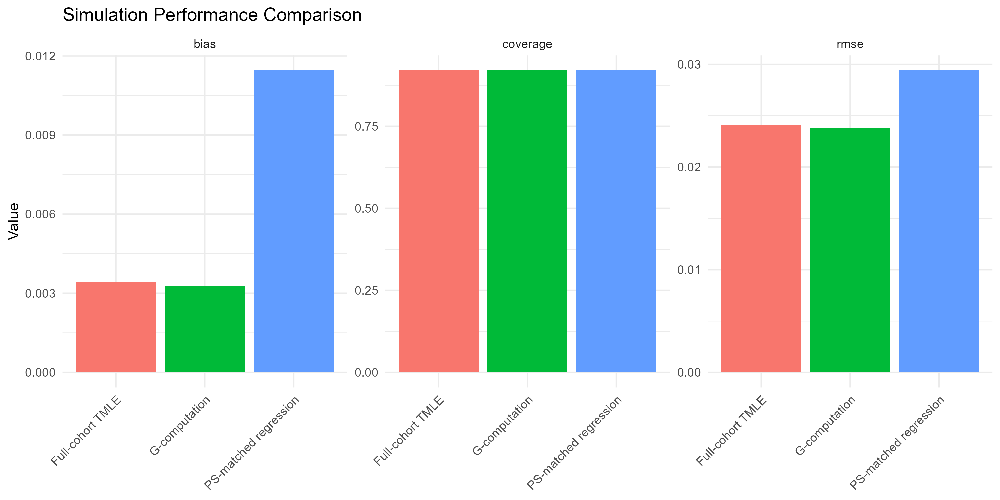
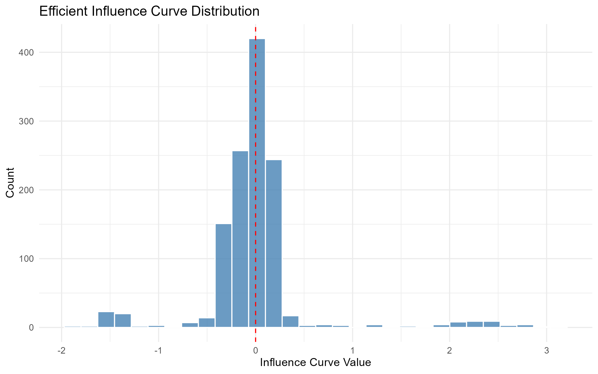
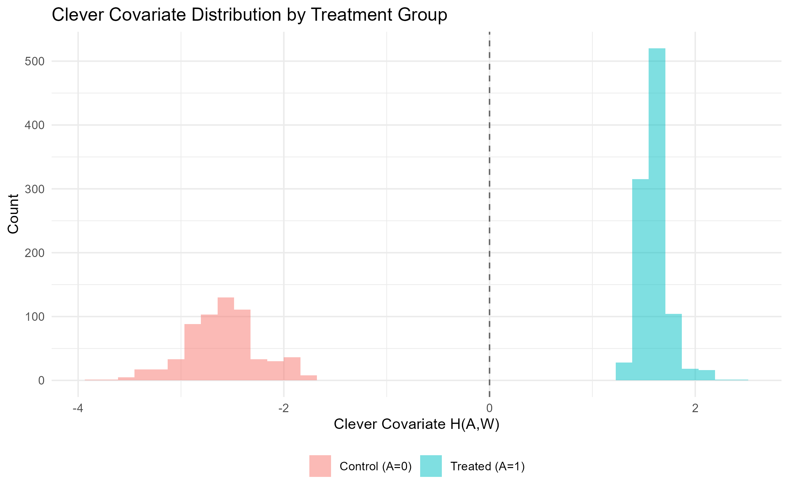

```{r setup, include = FALSE}
# Case-study numbers and figures come from the recorded multi-arm result
# files; the walkthrough slides execute the sixteen-verb workflow live on
# a simulated cohort.
library(ggplot2)
library(cleanTMLE)
.ma <- "../rescueCo/results/multiarm"
.rd <- function(f) {
  p <- file.path(.ma, f)
  if (file.exists(p)) read.csv(p, check.names = FALSE) else NULL
}
cs_sup <- .rd("support_by_contrast.csv")
cs_ncl <- .rd("nc_ladder.csv")
cs_lad <- .rd("ladder_estimates.csv")
if (is.null(cs_lad)) {
  ck <- list.files(.ma, pattern = "^ladder_.*\\.rds$", full.names = TRUE)
  if (length(ck)) cs_lad <- do.call(rbind, lapply(ck, readRDS))
}
.rds <- function(f) {
  p <- file.path(.ma, f)
  if (file.exists(p)) readRDS(p) else NULL
}
cs_cmp <- rbind(
  if (!is.null(x <- .rds("designcmp_C1.rds"))) cbind(contrast = "C1 (severe overlap)", x),
  if (!is.null(x <- .rds("designcmp_PRIMARY.rds"))) cbind(contrast = "Primary cohort (good overlap)", x))
cs_lock1 <- {
  p <- file.path(.ma, "multiarm_locks.rds")
  if (file.exists(p)) readRDS(p)[["C1"]] else NULL
}
cs_lite1 <- .rds("design_lite_C1.rds")
okabe <- c(PASS = "#009E73", FLAG = "#E69F00", SEVERE = "#D55E00",
           FAIL = "#B22222")
thm <- theme_minimal(base_size = 17) +
  theme(panel.grid.minor = element_blank(),
        legend.position = "bottom",
        plot.title = element_blank())
```

## The problem this package works on

Two failures poison comparative analyses of routine health data. The first is analyst degrees of freedom: when the person choosing the model can see how each choice moves the answer, the estimate carries those peeks. The second is quieter and worse. Some comparisons are not estimable at all, and the estimator does not say so.

A clean-room design fixes the first. cleanTMLE also answers the second, during the blind phase: is this comparison estimable, and with which estimand?

## This talk

1. The two failures, and a real analysis that fell into the second one.
2. A walkthrough of the workflow: sixteen verbs on one lock.
3. What the simulations showed.
4. Five ambulance-transport contrasts in Nairobi, and what the design stage refused to estimate.
5. Where this sits among existing tools.

# 1. Why this matters

## Peeking

Even with a written analysis plan, execution forces choices: sparse events, convergence failures, unexpected missingness. If those choices are made after the analyst has glimpsed the treatment-outcome association, the analysis is no longer prespecified, however honest the analyst.

The clean-room design of Muntner et al. (2024) addresses this. A design team builds the cohort, the propensity model, and the diagnostics without seeing the outcome. Only then does an outcome team estimate.

## The failure blinding cannot touch

The average treatment effect asks what would happen if everyone received treatment versus no one. Answering it requires every kind of patient to have had a real chance of landing in either arm.

When a whole stratum essentially never receives one treatment, the estimator does not refuse. It extrapolates. Truncating the weights caps the variance without restoring information.

A perfectly blinded team can still promise an estimand the data cannot deliver, and the lock makes the promise binding.

## We know because it happened to us

An earlier analysis of time to ambulance arrival, on a cohort where some patients essentially never receive the studied service:

- estimated effect **+14,637 minutes**, tight confidence interval
- crude difference **about 7 hours the other way**

Nothing in the estimator's own output flagged it.

## What the blind phase should establish

1. The cohort, treatment, outcome, and time horizon were fixed in advance.
2. The declared comparison is estimable. If not, which neighbouring estimand is.
3. The estimator was prespecified and screened against realistic data problems.
4. Any switch of estimand followed a rule declared before outcome access, and everything is on the record.

`design_report()` bundles the evidence for all four into the document a review team reads before outcomes are unlocked.

# 2. How the package works

## Sixteen verbs, one lock

| Stage | Verbs |
|---|---|
| 1: lock and declarations | `create_analysis_lock`, `declare_negative_controls`, `declare_estimand_ladder` |
| 2: design estimability | `fit_ps`, `assess_support`, `estimand_feasibility`, `simulate_support` |
| 2b: candidates and stress test | `define_candidates`, `stress_test`, `select_candidate` |
| 3: residual confounding | `negative_control_ladder`, `check_process_indicators` |
| review | `design_report`, `export_design_log` |
| 4: estimation | `estimate_effect`, `run_estimand_ladder` |

Everything above the last row runs with no outcome access. The next six slides run the workflow live on a simulated cohort.

## Walkthrough: lock the plan, rules included

```{r wt-lock, echo = TRUE}
dat  <- sim_func1(n = 1000, seed = 42)
lock <- create_analysis_lock(
  dat, "treatment", "event_24",
  covariates        = c("age", "sex", "biomarker", "comorbidity"),
  negative_controls = "nc_outcome",
  dq_thresholds = list(max_abs_bias = 0.02,
                       min_coverage = 0.90, max_rmse_ratio = 1.5),
  nc_criteria   = list(null_band = 0.02),
  seed = 42, enforce = TRUE)
lock <- declare_negative_controls(lock, "nc_outcome",
          domains = "health_seeking_behavior")
lock <- declare_estimand_ladder(lock, primary = "ATE",
          fallbacks = c("trimmed_ATE", "ATT"), trigger = "SEVERE")
substr(lock$lock_hash, 1, 16)
```

The thresholds are inside the fingerprint; the primary outcome column is already outside `lock$data`, in a sealed store that only Stage 4 rejoins.

## Walkthrough: is the comparison estimable?

```{r wt-support, echo = TRUE}
ps  <- fit_ps(lock, method = "glm")
sup <- assess_support(ps)
sup$verdict
fea <- estimand_feasibility(ps)
```

```{r wt-feas-table}
knitr::kable(fea$table[, c("estimand", "max_weight",
                           "ess_treated", "verdict")],
             digits = 1)
```

## Walkthrough: candidates under declared threats

```{r wt-stress, echo = TRUE}
cands <- define_candidates(grid = list(
  truncations = c(0.01, 0.05),
  libraries   = list(glm = "SL.glm")))
st <- stress_test(lock, cands, reps = 10, verbose = FALSE,
  threats = list(unmeasured_confounding = list(
    U_prevalence = 0.2, U_treatment_OR = c(1.5, 2),
    U_outcome_OR = c(1.5, 2))))
```

```{r wt-verdict-table}
knitr::kable(st$verdict, digits = 3)
```

## Walkthrough: select by the locked rule

```{r wt-select, echo = TRUE}
best <- select_candidate(st, rule = "min_max_rmse")
best$candidate_id
lock <- declare_estimand_ladder(lock, primary = "ATE",
          fallbacks = c("trimmed_ATE", "ATT"),
          trigger = "SEVERE", candidate = best)
```

The selection rule ran on simulated outcomes against fingerprinted thresholds; nothing about the realised effect direction could steer it.

## Walkthrough: the released record

```{r wt-log, echo = TRUE}
masked <- mask_outcome(lock)          # physically outcome-free
lock   <- unmask_outcome(masked, lock,
                         approved_by = "review team")
```

```{r wt-log-table}
lg <- export_design_log(lock, format = "muntner")
knitr::kable(tail(lg[, c("stage", "decision", "decided_by")], 3))
```

There is no token and no gate object: the single institutional switch is `enforce = TRUE`, and the single act of authorisation is a person on the record.

## Walkthrough: estimate what was declared

```{r wt-estimate, echo = TRUE}
fit <- run_estimand_ladder(lock, ps)
```

```{r wt-estimate-table}
knitr::kable(fit$table[, c("estimand", "estimate", "ci_lower",
                           "ci_upper", "support_verdict")],
             digits = 3)
```

Each row is labelled with its estimand and its support verdict; a switch or an override would appear in the design log, never silently.

## The support assessment

`assess_support()` grades the overlap on the fitted propensity score. Share of the sample outside the band, largest implied weight, effective sample size, and the c-statistic, whose discrimination is bad news here. A stratum scan and a shallow tree search catch pockets where treatment is nearly deterministic.

The verdict is PASS, FLAG, SEVERE, or FAIL, and its caveat sentence travels with every downstream estimate.

## What severe non-overlap looks like

:::: {.columns}
::: {.column width="50%"}

:::
::: {.column width="50%"}

:::
::::

Treated above the axis, controls below, band shaded.

## One fitted score, four estimands, very different weights

```{r fig-weights, fig.cap = "Implied weights on the protocol contrast, one point per patient, log scale. The ATE needs weights up to 257; the effect among the treated (ATT) is bounded at 5 by the largest propensity; the overlap-weighted ATO never exceeds 1."}
if (!is.null(cs_lock1) && !is.null(cs_lite1)) {
  g <- pmin(pmax(cs_lite1$ps_raw, 1e-6), 1 - 1e-6)
  A <- as.integer(cs_lock1$data[[cs_lock1$treatment]])
  wd <- rbind(
    data.frame(estimand = "ATE", w = ifelse(A == 1, 1 / g, 1 / (1 - g))),
    data.frame(estimand = "Trimmed ATE",
               w = { keep <- g >= 0.05 & g <= 0.95
                     ifelse(A[keep] == 1, 1 / g[keep], 1 / (1 - g[keep])) }),
    data.frame(estimand = "ATT", w = ifelse(A == 1, 1, g / (1 - g))),
    data.frame(estimand = "ATO", w = ifelse(A == 1, 1 - g, g)))
  wd$estimand <- factor(wd$estimand,
                        levels = c("ATE", "Trimmed ATE", "ATT", "ATO"))
  mx <- aggregate(w ~ estimand, wd, max)
  ggplot(wd, aes(estimand, w)) +
    geom_violin(fill = "#0072B2", colour = NA, alpha = 0.5, scale = "width") +
    geom_point(data = mx, colour = "#D55E00", size = 3) +
    geom_text(data = mx, aes(label = sprintf("max %.1f", w)),
              vjust = -0.8, colour = "#D55E00", size = 5) +
    geom_hline(yintercept = 1, linetype = "dashed", colour = "grey55") +
    scale_y_log10(limits = c(0.001, 900)) +
    labs(x = NULL, y = "implied weight (log scale)") + thm
}
```

## The estimand ladder

Switching estimands after seeing results is a garden of forking paths. Refusing ever to switch wastes designs that can answer a neighbouring question.

So the switch rule is pre-registered. The lock records the primary, the ordered fallbacks, and the verdict that triggers a move. Estimation runs the primary when feasible plus every feasible fallback, labels each row with its estimand and verdict, and refuses an infeasible primary unless an override reason is supplied and logged.

## The outcome-blind support map

Static weight diagnostics cannot say how much the extrapolation will hurt. That depends on how the outcome behaves in the region only one arm inhabits, and the design team is blind to the outcome.

So the package simulates: covariates resampled, treatment redrawn from the fitted propensity, simulated outcomes drawn from a prespecified family of surfaces. The truth is known on every replicate, separately per estimand. The map shows where each estimand holds a bias tolerance at near-nominal coverage.

## Redraw treatment, or keep it?

Plasmode studies commonly keep each subject's observed treatment. Shaw et al. (2025) showed that this builds a positivity violation into the simulation itself: all-treated regions stay all-treated in every replicate, whatever the generating propensity.

For a support map that is disqualifying, because the violation is the thing under study. cleanTMLE redraws treatment from the fitted propensity. The case study puts the two designs side by side on real data.

## The same loop stress-tests the estimator

Candidate TMLE specifications are compared on simulated outcomes, then re-run under prespecified data-quality threats: covariate missingness (MCAR, MAR, MNAR), exposure and outcome misclassification, near-positivity, unmeasured confounding.

Each candidate gets a degradation gradient on the same bias, RMSE, and coverage scale as the baseline. A minimax rule can lock the candidate with the best worst case rather than the best clean-data average.

## What the software controls, and what it cannot

It can keep the outcome masked or physically absent from the design stage, log every declaration and switch inside the fingerprinted lock, and flag estimates that violate bounds the raw data impose.

It cannot stop someone with raw-data access from peeking outside the package, validate how variables were measured, or see past the measured covariates. A propensity model missing the separating covariate will not warn. Those safeguards stay institutional.

# 3. What the simulations showed

## Three scenarios, six estimators

2,000 people, 200 repetitions each. Scenario A has good overlap; B has marginal overlap; C hides a confounder the analyst cannot measure. Estimators: crude, propensity matching, IPTW, TMLE, cross-validated TMLE, matched TMLE.

Under good overlap every adjusted estimator recovers the truth, and the workflow proceeds. That is the wiring check.

## Marginal overlap strains the variance, not the bias

TMLE and CV-TMLE keep bias small relative to the spread of the estimates.

IPTW confidence intervals come out too wide, because the variance formula treats an estimated propensity score as known. Matched TMLE has the same problem, roughly doubling the true spread. Both are fixable with a bootstrap variance, and the workflow says so before unblinding, as a documented qualification.

## Built-in confounding stops the workflow

In Scenario C every estimator is biased in the same direction; TMLE is the least biased and still biased. The unmeasured-confounding row of the stress test pushes bias past the locked threshold, and the prespecified rule returns stop before any outcome is read.

The software does not detect hidden confounders. It was simply willing to stop when a prespecified threat scenario failed, which is the behaviour a reviewer needs to trust the proceed decisions.

## Same fits, different pipeline

| Scenario | Traditional analyst | Outcome-blind workflow |
|---|---|---|
| Good overlap | Diagnostics look fine; report. | Same, plus simulation confirms the candidates. Proceed. |
| Marginal overlap | An attentive analyst adapts. Many do not. | Variance miscalibration quantified before unblinding. Proceed with qualification. |
| Unmeasured confounding | All adjusted estimates agree; analyst likely publishes a misleading null. | Prespecified stress row breaches the threshold. Stop. |

# 4. Case study: Rescue.Co, Nairobi

## Five contrasts, one registry

8,323 trauma patients with known transport mode, three Nairobi hospitals, 2018 to 2024. Each contrast gets its own lock on the shared cohort, 90 design columns, and the same declared ladder. Outcomes: six-month mortality, and time to arrival, the outcome behind the +14,637-minute failure. The outcome columns live in a separate store until estimation.

| Lock | Comparison | N | Treated |
|---|---|---:|---:|
| C1 | Rescue.Co vs everyone else (protocol comparator) | 8,323 | 1,039 |
| C2 | Rescue.Co vs non-ambulance | 7,165 | 1,039 |
| C3 | Any ambulance vs non-ambulance | 8,323 | 2,197 |
| C4 | Rescue.Co vs other ambulance, transfers included | 2,197 | 1,039 |
| Primary | Rescue.Co vs other ambulance, transfers and prior care excluded | 1,616 | 1,003 |

## The support verdicts

```{r fig-support, fig.cap = "Share of each contrast outside the propensity band [0.05, 0.95]. Dotted lines mark the verdict thresholds: FLAG above 1%, SEVERE above 25%. Labels give the largest implied ATE weight."}
if (!is.null(cs_sup)) {
  sp <- cs_sup
  sp$contrast[sp$contrast == "PRIMARY"] <- "Primary"
  sp$contrast <- factor(sp$contrast,
                        levels = rev(c("C1", "C2", "C3", "C4", "Primary")))
  sp$verdict <- factor(sp$verdict, levels = names(okabe))
  ggplot(sp, aes(pct_outside_band, contrast, colour = verdict)) +
    geom_vline(xintercept = c(1, 25), linetype = "dotted",
               colour = "grey55") +
    geom_segment(aes(x = 0, xend = pct_outside_band), linewidth = 1.1) +
    geom_point(size = 5) +
    geom_text(aes(label = sprintf("max weight %.0f", max_iptw_weight)),
              hjust = -0.15, vjust = -0.9, size = 5, show.legend = FALSE) +
    scale_colour_manual(values = okabe, name = NULL) +
    scale_x_continuous(limits = c(0, 62)) +
    labs(x = "% of sample outside propensity band [0.05, 0.95]", y = NULL) +
    thm
}
```

The protocol comparison places two-fifths of the sample outside the band. The declared trigger is met on C1 and C2 before any outcome is joined.

## Who never gets a Rescue.Co ambulance?

The tree search puts names on the C1 violation:

- injured at a private home, 1,386 patients, 1.4% treated
- other non-street injury places, 1,438 patients, 2.5% treated
- assault victims elsewhere, 1,062 patients, 4.2% treated

For these patients, "what if everyone were transported by Rescue.Co" has no answer in the data. A trimmed analysis removes 3,377 people, nearly all controls, and the design report describes them: 40% home injuries against 1% of those retained, more assaults, younger, farther away.

## Which estimands survive the C1 fit

| Estimand | Max weight | Verdict |
|---|---:|---|
| ATE | 257 | SEVERE, infeasible |
| Trimmed ATE | 20 | PASS, population changes |
| ATT | 5.0 | PASS |
| ATO | 1.0 | PASS |
| Matched ATT | 1.0 | PASS, 95% of treated matched |

The design supports an answer. Just not the one the protocol named.

## The exclusions, not the adjustment, removed the confounding

```{r fig-nc, fig.cap = "Two socioeconomic negative controls on the transfers-included contrast, refit on each nested cohort. Points are unadjusted risk differences with 95% intervals."}
if (!is.null(cs_ncl)) {
  nc <- cs_ncl[cs_ncl$contrast == "C4" &
               cs_ncl$negative_control %in%
                 c("nc_household_urban", "nc_cooking_fuel_wood_charcoal") &
               cs_ncl$status == "estimated", ]
  nc$control <- ifelse(grepl("urban", nc$negative_control),
                       "urban household", "wood or charcoal fuel")
  nc$rung <- factor(nc$cohort,
                    levels = c("full cohort", "transfers excluded",
                               "transfers and prior care excluded"),
                    labels = c("full cohort\n(n = 2,197)",
                               "transfers excluded\n(n = 1,703)",
                               "+ prior care excluded\n(n = 1,616)"))
  pd <- position_dodge(width = 0.35)
  ggplot(nc, aes(rung, estimate, colour = control, group = control)) +
    geom_hline(yintercept = 0, colour = "grey55") +
    geom_line(position = pd, linewidth = 0.9, alpha = 0.6) +
    geom_errorbar(aes(ymin = ci_lower, ymax = ci_upper), width = 0.12,
                  position = pd, linewidth = 0.9) +
    geom_point(size = 4, position = pd) +
    scale_colour_manual(values = c("#0072B2", "#CC79A7"), name = NULL) +
    labs(x = NULL, y = "risk difference") + thm
}
```

Both controls fail on the full cohort and turn null after the pre-registered transfer exclusion. On C1, the urban-household control fails and no restriction repairs it. Two rare controls are labelled inestimable rather than dropped.

## Care processes stay out of the adjustment set

Vitals recorded within an hour, and blood-pressure missingness, are predicted by treatment on three of the five contrasts (standardised differences up to 0.34). Transport mode changes the care process.

Conditioning on them would open collider paths through in-hospital care, so the locks keep them out, and the check documents why.

## The pre-outcome decisions

| Contrast | Recommendation |
|---|---|
| Primary | Proceed |
| C3, C4 | Proceed, FLAG caveat attached |
| C1, C2 | Proceed with qualification. The ATE is not supported; the ladder moves to trimmed ATE, then ATT, then ATO, and the switch is logged with the SEVERE verdict as its trigger |

All fixed before the outcome store was joined.

## Six-month mortality, down the ladder

```{r fig-forest, fig.cap = "Risk differences with 95% intervals, one row per feasible estimand per contrast. Negative favours Rescue.Co."}
if (!is.null(cs_lad) && any(grepl("death", cs_lad$outcome))) {
  ld <- cs_lad[grepl("death", cs_lad$outcome), ]
  ld$contrast[ld$contrast == "PRIMARY"] <- "Primary"
  ld$estimand <- sub("^trimmed_ATE$", "Trimmed ATE", ld$estimand)
  ld$row <- paste(ld$contrast, ld$estimand)
  ld$row <- factor(ld$row, levels = rev(unique(ld$row)))
  ggplot(ld, aes(estimate, row, colour = contrast)) +
    geom_vline(xintercept = 0, colour = "grey55") +
    geom_errorbar(aes(xmin = ci_lower, xmax = ci_upper), width = 0.18,
                  linewidth = 0.9) +
    geom_point(size = 4) +
    scale_colour_manual(values = c("#0072B2", "#009E73", "#E69F00",
                                   "#CC79A7", "#D55E00"), name = NULL) +
    labs(x = "risk difference, six-month mortality", y = NULL) + thm
} else {
  plot.new(); text(0.5, 0.5, "Estimation chain running; fills on render.")
}
```

```{r effects-note, results = "asis"}
if (!is.null(cs_lad)) {
  n_pairs <- length(unique(paste(cs_lad$contrast, cs_lad$outcome)))
  if (n_pairs < 10)
    cat("*", n_pairs, "of 10 contrast-outcome pairs completed so far;",
        "the figure fills as the chain lands.*")
}
```

C2 reports no ATE at all. The C1 ATE appears once, as a logged override kept so the two pipelines can be reconciled; it carries its SEVERE label and a standard error several times larger than the bounded rows beside it.

## The disaster outcome, re-analysed

```{r tta-table, results = "asis"}
if (!is.null(cs_lad) && any(grepl("time_to_arrival", cs_lad$outcome))) {
  ld <- cs_lad[grepl("time_to_arrival", cs_lad$outcome),
               intersect(c("contrast", "estimand", "estimate",
                           "ci_lower", "ci_upper", "implausible"),
                         names(cs_lad))]
  for (cn in c("estimate", "ci_lower", "ci_upper"))
    ld[[cn]] <- sprintf("%.1f", as.numeric(ld[[cn]]))
  names(ld) <- c("Contrast", "Estimand", "Minutes", "CI lower",
                 "CI upper", "Flagged")[seq_along(names(ld))]
  cat(knitr::kable(ld, format = "pipe", row.names = FALSE), sep = "\n")
} else {
  cat("*Estimation in progress. This slide fills with the",
      "time-to-arrival ladder rows.*")
}
```

Time to arrival once returned +14,637 minutes. Down the ladder, the bounded estimands agree that Rescue.Co arrives three to four and a half hours sooner, the override-only ATE row shows its strain in the interval width, and the implausibility guard checks every row against the raw arm summaries. Any one of its checks would have caught the original failure.

## The simulation trap, on real data

```{r fig-designcmp, fig.cap = "Coverage under the stressed outcome surface, 200 replicates per design. Keeping the observed treatment degrades every estimand, on the sound design too."}
if (!is.null(cs_cmp)) {
  dc <- cs_cmp[cs_cmp$confounding == 2 & cs_cmp$modification == 0, ]
  dc$design <- ifelse(dc$design == "generate_treatment",
                      "treatment redrawn", "observed treatment kept")
  dc$estimand <- sub("^trimmed_ATE$", "Trimmed ATE",
                     sub("^matched_ATT$", "Matched ATT", dc$estimand))
  dc$estimand <- factor(dc$estimand, levels = rev(c(
    "ATE", "Trimmed ATE", "ATT", "ATO", "Matched ATT")))
  ggplot(dc, aes(coverage, estimand, colour = design)) +
    geom_vline(xintercept = 0.95, linetype = "dashed", colour = "grey55") +
    geom_vline(xintercept = 0.90, linetype = "dotted", colour = "grey55") +
    geom_line(aes(group = estimand), colour = "grey70", linewidth = 0.9) +
    geom_point(size = 4.5) +
    facet_wrap(~ contrast) +
    scale_colour_manual(values = c(`treatment redrawn` = "#0072B2",
                                   `observed treatment kept` = "#D55E00"),
                        name = NULL) +
    scale_x_continuous(limits = c(0.55, 1)) +
    labs(x = "95% interval coverage under stress", y = NULL) + thm
}
```

A support map built on the kept-treatment design would declare sound designs infeasible. It manufactures the failure it was asked to detect.

## The workflow audited its own earlier mistake

The earlier single-contrast run had a design flaw. Its primary outcome was the common category of a 92%-prevalence dichotomy, the cohort-adequacy check recorded a stop, and the pipeline proceeded through an unlogged override.

The rebuild's reconciliation surfaced this because the record kept both entries, the stop and the estimate, with nothing between them. The fix went to the design: mortality became the primary outcome, and overrides now require a logged reason. The record makes gaps findable, including the workflow's own.

## How a reviewer reads the case study

- Every verdict, declaration, and switch was fixed and logged before the outcome store was joined.
- The protocol's primary comparison was refused on the record, with the evidence attached, and the reported estimands are labelled with the populations they describe.
- Where the two pipelines are comparable, the clean-room estimates agree with the parallel unblinded analysis to within fractions of a standard error, tracked row by row in a released reconciliation table.

# 5. Where this sits

## Side by side

| Feature | TMLE packages | causalRisk | Clean-room papers | cleanTMLE |
|---|:---:|:---:|:---:|:---:|
| Targeted-learning estimation | yes | -- | -- | yes |
| Cohort grammar, cumulative-risk reporting | partial | yes | -- | yes |
| Graded support verdict, per-estimand feasibility | -- | -- | -- | yes |
| Pre-registered estimand ladder, logged switching | -- | -- | -- | yes |
| Outcome-blind support map | -- | -- | -- | yes |
| Plasmode candidate selection, DQ stress test | -- | -- | -- | yes |
| Fingerprinted lock and design log | -- | -- | guidance | yes |

TMLE estimation is a decade old; the staged idea is published guidance. The new part is answering the estimability question inside the blind phase, with the record to prove when it was answered.

## When to use it, and its limits

Use it when a reviewer will ask whether a decision was made before you saw the answer: estimator and estimand choices in observational studies, SAP development, real-world evidence work.

It does not automate design, validate data or phenotypes, guarantee assumptions, or replace negative controls and post-outcome sensitivity analysis. For confirmatory studies it belongs inside institutional governance, with role separation and independent review. An `enforce = TRUE` mode withholds estimation until a recorded design review, where institutions want that in software.

## Where I want input

1. The harshest support-map surfaces behave like strong unmeasured confounding, so a whole-grid pass rule conflates two threats. How should the plausible region be elicited and pre-registered?
2. Is SEVERE the right default trigger, and trimmed ATE, ATT, ATO the right default order?
3. How should severity ranges for the stress test be documented so a reviewer accepts them?
4. The matched ATT is the most robust rung on every map here and the least interpretable population. Sensitivity analysis, or candidate primary?

## Resources

- Package: <https://github.com/amertens/cleanTMLE> (v0.2.0)
- Manuscript draft: `reports/manuscript_outcome_blind_dq.qmd`
- Case-study artifacts: `rescueCo/results/multiarm/`
- Vignettes: staged workflow, and the function reference

Thank you. Questions and pushback welcome.

# Appendix A: Concepts and alignment

## Conceptual layers in the staged workflow

| Layer | Description |
|---|---|
| Causal question | Clinical or policy question framed as a target trial. |
| Causal estimand | Counterfactual effect of interest, e.g. marginal risk difference. |
| Identification assumptions | Conditions under which the estimand equals an observed-data parameter. |
| Statistical estimand | That observed-data parameter. |
| Estimand ladder | Pre-registered fallbacks and the verdict that triggers a switch. |
| Estimator | TMLE, IPTW, matching. |
| Pre-outcome diagnostic | Support verdict, feasibility, simulated bias and coverage, balance, negative controls. |
| Governance decision | Proceed, proceed with qualification, or stop (Muntner et al. 2024). |

## The causal roadmap, and what the package covers

```{mermaid}
flowchart TD
    A["1. Causal question and target trial"] --> B["2. Observed data and source characterisation"]
    B --> C["3. Identification assumptions"]
    C --> D["4. Statistical estimand + declared ladder"]
    D --> E["5. Lock candidate estimators and thresholds"]
    E --> F["Design stage: support, feasibility, support map, plasmode, DQ stress, negative controls"]
    F --> G["Design report: proceed / qualify / stop"]
    G --> H["Estimate the declared primary and feasible fallbacks"]
    H --> I["Post-outcome sensitivity: E-value, delta, QBA"]
    I --> J["Interpretation and transportability"]
    style C fill:#e6e6e6,stroke:#333,color:#000
    style D fill:#e6e6e6,stroke:#333,color:#000
    style E fill:#e6e6e6,stroke:#333,color:#000
    style F fill:#e6e6e6,stroke:#333,color:#000
    style G fill:#e6e6e6,stroke:#333,color:#000
    style H fill:#e6e6e6,stroke:#333,color:#000
```

## Regulatory alignment (excerpt)

| Roadmap component | FDA / EMA / ICH anchor | cleanTMLE |
|---|---|---|
| Causal question | Target-trial framework; FDA RWE Framework; ICH M14 | Lock record; `design_report(protocol = ...)` emulation table |
| Identification (positivity) | ICH E9(R1) | `assess_support()`, `estimand_feasibility()` |
| Statistical estimand | ICH E9(R1); FDA RWE Considerations | `declare_estimand_ladder()`, `run_estimand_ladder()` |
| Estimator selection | FDA non-interventional studies; ICH M14 | `define_candidates()`, `select_candidate()` |
| Pre-outcome DQ stress | Source reliability (FDA, EMA) | `stress_test()`, `simulate_support()` |
| Post-outcome sensitivity | FDA non-interventional; ICH E9(R1) | `compute_evalue()`, `run_delta_sensitivity()` |

## The stress-test threat families

| Threat | Mechanism | Probes | Does not probe |
|---|---|---|---|
| Covariate missingness | MCAR, MAR, MNAR masks; median impute | Imputation robustness | Phenotype validity |
| Exposure misclassification | Flip A at given sens and spec | Treatment measurement | Differential error by outcome |
| Outcome misclassification | Flip Y, optionally per arm | Outcome measurement | Time-varying ascertainment |
| Near-positivity | Amplify covariate-treatment association | Estimator strain | The realised design's support |
| Unmeasured confounding | Latent U shifts A and Y | Exchangeability | Multiple latent confounders |

# Appendix B: Case-study detail

## The declared ladder, per lock

Identical across the five locks, declared before outcome access: primary ATE with IPCW for missing outcomes; fallbacks trimmed ATE [0.05, 0.95], then ATT, then ATO; trigger SEVERE. The matched ATT is assessed in the feasibility table and support map as a design-stage sensitivity, not estimated on the ladder.

Propensity library: the `build_sl_library()` preset for wide registry designs (penalised logistic learners, PCA-reduced GLMs, marginal mean; no tree learners, which can separate arms on wide indicator sets), ten folds.

## Negative-control ladder, exact rows

| Contrast | Cohort | Urban household | Wood or charcoal fuel |
|---|---|---:|---:|
| C4 | Full (n = 2,197) | +0.068 | -0.052 |
| C4 | Transfers excluded (n = 1,703) | +0.001 | +0.000 |
| C4 | Prior care also excluded (n = 1,616) | -0.003 | -0.001 |
| C1 | Full (n = 8,323) | +0.013 | -0.006 |

Hypertension is null on every rung. Insulin-treated diabetes and HIV on ART are inestimable (a cell below 5 events) and labelled as such. A TMLE-adjusted variant is released with a caveat: on restricted rungs it conditions on design columns that are near-copies of the socioeconomic controls.

## The support-map reading rule, from the design log

Recorded before estimation: the maps are read over the moderate-confounding region (simulated confounding strength up to 1), with the whole-grid pass reported as a conservative bound.

The harshest rung stresses every weighting-based estimand at once, including on the PASS-verdict primary cohort, so a whole-grid rule conflates support failure with confounding stress. The signature used instead: failure at the mildest surface means a support problem (C1's ATE, coverage 0.87 before any simulated confounding); failure only under stress, hitting all unmatched estimands together, means stress (the primary cohort at strength 2, where the matched ATT holds 0.93 to 0.96).

## Candidate selection under stress (earlier single-contrast lock)

Four TMLE candidates varying propensity library and truncation tie on the clean baseline (RMSE within 0.0002), where the minimum-RMSE rule would lock `glm_t01`. Under the five-threat sweep the worst-case RMSE ratios separate: 1.82, 1.73, 1.53, and 1.27 for `ensemble_t05`.

The minimax rule locks `ensemble_t05`. The candidate selected for clean-data efficiency was the most exposed under prespecified stress. Reported at 50 replicates as a workflow illustration; 200 is the inferential bar.

## Effect estimates, exact rows

```{r effects-table-appendix, results = "asis"}
if (!is.null(cs_lad) && any(grepl("death", cs_lad$outcome))) {
  ld <- cs_lad[grepl("death", cs_lad$outcome),
               intersect(c("contrast", "estimand", "n", "estimate",
                           "ci_lower", "ci_upper", "p_value",
                           "support_verdict"), names(cs_lad))]
  for (cn in c("estimate", "ci_lower", "ci_upper", "p_value"))
    ld[[cn]] <- sprintf("%.3f", as.numeric(ld[[cn]]))
  names(ld) <- c("Contrast", "Estimand", "N", "RD", "CI lower", "CI upper",
                 "p", "Support")[seq_along(names(ld))]
  cat(knitr::kable(ld, format = "pipe", row.names = FALSE), sep = "\n")
} else {
  cat("*Fills from the estimation outputs on render.*")
}
```

# Appendix C: Figures

## Support maps

:::: {.columns}
::: {.column width="50%"}

:::
::: {.column width="50%"}

:::
::::

## Support histograms, flagged contrasts

:::: {.columns}
::: {.column width="50%"}

:::
::: {.column width="50%"}

:::
::::

## Earlier single-contrast diagnostics

:::: {.columns}
::: {.column width="50%"}

:::
::: {.column width="50%"}

:::
::::

## TMLE internals (earlier lock)

:::: {.columns}
::: {.column width="50%"}

:::
::: {.column width="50%"}

:::
::::
