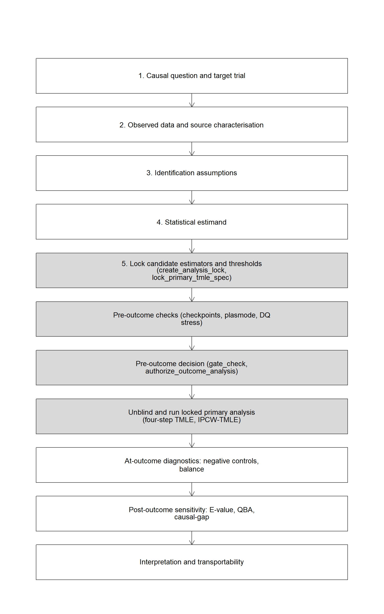
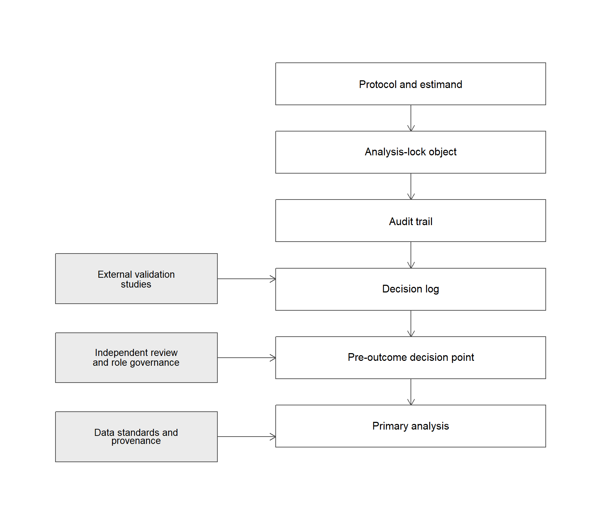

```{r setup, include = FALSE}
knitr::opts_chunk$set(
  collapse  = TRUE,
  comment   = "R> ",
  warning   = FALSE,
  message   = FALSE,
  echo      = FALSE,
  fig.width = 8,
  fig.height = 5
)
library(ggplot2)
library(cleanTMLE)

# ── Bootstrap variance scalar helpers (used in abstract inline code) ──────────
# Defined here so abstract inline R has access; overridden later from CSV.
.bv_def <- function(boot_var, scenario_pat, method, col) {
  r <- boot_var[grepl(scenario_pat, boot_var$scenario, ignore.case=TRUE) &
                boot_var$method == method, col, drop=TRUE]
  if (length(r)==0 || all(is.na(r))) NA else r[1]
}
# Binomial Monte Carlo SE of a coverage proportion, sqrt(p(1-p)/n_reps).
.bv_cov_mcse <- function(boot_var, scenario_pat, method, cov_col) {
  p <- .bv_def(boot_var, scenario_pat, method, cov_col)
  n <- .bv_def(boot_var, scenario_pat, method, "n_reps")
  if (is.na(p) || is.na(n)) NA else sqrt(p * (1 - p) / n)
}
boot_path <- file.path("..", "results_new", "bootstrap_variance.csv")
if (file.exists(boot_path)) {
  boot_var          <- read.csv(boot_path)
  # Scenario C: Very Good Overlap
  mt_C_ratio_if     <- .bv_def(boot_var, "Very Good", "Match_TMLE", "se_sd_ratio_if")
  mt_C_cov_if       <- .bv_def(boot_var, "Very Good", "Match_TMLE", "coverage_if")
  mt_C_cov_boot     <- .bv_def(boot_var, "Very Good", "Match_TMLE", "coverage_boot")
  iptw_C_ratio_if   <- .bv_def(boot_var, "Very Good", "IPTW",       "se_sd_ratio_if")
  iptw_C_cov_if     <- .bv_def(boot_var, "Very Good", "IPTW",       "coverage_if")
  # Scenario A: Good Overlap
  mt_A_ratio_if     <- .bv_def(boot_var, "^A",        "Match_TMLE", "se_sd_ratio_if")
  mt_A_cov_if       <- .bv_def(boot_var, "^A",        "Match_TMLE", "coverage_if")
  mt_A_cov_boot     <- .bv_def(boot_var, "^A",        "Match_TMLE", "coverage_boot")
  iptw_A_ratio_if   <- .bv_def(boot_var, "^A",        "IPTW",       "se_sd_ratio_if")
  iptw_A_cov_if     <- .bv_def(boot_var, "^A",        "IPTW",       "coverage_if")
  # Monte Carlo SE of the coverage proportions referenced inline.
  mt_C_cov_if_se    <- .bv_cov_mcse(boot_var, "Very Good", "Match_TMLE", "coverage_if")
  mt_C_cov_boot_se  <- .bv_cov_mcse(boot_var, "Very Good", "Match_TMLE", "coverage_boot")
  mt_A_cov_if_se    <- .bv_cov_mcse(boot_var, "^A",        "Match_TMLE", "coverage_if")
  mt_A_cov_boot_se  <- .bv_cov_mcse(boot_var, "^A",        "Match_TMLE", "coverage_boot")
  iptw_B_cov_if_se  <- .bv_cov_mcse(boot_var, "Marginal",  "IPTW",       "coverage_if")
  # Scenario B: Marginal Overlap
  mt_B_ratio_if     <- .bv_def(boot_var, "Marginal",  "Match_TMLE", "se_sd_ratio_if")
  mt_B_cov_if       <- .bv_def(boot_var, "Marginal",  "Match_TMLE", "coverage_if")
  mt_B_ratio_boot   <- .bv_def(boot_var, "Marginal",  "Match_TMLE", "se_sd_ratio_boot")
  mt_B_cov_boot     <- .bv_def(boot_var, "Marginal",  "Match_TMLE", "coverage_boot")
  iptw_B_ratio_if   <- .bv_def(boot_var, "Marginal",  "IPTW",       "se_sd_ratio_if")
  iptw_B_cov_if     <- .bv_def(boot_var, "Marginal",  "IPTW",       "coverage_if")
  # TMLE and TMLE_CF under marginal overlap (variance sandbox, N_MC = 60, B = 200)
  tmle_B_ratio_if   <- .bv_def(boot_var, "Marginal",  "TMLE",       "se_sd_ratio_if")
  tmle_B_cov_if     <- .bv_def(boot_var, "Marginal",  "TMLE",       "coverage_if")
  tmle_B_ratio_boot <- .bv_def(boot_var, "Marginal",  "TMLE",       "se_sd_ratio_boot")
  tmle_B_cov_boot   <- .bv_def(boot_var, "Marginal",  "TMLE",       "coverage_boot")
  tmle_cf_B_ratio_if   <- .bv_def(boot_var, "Marginal", "TMLE_CF",  "se_sd_ratio_if")
  tmle_cf_B_cov_if     <- .bv_def(boot_var, "Marginal", "TMLE_CF",  "coverage_if")
  tmle_cf_B_ratio_boot <- .bv_def(boot_var, "Marginal", "TMLE_CF",  "se_sd_ratio_boot")
  tmle_cf_B_cov_boot   <- .bv_def(boot_var, "Marginal", "TMLE_CF",  "coverage_boot")
  tmle_B_cov_if_se  <- .bv_cov_mcse(boot_var, "Marginal", "TMLE",   "coverage_if")
  tmle_B_cov_boot_se <- .bv_cov_mcse(boot_var, "Marginal", "TMLE",  "coverage_boot")
  tmle_cf_B_cov_if_se <- .bv_cov_mcse(boot_var, "Marginal", "TMLE_CF", "coverage_if")
} else {
  # No silent fallback. The abstract and the variance section report these
  # numbers as results, so a missing results file must fail the render rather
  # than substitute look-alike values.
  stop(
    "Required results file not found: ", normalizePath(boot_path, mustWork = FALSE),
    "\nRun `_bootstrap_variance.R` to produce `results_new/bootstrap_variance.csv` ",
    "before rendering. The manuscript will not render with placeholder numbers."
  )
}

# Scenario C (unmeasured confounding) primary-TMLE numbers, read once so the
# prose stays in sync with the regenerated simulation results rather than being
# hardcoded in several places.
.simres_path <- file.path("..", "results_new", "simulation_results.rds")
if (file.exists(.simres_path)) {
  .sr   <- readRDS(.simres_path)
  .scT  <- .sr$summaries$unmeasured_conf
  .scT  <- .scT[.scT$method == "TMLE", ]
  scC_bias  <- .scT$bias
  scC_cov   <- .scT$coverage
  scC_est   <- .scT$mean_est
  scC_truth <- .sr$truths$unmeasured_conf$RD
  .scRt     <- .sr$results$unmeasured_conf
  .scRt     <- .scRt[.scRt$method == "TMLE", ]
  scC_pct_excl0 <- mean(.scRt$ci_lower > 0 | .scRt$ci_upper < 0, na.rm = TRUE)
} else {
  scC_bias <- scC_cov <- scC_est <- scC_truth <- scC_pct_excl0 <- NA_real_
}
```

# Abstract {.unnumbered}

A real-world evidence study reaches an effect estimate only after
many analytic decisions: how to define the study population, how to
handle limited overlap, which estimator to use, and whether the data
are reliable enough to answer the question. These decisions are
usually documented in separate places. The causal question and
target-trial design go in a protocol, data fitness in a checklist,
and estimator choice in a statistical analysis plan. A reviewer is
then left to reconstruct how the design assumptions, the data
limitations, and the estimation choices connect.

cleanTMLE is an R package for staged, outcome-blind targeted
learning on binary point-treatment studies. Working inside the
causal roadmap, the analyst first defines the causal question,
observed data, identification assumptions, statistical estimand,
and a set of candidate estimators, then uses outcome-blind
simulation to compare those candidates before inspecting the
observed treatment-outcome association. Outcome-blind here has a
precise sense: the plasmode generator fits the marginal mean of the
observed outcome given covariates, and the joint treatment-outcome
association is never inspected before the pre-outcome decision. The
package extends this loop with a plasmode data-quality stress test
that generates synthetic outcomes from the empirical covariate and
treatment structure and evaluates each candidate under five prespecified
threat families: covariate missingness, exposure misclassification,
outcome misclassification, near-positivity, and unmeasured confounding.

In Monte Carlo experiments, adjusted estimators recovered the true
risk difference under good overlap, and TMLE and cross-validated
TMLE held bias small relative to the empirical standard deviation
under marginal overlap. Under a deliberately misspecified outcome
surface, cross-validated TMLE with a flexible library recovered the
true risk difference, while the unadjusted crude estimator carried the
wrong sign and the GLM-based adjusted estimators, though correctly
signed, remained substantially biased. A supplementary variance comparison found that the
matched-cohort TMLE paired-difference SE is anti-conservative under
good overlap (95% CI coverage `r round(mt_A_cov_if, 2)`, Monte Carlo SE
`r round(mt_A_cov_if_se, 2)`) because it ignores matching-draw variance,
and a full-pipeline bootstrap that re-runs matching on each resample
raised coverage to `r round(mt_A_cov_boot, 2)` [@abadie2008bootstrap].
`select_variance_method()` uses oracle coverage on plasmode-generated
synthetic data to identify, for each estimator-scenario combination,
which variance method achieves nominal coverage. When
unmeasured confounding was introduced, all estimators were biased
in the same direction, and the prespecified pre-outcome decision
correctly returned STOP: the workflow flags a prespecified
unmeasured-confounding scenario under which the planned analysis
would no longer meet the locked operating-characteristic
thresholds. The data-quality stress test further showed that
outcome misclassification and unmeasured confounding produced the
largest degradation in estimator performance. The package also ships a worst-case selection rule (`min_max_rmse`) that
ranks candidates by their maximum RMSE across all declared threats;
a companion vignette illustrates a setting where this rule locks a
different candidate from the baseline `min_rmse` rule.

We illustrate the workflow on the Rescue.Co Kenya Trauma Registry
(n = 1,693; 24.6 % outcome missingness). Six estimators agreed on
direction, with risk differences from 0.026 to 0.037 favouring
Rescue.Co transport; the prespecified primary TMLE interval crossed
zero. cleanTMLE is the software layer of an outcome-blind staged
workflow: it does not replace target-trial design, fit-for-purpose
data review, validation studies, independent governance, or
post-outcome sensitivity analyses. Its contribution is to turn
prespecified targeted-learning decisions, outcome-blind estimator
selection, and data-quality stress testing into a reproducible
record an external reviewer can reconstruct.

**Keywords:** targeted maximum likelihood estimation, plasmode
simulation, real-world evidence, fit-for-purpose data, outcome-
blind analysis, R, statistical analysis plan, regulatory science.

# Introduction

## Prespecification and fit-for-purpose data in RWE

Outcome blinding and prespecification are governance tools, not
substitutes for causal design. In a real-world evidence (RWE) study
the analyst still has to define the target trial
[@hernan2016targettrial; @hernan2016target], specify a statistical
estimand consistent with the ICH E9(R1) framework [@ich2019e9r1],
justify identification from the available data, and defend the
relevance and reliability of the data source for the regulatory or
scientific question.

Regulatory bodies have converged on this list. The FDA RWE
framework and its source-specific guidances cover
real-world data and evidence [@fda2018rwe; @fda2024considerations],
EHR and claims data [@fda2024ehrclaims], registries
[@fda2021registries], and non-interventional studies
[@fda2024noninterventional]. The EMA materials add registry-based
studies [@ema2021registry], a regulator-led RWE guide
[@ema2024guide], and an RWD data-quality framework
[@ema2026rwd]. ICH M14 (March 2026) sets harmonised principles
for non-interventional studies that use real-world data for safety
assessment of medicines [@ich2024m14].

Within this broader workflow, two arguments are typically
developed in parallel but reported separately. The
*estimator-selection* argument is checked with outcome-blind
plasmode simulation [@franklin2014plasmode; @schuler2017tmle;
@dang2023roadmap; @gruber2022sap; @schreck2024plasmode]. The
*fit-for-purpose* argument is documented qualitatively through
templates such as SPIFD2, the Structured Process to Identify
Fit-for-purpose study Design and Data [@gatto2022spifd; @gatto2023spifd2],
or HARPER [@wang2023harper], and through reporting tools such as
TARGET, the Target Trial reporting tool for observational studies
[@cashin2024target], and STaRT-RWE, the Structured Template for
Planning and Reporting on the Implementation of real-world evidence
studies [@wang2021startrwe].

These two arguments are connected: a candidate estimator that
performs well on a simulation derived from real covariate and
treatment distributions may still fail under realistic measurement
error, missingness, or unmeasured confounding. The plasmode loop is
under the analyst's control, so it can be extended to ask not only
"which candidate has the lowest RMSE under the locked
data-generating process?" but also "which candidate maintains
acceptable bias, RMSE, and coverage across the plausible range of
each threat documented in the fit-for-purpose review?" We refer to
this extension as a *data-quality (DQ) stress test*. It is a
pre-outcome robustness screen rather than a substitute for
variable validation or for post-unblinding sensitivity analysis.
The workflow does not guarantee that estimator rankings under
synthetic outcomes will generalise to the realised outcome
process; the conclusions are only as credible as the
synthetic-outcome model and the externally justified severity
ranges entered into the DQ stress test.

We use "data-quality stress testing" in a restricted sense: the
procedure does not assess data provenance, phenotype validity,
linkage accuracy, representativeness, or regulatory acceptability,
which remain study-level evaluations. Once investigators have
specified plausible threats and severity ranges from external
validation studies, data profiling, or expert elicitation, the
package evaluates how candidate estimators behave under those
prespecified perturbations before the observed treatment-outcome
association is examined. The central contribution is a
quantitative bridge between fit-for-purpose review and estimator
selection. In a conventional workflow, data-fitness concerns are
documented qualitatively, while estimator choice is justified
separately through modeling preferences or diagnostics. cleanTMLE
uses the same outcome-blind plasmode loop used for candidate
selection to evaluate whether prespecified TMLE candidates remain
acceptable under data-quality threats derived from the
fit-for-purpose review.

In this manuscript, *outcome-blind* means that decisions about
cohort construction, candidate estimators, simulation scenarios,
decision thresholds, and primary-estimator selection are made
without inspecting the observed treatment-outcome association.
Analysts may use baseline covariates, treatment assignment,
missingness indicators, and synthetic outcomes generated for
plasmode simulations; the marginal mean of the observed outcome on
covariates is also used internally to fit the plasmode generator.
The observed treatment-outcome relationship is not used for
estimator selection or design revision before the pre-outcome
decision point.

Standard pre-outcome review often separates three activities:
target-trial / protocol design, qualitative fit-for-purpose data
review, and estimator selection. Standard plasmode simulation can
compare estimators before outcome access, but it usually evaluates
performance under one locked synthetic outcome mechanism. cleanTMLE
extends that loop by stress-testing the selected estimator across
prespecified data-quality threats derived from the fit-for-purpose
review. This builds a quantitative bridge between the qualitative
data-fitness argument and the estimator-selection argument.

## What the package adds, and what it does not

cleanTMLE is an R [@rcoreteam2024] package that operationalises the
estimator-selection and stress-testing steps of a staged analysis
within the causal roadmap [@dang2023roadmap; @petersen2014roadmap;
@gruber2022sap]. Its two methodological contributions are an
outcome-blind plasmode candidate selector and the data-quality stress
test introduced above, which extends that selector to score each
candidate against prespecified data-quality threats. Both build on
targeted maximum likelihood estimation (TMLE) [@vanderLaan2006tmle;
@vdL2011tlbook; @schuler2017tmle; @zheng2011crossvalidated;
@chernozhukov2018dml], the natural setting because every analytic
decision (the SuperLearner library [@vdL2007superlearner;
@phillips2023sl], the truncation rule, the targeting procedure, and the
prespecified set of candidate estimators) can be listed in advance,
while the estimator remains data-adaptive and still admits valid
Wald-type confidence intervals under standard regularity conditions.
This modular structure makes it possible to compare prespecified
candidates under synthetic outcomes without revising the analytic plan
after inspecting observed treatment-outcome associations.

Around these statistical components the package adds an optional
transparency layer, for analysts who want their prespecification to be a
reproducible record rather than a separate paper document: an
analysis-lock object, a serialisable audit trail and decision log in the
sense of @muntner2024staging, and a pre-outcome decision rule. The
decision rule applies the three review-team recommendations of
@muntner2024staging, namely proceeding to the comparative analysis,
proceeding with a documented qualification or additional analysis, or
stopping before it. The package labels these GO, FLAG, and STOP, and it
enforces the sequence by withholding its primary-analysis functions
until the prespecified checkpoints have been recorded. This software
arrangement sits inside, rather than substitutes for, the personnel-based
governance of a clean room such as role separation, credentialed data
access, and an independent masked review team, which we return to in
@sec-discussion. The "clean room" label is the manufacturing analogy
adopted by @muntner2024staging, in which access to a sterile area is
blocked until protocols have been followed; the substantive content here
is the staged restriction of outcome access. @sec-roadmap situates the
package inside the causal roadmap.

## Current scope of cleanTMLE

The simulation, vignette, and case study in this paper run on a binary
point exposure, a binary outcome, and the marginal risk-difference
estimand, with outcome missingness handled through complete-case and
inverse-probability-of-censoring-weighted (IPCW)
sensitivity paths under prespecified missingness assumptions (the
complete-case path is unbiased under missingness completely at random
(MCAR), and the IPCW path is unbiased
under conditional independent censoring given measured covariates and
treatment). Within that scope the package exposes the full estimator
spectrum, namely IPTW with stabilised weights (`estimate_ipwrisk()`),
parametric g-computation (`estimate_gcomprisk()`), augmented IPW
(`estimate_aipwrisk()`), and TMLE (`run_clean_tmle()`, together with the
modular `fit_tmle_*()` primitives and the IPCW variant
`run_ipcw_tmle()`). The prespecified primary estimator is TMLE, and the
other three are reported as concordance checks. Hazard ratios,
time-varying treatments, competing risks, and multinomial exposures
are out of scope for the v0.1 release; native missingness-handling
models (multiple imputation, inverse-probability-of-missingness
weighting for covariates) are likewise deferred, although the
data-quality stress test now degrades covariates under MAR and MNAR
to test the default median-imputation handling against them.
Analysts who need those estimands can compose cleanTMLE's
prespecification and audit functions with `survtmle`
[@survtmlepackage2018] or `lmtp` [@lmtppackage2021] until those features
are added. This paper documents version 0.1.5 of the package. The
case-study estimates in @sec-casestudy were produced under version 0.1.1;
the 0.1.5 API is backward-compatible for the functions used there, and
the numerical results are unchanged.

## What the paper contributes

We state the contribution narrowly. It is not a new estimator or a new
theorem: the estimators are standard targeted learning, and prespecifying
TMLE in a statistical analysis plan is already set out by
@gruber2022sap and Step 5 of the roadmap [@dang2023roadmap]. The
contribution is a single, prespecified, outcome-blind procedure that ties
the qualitative fit-for-purpose threats documented in a SPIFD2-style
review [@gatto2023spifd2] to quantitative estimator selection on one
decision scale, together with a reproducible software implementation.
Concretely, we extend the outcome-blind plasmode loop
[@dang2023roadmap; @gruber2022sap; @schreck2024plasmode] from
candidate-estimator selection to estimator robustness *screening* under
prespecified threat ranges: each candidate produces a degradation
gradient on the same bias, RMSE, and coverage scale as the baseline
plasmode, so the prespecified decision rule applies uniformly across
baseline and stressed scenarios. We characterise the screen's operating
characteristics as a decision rule (@sec-gate-oc): how often it returns
the same GO/STOP verdict an oracle with knowledge of the realised
estimator's bias would return, and how that calibration degrades when the
synthetic-outcome model is misspecified.

The boundary with the FIORD framework is as follows. FIORD, the Forum
on the Integration of Observational and Randomized Data
[@nance2026fiord; @kent2026fiord], supplies the outcome-blind
candidate-evaluation loop and the two-stage selector that first screens
candidates on oracle coverage and then selects a variance method. This paper
contributes the software implementation of that loop, the data-quality
stress-test extension that scores each candidate under prespecified threats on
the same decision scale, and the lock, audit, and pre-outcome-decision record.
We hold to this division of labour throughout, and we do not claim the
outcome-blind selection framework as original to this work.

We position the screen as a quantitative supplement to fit-for-purpose
review (@sec-bridge) and not a substitute for variable-validation
studies, source-data assessment, or post-outcome quantitative bias
analysis, and we are explicit (@sec-guarantees) about what passing it does
and does not establish. The R implementation records the supporting
prespecification (the SHA-256-fingerprinted analysis lock, the audit
trail, the decision log, and the pre-outcome decision) so that the screen
and the locked primary analysis share a single reproducible record.

For an applied real-world evidence team the operational payoff is
concrete. Prespecifying the estimand, the candidate estimators, the
learner libraries, and the decision thresholds inside a fingerprinted
lock, and recording every pre-outcome diagnostic in an exportable audit
trail, gives a reviewer a record that can be reconstructed without
relying on the analyst's recollection of which choice was made when.
This addresses a recurring concern in real-world evidence submissions,
that analytic choices may have been shaped by the observed
treatment-outcome association [@muntner2024staging]. The same record
reduces post-hoc disputes over truncation, learner library, and cohort
decisions, because each is timestamped before the outcome is read. The
cost is the discipline of fixing these choices in advance and the
compute time of the plasmode and data-quality runs, both of which fit
inside a conventional statistical-analysis-plan timeline.

The practical consequence is visible when the same fitted estimators are
read under a conventional pipeline and under the staged workflow
(@tbl-workflow-contrast). Under good overlap the two agree. Under
marginal overlap the workflow flags the IPTW variance calibration before
unblinding, where the conventional pipeline relies on a reviewer to
notice it. Under unmeasured confounding of a prespecified strength the
staged decision rule returns STOP and the locked primary analysis does
not run, whereas the conventional pipeline reports an estimate biased
toward the null (mean bias about `r round(scC_bias, 3)` toward zero,
roughly twice the 0.02 threshold, so the realised risk difference of
about `r round(scC_est, 3)` attenuates the true `r round(scC_truth, 3)`),
with 95% CI coverage of the true effect near `r round(scC_cov, 2)` and
only about `r round(100 * scC_pct_excl0)`% of replicate intervals
excluding zero. A conventional analysis would therefore typically report
no significant effect and publish a null that masks a real one. The contrast here is
genuine rather than rhetorical: under this prespecified
unmeasured-confounding scenario the realised measured-covariate analysis
is materially biased and under-covering, so both a realised-bias oracle
and the outcome-blind screen flag it (detection and fragility agree),
and a conventional pipeline would publish a genuinely misleading null.
The
fits are identical under both pipelines; the difference is the
prespecified decision applied before the outcome is read.

## Why targeted learning for an outcome-blind workflow

An outcome-blind workflow fixes the estimator before the
treatment-outcome association is read, so the estimator must have a target
that is declared in advance and that does not depend on how the nuisance
models are fit. Targeted maximum likelihood estimation has this structure.
The target parameter, here the marginal risk difference, is specified before
estimation, and the propensity-score and outcome models are nuisance fits
that can be learned by flexible, data-adaptive methods without changing the
target. The targeting step then removes the plug-in bias of the initial
outcome fit using the propensity score, so the bias of the final estimator
does not depend on the quality of any single nuisance model in the way a
plug-in or single-model estimator does.
<!-- TODO: add citation for AIPW / double robustness (Robins, Rotnitzky & Zhao 1994; Bang & Robins 2005); keys not yet in references.bib -->
This double-robustness property, that a consistent estimate follows if
either the propensity or the outcome model is correctly specified, is
shared with augmented inverse-probability weighting. The candidate estimators are
enumerable, which is what makes outcome-blind selection among them feasible:
each candidate is a fixed choice of nuisance libraries, truncation, and
cross-fitting, and the candidates can be ranked on synthetic data before the
outcome is unblinded. A logistic outcome regression or an inverse-probability
weight does not separate the target from the model in this way, which is why
the workflow is built on targeted learning.

The next section (@sec-roadmap) places these contributions inside the causal
roadmap, and subsequent sections follow that roadmap order.

# The causal roadmap and the role of cleanTMLE {#sec-roadmap}

cleanTMLE is designed to encourage the analyst to follow the causal
roadmap of @petersen2014roadmap and @dang2023roadmap when defining and
executing the analysis. The roadmap sets out an explicit, prespecified
sequence of seven steps: (1) state the causal question, causal model, and
causal estimand; (2) characterise the observed data and their fitness for
the target trial; (3) assess identifiability; (4) define the statistical
estimand; (5) choose a statistical model and estimator with prespecified
operating characteristics, using outcome-blind simulation and targeted
learning; (6) specify a procedure for sensitivity analysis to violations
of the identification assumptions; and (7) compare alternative study
designs, again using outcome-blind simulation [@dang2023roadmap]. The
package applies this roadmap to a staged analysis in the sense of
@muntner2024staging. It operationalises Step 5 through outcome-blind
plasmode estimator selection and TMLE estimators, contributes the
data-quality stress test as an extension of Steps 5 and 7, and records
the Step 6 sensitivity analyses. Steps 1 to 4 remain external
study-level work, supported by target-trial templates
[@hernan2016targettrial; @cashin2024target], fit-for-purpose checklists
[@gatto2023spifd2; @wang2023harper], and source-specific data-relevance
and reliability assessments [@fda2024considerations; @fda2024ehrclaims;
@fda2021registries; @ema2024guide; @ema2026rwd].

To keep the estimand, estimator, simulation, and governance decision
distinct, the manuscript uses a fixed vocabulary for the conceptual
layers of the workflow, defined in @tbl-layers (Appendix). @fig-roadmap
(Appendix) places the package inside the roadmap, shading the steps it
can operationalise, and @fig-governance situates the software
arrangement within the broader governance stack of external validation,
independent oversight, and data standards. A full mapping of each
roadmap component to the relevant FDA, EMA, and ICH expectation, to what
cleanTMLE operationalises in software, and to what still requires
external study-level justification is given in @tbl-reg-align, and
@tbl-event-diag lists the additional event-process and diagnostic
helpers. We return to the regulatory correspondence in @sec-discussion
rather than developing it in the methods, because the software
operationalises only part of each expectation.

The remaining methods sections follow the roadmap order. @sec-estimand
states the target-trial estimand and identification assumptions
used in the simulation. @sec-framework describes the lock,
audit, and pre-outcome-decision functions. @sec-dq introduces the DQ stress
test, including a threat-to-assumption matrix that is explicit
about what each scenario probes and what it does not probe, and
discusses calibration of severity ranges from external evidence.
@sec-bridge reframes the DQ stress test as a quantitative
*supplement* to fit-for-purpose review rather than a replacement
for it. @sec-implementation--@sec-casestudy report
the implementation, the simulation, and the case study;
@sec-discussion discusses limitations and the role of
post-outcome sensitivity analyses.

# cleanTMLE at a glance: a worked walkthrough {#sec-walkthrough}

Before developing the estimand, the framework, and the stress test
formally, we show the package used end-to-end, so that later sections
can be read against a concrete sequence of calls and outputs. The
walkthrough follows the Rescue.Co case study of @sec-casestudy; here we
keep the code schematic and report representative output, and defer the
full results to that section. Each call produces a record that the audit
trail carries forward, and the outcome column stays masked until the
gate authorises Stage 4.

```{r walkthrough, eval = FALSE, echo = TRUE}
library(cleanTMLE)

# Stage 1a: lock the analytic specification (marginal risk-difference estimand
# at 6 months, recorded with the lock).
lock  <- create_analysis_lock(
  data = rescueco, treatment = "rescueco", outcome = "gose_good",
  covariates = baseline_covariates,
  sl_library = c("SL.glm", "SL.glmnet", "SL.gam"), seed = 2026)
audit <- create_audit_log(lock)
#> lock_hash: 9f2c1a... (SHA-256 fingerprint of columns + data shape)

# Stage 1b: cohort adequacy (events only; outcome still masked).
cp1 <- checkpoint_cohort_adequacy(lock, min_n_per_arm = 200, min_events = 50)
#> PASS: 1,013 vs 680 per arm; 1,277 with observed GOSE

# Stage 2a: propensity score, overlap, balance.
ps   <- fit_ps_superlearner(lock)
cp2  <- checkpoint_balance(compute_ps_diagnostics(ps), max_smd = 0.10)
#> PASS: PS in [0.21, 0.81]; max post-weighting SMD 0.07; ESS 78% of n

# Stage 2b + 2c: outcome-blind candidate selection and DQ stress test.
cands <- list(tmle_candidate("glm_t01", truncation = 0.01),
              tmle_candidate("ensemble_t05", truncation = 0.05))
plas  <- run_plasmode_feasibility(lock, tmle_candidates = cands, reps = 50)
dq    <- run_plasmode_dq_stress(lock, tmle_candidates = cands,
                                scenarios = default_dq_scenarios())
sel   <- select_tmle_candidate(plas, rule = "min_max_rmse", dq_results = dq)
#> Selected candidate: 'ensemble_t05' (min-max RMSE across DQ threats)

# Stage 3: negative-control outcomes.
nc <- run_residual_confounding_stage(lock,
        negative_controls = c("household_urban", "chronic_hypertension"))
#> 2 of 5 NCs fit (3 dropped by near-zero-variance filter); both near null

# Pre-outcome decision and authorisation.
gate <- gate_all(cp1, cp2, nc, allow_flag = TRUE)
auth <- authorize_outcome_analysis(lock, gate)
#> Decision: GO with FLAG (narrowed negative-control panel)

# Stage 4: unblind and run the locked primary analysis.
fit  <- run_clean_tmle(lock, spec = sel, ps_fit = ps, authorization = auth)
#> Risk difference 0.031 (95% CI -0.001, 0.062)
```

@tbl-functions summarises the functions exercised above, what each one
does, and the representative output it returns. Functions in the first
block run while the outcome is masked; only `run_clean_tmle()` (and its
IPCW and concordance siblings) read the observed outcome, and they do so
only on a lock carrying a valid authorisation.

```{r functions-table}
#| label: tbl-functions
fns <- data.frame(
  Stage = c("1a", "1b", "2a", "2a", "2b", "2c", "2c", "3",
            "gate", "gate", "4", "4", "report"),
  `Function` = c(
    "create_analysis_lock()",
    "checkpoint_cohort_adequacy()",
    "fit_ps_superlearner()",
    "checkpoint_balance()",
    "run_plasmode_feasibility()",
    "run_plasmode_dq_stress()",
    "select_tmle_candidate()",
    "run_residual_confounding_stage()",
    "gate_all()",
    "authorize_outcome_analysis()",
    "run_clean_tmle()",
    "run_ipcw_tmle()",
    "export_decision_log()"),
  `What it does` = c(
    "Build the analysis lock; SHA-256 fingerprint of columns and data shape; mask the outcome.",
    "Check minimum sample size and event count per arm; reads event counts only.",
    "Fit the SuperLearner propensity score on baseline covariates.",
    "Score post-weighting balance against a maximum-SMD threshold.",
    "Run the outcome-blind plasmode loop to evaluate candidate estimators on synthetic outcomes.",
    "Re-run the plasmode loop under prespecified data-quality threats; produce degradation gradients.",
    "Apply the selection rule (e.g. min-max RMSE, or fiord_two_stage) and lock the primary candidate.",
    "Estimate effects on prespecified negative-control outcomes to probe residual confounding.",
    "Aggregate checkpoint records into a single pre-outcome decision.",
    "Record authorisation so Stage-4 functions will read the outcome.",
    "Run the locked four-step TMLE primary analysis; refuses to run without authorisation.",
    "TMLE with inverse-probability-of-censoring weights for outcome missingness.",
    "Export the audit trail and decision log as a tidy data frame for the reviewer."),
  `Representative output` = c(
    "lock object; lock_hash = 9f2c1a...",
    "PASS / FLAG / STOP + counts (1,013 vs 680; 50+ events)",
    "ps_fit object; predicted scores in [0.21, 0.81]",
    "PASS; max SMD 0.07 (threshold 0.10)",
    "per-candidate bias, RMSE, coverage table",
    "degradation gradient per candidate per threat",
    "selected candidate id ('ensemble_t05')",
    "per-NC estimate and CI; both near null",
    "GO / FLAG / STOP with rationale",
    "authorisation token attached to the lock",
    "RD 0.031 (95% CI -0.001, 0.062)",
    "IPCW-weighted RD 0.033 (95% CI -0.000, 0.066)",
    "tidy data frame of decisions, timestamps, rationales"),
  check.names = FALSE, stringsAsFactors = FALSE)
knitr::kable(fns,
  caption = "Key cleanTMLE functions exercised in the worked walkthrough, with a concise description and representative output. Stages 1a-3 and the gate run while the outcome is masked; Stage-4 functions read the observed outcome only under a valid authorisation.")
```

# Estimand, Causal Model, and Identifiability {#sec-estimand}

## Estimand specification

We follow @ich2019e9r1 and @dang2023roadmap by writing the estimand
along five attributes. For the running example the population is
adults eligible at the index visit. The treatment is a binary point
exposure $A \in \{0, 1\}$ at index. The endpoint is a binary
indicator of the primary event by 24 months, denoted $Y$. The
summary measure is the marginal counterfactual risk difference
$\Psi = E\{Y(1)\} - E\{Y(0)\}$. Intercurrent events are handled
under a treatment-policy strategy; censoring and treatment
switching are not modelled in this illustration. The corresponding
statistical estimand under the identification assumptions in
@sec-id is $\Psi = E_W\{E[Y \mid A=1, W] - E[Y \mid A=0, W]\}$,
the marginal g-formula contrast [@robins1986newapproach;
@hernan2020causal].

In the workflow this specification is recorded on the lock at
Stage 1a and is preserved on the lock object that downstream stages
consume. The estimand fields are not part of the integrity
fingerprint computed by `create_analysis_lock()`; analysts who want
a tamper-evident estimand record can log it with a
`record_decision_log_entry()` call so that any later modification is
visible in the exported decision log.

## Causal model

The data-generating process has five baseline covariates
$W = (\text{age}, \text{sex}, \text{biomarker}, \text{comorbidity}, \text{CKD})$,
a binary treatment $A$ that depends on $W$, and a binary outcome
$Y$ at 24 months. In the unmeasured-confounding scenario a binary
$U \sim \text{Bern}(p_U)$ also affects both $A$ and $Y$. The DAG
is

```
   W ───► A ──► Y
   │          ▲
   └──────────┘
   (Scenario C only:)
   U ──► A
   U ──► Y
```

with no arrow from $A$ to $W$ (point exposure) and no arrow
between $W$ and $U$.

## Event-process classification

A recurring source of ambiguity in real-world evidence analyses
is the treatment of post-baseline events such as treatment
discontinuation, treatment switching, death, loss to follow-up,
administrative end of follow-up, and missing outcome measurement.
These events should not be assigned generically to censoring or
exclusion rules. Instead, each event should be mapped to its role
in the causal estimand, its corresponding ICH E9(R1)
intercurrent-event strategy when applicable, and its operational
role in estimation. For example, death may be an outcome, a
competing event, a component of a composite endpoint, or an
intercurrent event requiring a treatment-policy, hypothetical,
composite, while-on-treatment, or principal-stratum strategy,
depending on the clinical question. This classification should be
prespecified and linked to sensitivity analyses, and recorded as a
structured object that the audit log can carry.

## Identifiability assumptions {#sec-id}

Under this DAG, $\Psi$ is identified by the g-formula if three
identification assumptions hold [@hernan2020causal]:

- *Conditional exchangeability*, $Y(a) \perp\!\!\!\perp A \mid W$.
  This holds in scenarios A and B by construction. It is violated
  by construction in scenario C, where $U$ is not in the analyst's
  adjustment set. **Probed by:** the unmeasured-confounding scenario
  in `run_plasmode_dq_stress()`.
- *Positivity*, $0 < \Pr(A = 1 \mid W) < 1$ for every $W$ in the
  support. Scenario A satisfies this comfortably. Scenario B
  pushes the propensity toward the boundary but does not violate
  it in the limit. **Probed by:** the near-positivity scenario,
  which amplifies the covariate-to-treatment association, and by the
  truncation level of each TMLE candidate; near-positivity strain
  shows up as inflated SE/SD in the baseline plasmode metrics.
- *Consistency / SUTVA*, $Y = Y(A)$. **Probed by:** the treatment-
  misclassification scenario, which simulates a violation of
  consistency caused by exposure-algorithm error.

Identification of $\Psi$ requires only these three. It does not
require that the nuisance models be correctly specified: that is the
point of targeted learning, whose targeting step keeps the estimator
consistent when the outcome model is misspecified but the propensity
model is not, and vice versa. Two further conditions are needed for
the estimate to be *trustworthy* rather than merely identified, and
the DQ stress test probes them alongside the identification
assumptions above. These are measurement and estimation conditions,
not identification assumptions:

- *No measurement error in the outcome*, $\tilde{Y} = Y$, and no
  differential exposure or outcome misclassification. **Probed by:**
  the outcome-misclassification scenario, with optional per-arm
  differential misclassification.
- *Covariate missingness that median imputation can absorb.* The
  stress test degrades $W$ under MCAR, MAR, and MNAR masks
  <!-- TODO: add citation for the MCAR/MAR/MNAR taxonomy (Rubin 1976; Little & Rubin); keys not yet in references.bib -->.
  **Probed by:** the covariate-missingness scenario, which masks a
  fraction of values and imputes with the column median.

Estimation quality, the choice of SuperLearner library and truncation
rule for $g(W)$ and $E[Y \mid A, W]$, is not an identification
assumption either; it is exercised by the standard plasmode
candidate-selection metrics, which compare candidates that vary the
library and the truncation rule.

The simulation thus contains one analytic challenge (marginal
overlap, B) and one identifiability violation (unmeasured
confounding, C). We use C to demonstrate what the DQ stress test
flags under a prespecified latent-U scenario, and to
contrast the stress-test output with the post-hoc E-value
[@vanderWeele2017evalue] and with the negative-control-outcome
check [@lipsitch2010negative].

# The cleanTMLE Framework {#sec-framework}

## Staged workflow

cleanTMLE adopts the staged design set out by @muntner2024staging and
aligns it with the causal-roadmap formulation of @dang2023roadmap and
the targeted-learning statistical-analysis-plan template of
@gruber2022sap. Stage names below are package-internal labels; the stage
content matches the roadmap steps of @dang2023roadmap.

| Stage | Purpose | Does the function read the outcome? |
|-------|---------|:------------:|
| 0 | Feasibility assessment, utilisation study, draft protocol/SAP [@muntner2024staging; @kent2026fiord] | No (no data access yet) |
| 1a | Lock estimand, covariates, SuperLearner library, candidate grid | No |
| 1b | Cohort adequacy: $N$ per arm, events, design precision | Events only |
| 2a | Propensity-score diagnostics: overlap, ESS, balance | No |
| 2b | Outcome-blind plasmode candidate selection | No (synthetic outcome) |
| **2c** | **Plasmode DQ stress test** | **No (synthetic outcome)** |
| 3 | Negative-control outcomes, residual-bias check | NC outcomes only |
| Pre-outcome decision | GO/FLAG/STOP authorisation | No |
| 4 | Primary comparative analysis | **Yes** |

Stages 1 to 3 do not access the real outcome. The plasmode at Stage
2b generates synthetic outcomes from a parametric model fitted to
the real covariates and treatment, which is why it is a natural
host for the DQ stress test we describe in @sec-dq.

Within a staging-and-clean-room framework, the DQ stress test
is a quantitative checkpoint. Instead of discussing data-fitness
concerns only qualitatively, the workflow evaluates whether
candidate estimators continue to satisfy prespecified
operating-characteristic thresholds under threat scenarios derived
from the fit-for-purpose review.

Clean-room guidance addresses a limitation of preregistration:
during RWE execution, investigators often encounter data
incompleteness, coding limitations, sparse events, covariate
imbalance, model-convergence problems, and censoring or
missingness issues that require decisions after data access but
before comparative effect estimation
[@mcgrath2021romiplostim; @muntner2024staging]. cleanTMLE
operationalises the software portion of this process by recording
pre-outcome diagnostics, checkpoint decisions, deviations, and
authorisation status before the observed primary
treatment-outcome association is estimated.

## How the workflow records and protects analytic decisions

The analysis lock is the central object on which all later
diagnostics depend. It is created at the start of the workflow and
records the prespecified analytic specification: the analytic
dataset, the treatment, outcome, and covariate column names, the
nuisance-learning library, and the random seed. A fingerprint of
those fields is recorded so that the same lock can be reconciled
later by an external reviewer; the estimand and the prespecified
choice of estimator are attached after the lock is created and are
captured by the audit trail rather than by the fingerprint, so any
change to those fields appears as a separate entry in the audit.
While the analysis is outcome-blind, the lock is held in a state
in which the outcome column is masked; the workflow restores the
outcome only after the prespecified diagnostics and checkpoint
review have been completed. Outcome-analysis functions verify that
this review has been completed before allowing access to the
observed outcome.

Two complementary records track analytic decisions through the
workflow. The audit trail accumulates entries automatically from
the checkpoint diagnostics, recording what was evaluated, when,
and against which prespecified criteria. The decision log captures
analyst choices and any deviations from the protocol, with a brief
rationale for each. Both can be exported as tidy data frames and
archived alongside the lock; the audit trail is linked to the
prespecified analysis object, so deviations from the recorded
workflow can be detected during review. The exported decision log
follows the structure of the Romiplostim worked example
[@mcgrath2021romiplostim], which @muntner2024staging take as the
reference template for a staged outcome-blind decision record.

Beyond a single outcome-masking step, @muntner2024staging and
@kent2026fiord recommend tiered, role-based access in which
analytic advisors see summary outputs by stage and checkpoint
reviewers see summary outputs only by checkpoint. The exported
audit and decision logs support that arrangement at the workflow
level, providing reviewer-facing summaries that do not require
raw-data access.

## Personnel-based and simulation-based outcome blinding

Outcome blinding can be enforced in two complementary ways. The
first is personnel-based [@muntner2024staging]. A blinded analyst
writes the analysis plan, defines the cohort, performs the design
diagnostics, and reaches the pre-outcome decision point; only then
does a separate analyst, or another role on the same team, link
the outcome and run the comparative analysis. Separation is
maintained by an institutional partition of duties and a
documented audit by a data manager who controls access to the
outcome variable. Reviewers and regulators evaluate two artefacts
at the end: a timestamped analysis plan and a final estimate
produced under that plan.

Outcome-blind simulation addresses the same concern through a
different mechanism. Candidate estimators, truncation rules, and
data-quality scenarios may be evaluated using synthetic outcomes
generated without using the observed treatment-outcome
association. This allows investigators to compare estimators and
revise prespecified simulation settings before unblinding while
preserving separation from the observed comparative effect. The
software-mediated workflow partially substitutes for
personnel-based outcome separation by restricting outcome analysis
until prespecified review steps have been completed. It complements
that arrangement rather than replacing it: the audit and decision
logs sit alongside the timestamped paper plan and the data
manager's role, so reviewers see transparent documentation of every
analytic decision on top of the institutional documentation that
already exists.

The two arrangements address the same underlying concern, that
analytic decisions made after seeing the treatment-outcome
association are not credible, but they differ in their residual
risks. Personnel-based blinding requires an institutional
commitment to the partition of duties and tolerates ad-hoc
deviation by the blinded analyst, since the only ground truth is
the timestamped plan. Simulation-based blinding reduces the
personnel constraint but introduces a different residual risk: the
investigator must defend the assumption that the synthetic-outcome
mechanism is faithful enough to the real data-generating process
that estimator selection on simulations generalises to the
realised data. A defensible RWE pipeline can therefore use both,
running the simulation-based workflow inside an institutional
partition of duties so that outcome separation and quantitative
robustness screening apply together.

### Methodological tradeoffs

Compared with personnel-mediated outcome blinding, the
simulation-mediated approach has the following tradeoffs.

*In favour:* a single statistician can produce a documented
prespecification without a separate unblinded role, with the
caveat that submission-grade studies should retain a personnel
partition; the prespecified set of candidate estimators, the
truncation thresholds, and the decision thresholds can be revised
after viewing simulation results because those results use
synthetic outcomes, so the analytic plan need not be re-frozen
each time a tuning choice is reconsidered; the design records
support transparent reconstruction of every prespecified decision
by an external reviewer; and the same simulation loop that
selects the candidate can be used to evaluate its robustness to
prespecified data-quality threats, an evaluation that has no
direct counterpart in personnel-based blinding, where data
fitness is documented qualitatively.

*Against:* the plasmode generator uses the realised outcome
$Y$ to fit a covariate-only mean model, so the analyst learns the
marginal distribution of $Y$ given $W$, although not the joint
$(A, Y) \mid W$ relationship. The Dang causal-roadmap reading of
*outcome-blind* permits this; a stricter reading of outcome blinding
would require $E[Y \mid W]$ to come from external pilot data
[@dang2023roadmap, p. 7], and the package supports both modes,
recording which mode was used. The synthetic outcome is generated
from a parametric model with a fixed risk difference, so effect
modification is not represented; a richer data-generating process
is possible but is not exercised here. Finally, when the analyst
also writes the plasmode and stress-test specifications, there is
no independent check that the synthetic-outcome mechanism is
faithful, whereas the personnel-based arrangement provides an
additional layer of cross-validation through the data manager.

We document these trade-offs explicitly in the package's
documentation so that the analyst can choose the level of
formality the study requires. For exploratory or lower-stakes RWE
studies, the software-only workflow may be adequate to document
and audit outcome-blind estimator selection. For high-stakes
regulatory or confirmatory studies, cleanTMLE should be embedded
within personnel-based outcome-blinding and access-control
arrangements.

## Reviewer-facing pre-outcome study dossier

The pre-outcome study dossier is a structured bundle the review
team can read before authorising the primary analysis. It
consists of:

| Component | cleanTMLE artefact | Outcome access |
|---|---|---|
| Protocol and target-trial timing | Estimand record + target-trial timing table | No Y |
| Cohort flow / attrition | `attrition_table()` | No Y |
| Event-process classification | Structured event-process table + component/composite coherence check | No Y |
| Covariate and missingness summary | `make_table1()`, missingness-pattern checks | No Y |
| PS overlap and balance | `compute_ps_diagnostics()`, `love_plot()`, `love_plot_threeway()` | No Y |
| Treatment- and IPCW-weight diagnostics | `clean_weight_diagnostics()`, `extreme_weights()` | No Y |
| Event-count and precision adequacy | `checkpoint_cohort_adequacy()`, `estimate_design_precision()` | Marginal Y only |
| Baseline plasmode candidate selection | `run_plasmode_feasibility()`, `select_tmle_candidate()` | Synthetic Y only |
| DQ stress-test results | `run_plasmode_dq_stress()`, `summarize_dq_degradation()` | Synthetic Y only |
| Negative-control eligibility and attrition | `run_residual_confounding_stage()`, NC attrition diagram | Negative-control Y only |
| Staged checkpoint dashboard | `gate_all()` composite + per-checkpoint records | No Y |
| Decision log and audit log export | `export_decision_log()`, `save_decision_log()` | No Y |
| Authorisation record for primary analysis | `authorize_outcome_analysis()` | No Y |

The dossier is the artefact the reviewer reads. Comparative
treatment-outcome estimates are not part of the dossier and are
produced only after authorisation.

# Data Quality as a Quantifiable Threat {#sec-dq}

The outcome-blind plasmode loop on which the DQ stress test is built
follows the guidance of @nance2026fiord, which formalises a five-step
pre-outcome candidate-evaluation procedure: (1) declare the candidate estimators,
learner libraries, truncation grids, and variance methods to be
compared; (2) specify a data-generating process; (3) generate
replicates and apply candidate estimators factorially; (4) select
candidates in two stages, first the point estimator (against an
oracle-coverage screen built from the Monte Carlo empirical SE),
then the variance method; (5) implement on real data and report
transparently. FIORD also formalises a **spectrum of data-generating
processes** for the simulation, from fully investigator-specified
parametric structural equations, through hybrid generators that use
empirical covariates and fitted treatment / censoring mechanisms with
an investigator-specified outcome regression, to parametric bootstraps
from the fitted joint. cleanTMLE's default plasmode sits in the
*hybrid* middle of this spectrum: it uses the empirical $(W, A)$
structure with a covariate-only outcome model, never the joint
$(A, Y) \mid W$ relationship. The DQ stress test extends FIORD by
adding the prespecified perturbation step on top of the same
hybrid generator.

## Why plasmode DQ stress testing adds information beyond standard pre-outcome diagnostics

Four pre-outcome tools answer four different questions and are
complementary rather than substitutable. (i) Propensity-score
diagnostics [@austin2009ps] assess empirical comparability, overlap, and
weight stability, indicating whether the design is feasible under the
observed covariate and treatment distributions; they do not estimate the
operating characteristics of a candidate estimator. Balance is
conventionally summarised with standardised mean differences (SMDs), but
univariate SMDs compare only the marginal means of each covariate and
can be satisfied while variances, higher moments, or covariate
interactions remain imbalanced, so distributional and interaction
diagnostics are needed alongside them after matching or weighting
[@austin2009ps; @zhang2019balance].
(ii) Baseline plasmode simulation evaluates candidate-estimator
operating characteristics (bias, RMSE, coverage) under a single
locked synthetic outcome model conditional on the empirical
$(W, A)$ structure. (iii) Negative-control analyses probe
residual bias for selected control outcomes against a different
data-generating channel altogether; they do not directly evaluate
how the primary estimator behaves under prespecified measurement
error, missingness, or unmeasured-confounding scenarios.
(iv) The DQ stress test asks whether the locked
estimator-selection decision is stable under prespecified
fit-for-purpose threats translated into quantitative
perturbations of the baseline plasmode, before the primary
treatment-outcome association is inspected. A STOP under a stress
scenario should be read as evidence that the study requires redesign,
external validation, additional sensitivity analysis, or narrower causal
claims before outcome access.

The DQ stress test is a quantitative supplement to fit-for-purpose
review, not a substitute for validation, governance, or
post-outcome quantitative bias analysis. The workflow does not
guarantee that estimator rankings under synthetic outcomes will
generalise to the realised outcome process. DQ stress testing
should not be interpreted as a formal identification-region
analysis or as a replacement for post-outcome quantitative bias
analysis. It is a pre-outcome robustness screen for estimator
behaviour under prespecified perturbations.

## Mapping data-quality concerns to plasmode parameters

SPIFD2 [@gatto2023spifd2] does not list a fixed taxonomy of
"data-quality dimensions"; it is a stepwise template that asks the
analyst to record each design element of the hypothetical target
trial and the data feature that operationalises it. The harmonised
data-quality terminology of @kahn2016data, by contrast, defines
three dimensions (conformance, completeness, plausibility) that
have become standard in OHDSI-style assessments. We map both
SPIFD2 design-element categories and the @kahn2016data dimensions
to plasmode parameters as follows.

```{r spifd2-table}
#| label: tbl-spifd2-map
#| tbl-cap: "Mapping data-quality concerns to plasmode-parameter inputs of run_plasmode_dq_stress()."
spifd2_map <- data.frame(
  `SPIFD2 / Kahn category` = c(
    "Covariate measurement / availability (Kahn: completeness)",
    "Treatment exposure definition (Kahn: conformance)",
    "Outcome ascertainment (Kahn: conformance + plausibility)",
    "Unmeasured confounding (SPIFD2 sensitivity step)",
    "Sample-size adequacy (SPIFD2 step 2)"
  ),
  `Plasmode parameter` = c(
    "Fraction of MCAR missingness, pi",
    "(sens, spec) of treatment ascertainment",
    "(sens, spec) of outcome ascertainment, optionally by arm",
    "Latent U with prevalence p_U and (OR_A, OR_Y)",
    "Tested by base plasmode through n"
  ),
  `Source of plausible range` = c(
    "Data profiling, linked validation studies",
    "Chart review, claims-validation literature",
    "Algorithm validation, PPV / sensitivity studies",
    "Expert elicitation, literature, E-value bounds",
    "Known from data source"
  ),
  `Decision criterion (default)` = c(
    "RMSE ratio > 1.5 at observed missingness rate",
    "|Bias| > target at plausible (sens, spec)",
    "|Bias| > target at plausible (sens, spec)",
    "|Bias| > target at plausible U strength",
    "Coverage < min_coverage"
  ),
  check.names = FALSE,
  stringsAsFactors = FALSE
)
knitr::kable(spifd2_map)
```

The mapping is deliberately one-to-many: a single SPIFD2 design
element (say, outcome ascertainment) can drive several plasmode
parameters (per-arm sensitivity and specificity), and a single
plasmode parameter (say, MCAR fraction) can speak to several SPIFD2
elements (covariate availability, missingness handling).

## The degradation gradient

Rather than testing a single value of each threat, the function
sweeps a vector of severities. The degradation gradient is the
curve of bias, RMSE, coverage, or type I error against the
severity of a prespecified data-quality threat. It is analogous to
a dose-response curve for estimator fragility: it asks how severe
the degradation must be before a candidate fails the locked
decision criteria. A robust candidate has a shallow gradient and
remains within thresholds across plausible severities. A fragile
candidate shows a cliff, where a small increase in degradation
moves bias or coverage beyond the threshold. The default candidate-selection
rule (`select_tmle_candidate(rule = "min_rmse")`) chooses on RMSE in a
single step. cleanTMLE also provides `rule = "fiord_two_stage"`, which
implements the point-estimator stage of the two-stage selector
formalised in FIORD [@nance2026fiord]: candidates are first screened to
those that achieve nominal **oracle coverage** (a CI built from the
Monte Carlo empirical SE), and the lowest-variance survivor is locked
in. FIORD's second stage, selecting the variance method on the locked
point estimator to achieve nominal coverage, is provided by
`select_variance_method()`, with `bootstrap_rd_variance()` supplying a
full-pipeline nonparametric bootstrap that re-runs matching on each resample
as one candidate variance method alongside the influence-function SE; the
method achieving nominal oracle coverage is selected empirically (@sec-simulation).
The rule can also require a
maximum allowed degradation in the DQ stress test, which excludes
fragile candidates before the outcome is accessed.

Propensity-score truncation does not only stabilise variance. It
also restricts support to units with adequate overlap and therefore
changes the effective target population, so it changes the estimand
and not only the variance of the estimator [@lash2014qba]. When the
prespecified truncation level varies across candidates, the
candidates are paired estimator-and-estimand objects, and the
pre-outcome decision must consider whether the implied target
population still answers the scientific question posed in the
target trial. cleanTMLE records the truncation rule for each
candidate as part of the analysis lock, so the
estimand-versus-estimator distinction is auditable and any
estimand drift induced by truncation is scored on the same RMSE
and coverage metrics as everything else, and not chosen
post-hoc on the realised data.

### When STOP motivates estimand revision, not just estimator
swapping

A STOP or FLAG decision from the pre-outcome rule is not always a
signal to *change the estimator*; sometimes it is a signal to
*change the estimand* itself. The targeted-learning RWE roadmap
[@dang2023roadmap; @petersen2014roadmap] makes this explicit: if
the simulation reveals that no prespecified candidate can recover
the original target estimand under plausible threats, the honest
moves include narrowing the target population to where positivity
is supported, revising the treatment strategy to one whose
counterfactual is identifiable from the data, changing the
follow-up window, switching from a marginal to a matched or
overlap-restricted target, or changing the missingness strategy.
Each of these is an *estimand revision*, recorded in the analysis
lock and decision log alongside the estimator changes that
prompted it. Reporting the revised estimand transparently is
preferable to reporting the original estimand with a documented
override.

## Threat-to-assumption matrix: what each scenario probes (and what it does not) {#sec-threat-matrix}

Each DQ scenario is best understood as an *engineering
approximation* to a class of threats rather than an
assumption-specific diagnostic. @tbl-threat-matrix
makes that distinction explicit: for each scenario it lists the
identification or measurement assumption nominally probed, the
scenario operationalisation, and the threats the scenario *does
not* probe. The reader should treat the table as a guide to
interpreting `run_plasmode_dq_stress()` output rather than as a
claim that the five scenarios constitute a complete
threat taxonomy.

```{r threat-matrix-table}
#| label: tbl-threat-matrix
threat_mat <- data.frame(
  Scenario = c("Covariate missingness",
               "Treatment misclassification",
               "Outcome misclassification",
               "Near-positivity",
               "Unmeasured confounding"),
  `Nominally probes` = c(
    "Robustness of nuisance fits to missingness in $W$ and its imputation",
    "Consistency / SUTVA on $A$ when the treatment phenotype is imperfect",
    "Differential or non-differential outcome measurement error",
    "Positivity: stability of the estimate as propensity weights grow heavy",
    "Conditional exchangeability when one or more confounders are unmeasured"
  ),
  Operationalisation = c(
    "MCAR, MAR, and MNAR masks of $W$, median imputation",
    "Sensitivity / specificity flips of $A$, optionally asymmetric",
    "Sensitivity / specificity flips of $Y$, optionally per arm",
    "Amplifying the covariate-to-treatment association ($\\times 2 / \\times 3 / \\times 4$)",
    "Latent $U \\sim \\text{Bern}(p_U)$ with $\\text{OR}_A$, $\\text{OR}_Y$"
  ),
  `Does NOT probe` = c(
    "Missingness in $A$ or $Y$; non-median-imputation handling (MI, IPW)",
    "Time-varying treatment versions; per-arm differential exposure error",
    "Outcome measurement processes that depend on covariates other than $A$",
    "Structural non-overlap (deterministic treatment assignment)",
    "Confounding by variables not exchangeable with the chosen latent $U$"
  ),
  check.names = FALSE,
  stringsAsFactors = FALSE
)
knitr::kable(threat_mat,
             caption = "Threat-to-assumption matrix. For each scenario, the assumption nominally probed, the operationalisation, and the threats the scenario does NOT probe. Severity ranges must come from external validation evidence (see @sec-calibration).")
```

A consequence is that the `run_plasmode_dq_stress()` output is
useful for *robustness screening* of candidate estimators against
prespecified threat ranges, not for *validating* the data source.
Variable validation, source-data audit, and post-outcome
quantitative bias analysis [@lash2014qba] remain separate
activities anchored in the validation literature
[@fda2024ehrclaims; @fda2021registries; @ema2026rwd] rather than
in the simulation engine.

## Calibration of severity ranges from external evidence {#sec-calibration}

The DQ stress test is only as informative as the severity grids
the analyst supplies. Each grid should be anchored in external
evidence, not chosen for convenience:

- **Covariate missingness fractions** should be calibrated to the
  observed missingness in the data source under study, plus
  realistic alternative scenarios from data-profiling studies
  [@kahn2016data; @fda2024ehrclaims; @ema2026rwd].
- **Treatment-ascertainment (sensitivity, specificity)** ranges
  should come from claims-validation studies for the relevant
  exposure phenotype or from independent chart review
  [@fda2024considerations; @fda2024ehrclaims].
- **Outcome-ascertainment (sensitivity, specificity)** ranges
  should come from algorithm-validation studies or PPV / sensitivity
  literature for the outcome phenotype, with optional per-arm
  differential misclassification when the validation literature
  supports it [@fda2024considerations].
- **Unmeasured-confounder strengths** ($p_U$, $\text{OR}_A$,
  $\text{OR}_Y$) should be elicited from subject-matter experts,
  prior-literature E-value bounds [@vanderWeele2017evalue], or
  causal-gap sensitivity ranges [@diaz2013sensitivity].

We recommend that the analyst record, in the decision log, a brief
citation for each severity range alongside the lock fingerprint, so
that a reviewer can check both the values and their provenance. The
boundaries of what this screen does *not* establish (data-source
validation, causal identification, post-outcome sensitivity, and
independent governance) are listed concisely in the regulatory
alignment table (@sec-roadmap, @tbl-reg-align) and
in the limitations paragraph in the Discussion (@sec-discussion).

# A quantitative supplement to fit-for-purpose review {#sec-bridge}

This section describes how the pre-outcome decision is currently scored
in published TL-RWE pipelines and what changes when the DQ stress
test feeds into the same decision. The test scores robustness of
candidate estimators against prespecified threat ranges; the
validity of those ranges, and of the data source itself, remains
an external study-level argument anchored in source-specific
assessment guidance [@fda2024considerations; @fda2024ehrclaims;
@ema2026rwd] (see @tbl-reg-align).

A note on terminology: @muntner2024staging describe three
review-team decisions ("proceed to the next stage", "conduct
additional analyses to address bias", or "terminate the study"),
which we standardise throughout this manuscript as GO, FLAG, and
STOP. GO means proceed to the locked primary analysis; FLAG means
proceed only with documented review or qualification; STOP means
do not conduct or report the primary comparative analysis under
the current estimand/design/specification. The cleanTMLE software
uses the three labels for the same purpose, and the mapping to the
Muntner et al. wording is one-to-one.

## What the pre-outcome decision currently does

In the published TL-RWE literature the pre-outcome decision is a
prespecified set of qualitative checks: the SAP exists, the lock is
in place, the cohort meets minimum size and event criteria, the
propensity-score overlap looks acceptable, and the negative-
control-outcome estimate is consistent with no effect
[@dang2023roadmap; @gruber2022sap; @gruber2024evaluating]. Each
check is binary or ordinal, and each is computed from a different
source (a PDF SAP, a balance table, a negative-control estimate).
When the data-fitness argument is added, it usually appears as a
separate document (the SPIFD2 or HARPER table
[@wang2023harper]) and is adjudicated by reviewers rather than
scored against the prespecified decision rule.

## What the DQ supplement adds

The DQ stress test reports, for each candidate, the same triple
(bias, RMSE, coverage) at each severity of each threat that the
baseline plasmode reports. Because the units match, the same
prespecified thresholds (maximum allowed bias, minimum allowed
coverage, and an allowed SE-calibration window) can be applied
uniformly to the baseline plasmode and to the degraded runs. The
prespecified candidate is required to meet those thresholds both
under the locked data-generating process and across the plausible
range of each threat documented in the fit-for-purpose review.
The package ships heuristic defaults for these thresholds
(`max_abs_bias = 0.01` on the risk-difference scale, `min_coverage
= 0.90`, an SE-to-empirical-SD window of (0.8, 1.2), and an ESS
floor at 30% of $n$). These are conventional rules of thumb rather
than values derived from a regulatory specification; analysts
should set them from the study context (the estimand magnitude,
the prespecified Type I error budget, and the operating
characteristics required by the receiver of the evidence) before
the analysis lock is signed. The package records the values in
use as part of the lock fingerprint.

This shifts the pre-outcome decision in three ways. First, the
data-fitness argument becomes numeric and candidate-specific:
instead of a prose claim that "the outcome ascertainment algorithm
has reported sensitivity 0.90," the analyst sees that at
sensitivity = 0.90 and specificity = 0.95 the bias of the selected
candidate rises from near zero to 0.004, still within the
prespecified threshold of 0.010. The steeper threat is unmeasured
confounding: at OR$_A$ = OR$_Y$ = 2.0 the same candidate's bias
reaches 0.010, touching the threshold, and RMSE rises by 9 %
relative to the baseline plasmode. Second, the default
`select_tmle_candidate()` rule, which picks the RMSE-minimiser on
the baseline plasmode, gains the option `rule = "min_max_rmse"`,
which selects the candidate with the lowest worst-case RMSE across
the DQ scenarios; a candidate that wins on the baseline but
collapses under a positivity violation loses to a slightly less
efficient one that maintains acceptable performance across the
entire plausible range. @sec-divergence exhibits a candidate grid
under which this rule changes the locked estimator. Third, because the DQ output is recorded
in the same audit log as the baseline plasmode, a reviewer can
read the audit trail, see the externally derived ranges that went
in, see the prespecified thresholds that came out, and reproduce
the decision.

## Position relative to other bias analyses

The DQ stress test is distinct from quantitative bias analysis (QBA)
[@lash2014qba] and from the targeted-learning causal-gap sensitivity
analysis of @diaz2013sensitivity. QBA adjusts the *final* effect
estimate for a postulated bias and is an unblinding-stage tool;
causal-gap characterises how the estimate changes as a function of
an unmeasured-confounder bound and complements the E-value
[@vanderWeele2017evalue]. The DQ stress test, by contrast, asks
whether candidate estimators still pass the pre-outcome decision when
the data are degraded under prespecified threats, and reaches
covariate missingness and exposure misclassification in particular.

We therefore position the DQ stress test as the *first* of three
sequential bias analyses: pre-outcome (DQ stress test), at-outcome
(negative-control outcomes [@lipsitch2010negative]), and
post-outcome (E-value, QBA, causal-gap). Each addresses a different
threat, at a different stage, with a different artifact.

## Why "outcome-blind" matters here

The plasmode generator and DQ stress test use **all the data
except the outcome**: real baseline covariates $W$, real treatment
assignment $A$, real missingness indicators, real follow-up
intervals, but not the observed primary treatment-outcome
association. This phrasing, which we adopt from the FIORD
outcome-blind simulation literature [@nance2026fiord], states the
admissibility condition directly. Every input to the candidate
evaluation is drawn from the study data except the comparative
quantity the analysis is supposed to estimate. Depending on
configured mode, the plasmode generator may use the marginal
outcome model $E[Y \mid W]$ (the *hybrid* mode that sits in the
middle of the FIORD DGP spectrum), or it may take $E[Y \mid W]$
from external pilot data, with the joint $(A, Y) \mid W$
relationship never inspected
[@dang2023roadmap, p. 7]. This is the property that makes the test
admissible inside the prespecification: the analyst can iterate on
the prespecified set of candidate estimators, on the degradation
parameters, and on the decision thresholds without learning the
observed treatment-outcome association in the actual study data. The analysis-lock fingerprint
records the final choices. Once the prespecified workflow has been
completed, the outcome is unmasked and the primary analysis is
run.

## What passing the screen does and does not establish {#sec-guarantees}

The screen is a heuristic, not a guarantee, and it is worth stating its
epistemic status precisely. Passing the DQ stress test establishes only
that, *under the analyst's synthetic-outcome model and over the
prespecified range of each threat*, the locked candidate maintained bias,
coverage, and SE calibration within the prespecified thresholds. It does
not establish that the identification assumptions hold, that the data are
fit for purpose, or that the realised estimator will behave as the
synthetic one did. Three caveats follow directly. First, the screen can
only score threats the analyst names: a confounder, a misclassification
pattern, or a missingness mechanism that is not anticipated, or is
specified at too mild a severity, is not detected, so a STOP is evidence
of fragility but a GO is not evidence of robustness. Second, the
conclusions are conditional on the synthetic-outcome model; if that model
misrepresents the covariate-outcome surface (for example by omitting
effect modification), the simulated operating characteristics can be
optimistic, which is why we report the screen's calibration under a
misspecified model in @sec-gate-oc and recommend fitting the
synthetic-outcome model with a SuperLearner library rather than a single
GLM. Third, the screen is a *pre-outcome* device; it complements, and does
not replace, the at-outcome negative-control check and the post-outcome
sensitivity analyses (E-value, quantitative bias analysis, causal-gap)
that interrogate the realised estimate. We therefore read a passing screen
as a necessary, prespecified, and reproducible filter, not as a
certificate of validity.

# Implementation and `run_plasmode_dq_stress()` {#sec-implementation}

## A worked workflow

A typical cleanTMLE session for a binary point-treatment endpoint
looks like the following. We omit print output for compactness;
each print method is documented in `?print.cleanroom_lock` and the
related help pages.

Before Stage 1b, the package's `attrition_table()` provides a
code-level ledger of inclusion and exclusion criteria, producing
a CONSORT-style flow from the raw source table to the analytic
cohort. Recording attrition this way anchors the locked cohort
definition to its data-driven realisation and gives the Stage 1b
cohort-adequacy checkpoint a reproducible source.

```{r demo-workflow, eval = FALSE, echo = TRUE}
library(cleanTMLE)

# Stage 1a: lock the analytic specification
lock <- create_analysis_lock(
  data        = study_data,
  treatment   = "treatment",
  outcome     = "event_24",
  covariates  = c("age", "sex", "biomarker", "comorbidity", "ckd"),
  sl_library  = c("SL.glm", "SL.glmnet", "SL.ranger"),
  seed        = 2026
)
# Estimand: marginal risk difference for the primary event by 24 months,
# recorded on the lock at Stage 1a.

# Stage 1b: cohort adequacy + design precision
audit <- create_audit_log(lock)
cp1   <- checkpoint_cohort_adequacy(lock,
                                    min_n_per_arm = 200,
                                    min_events    = 50)
audit <- record_checkpoint(audit, cp1)

# Stage 2a: propensity-score diagnostics + balance checkpoint
ps_fit  <- fit_ps_superlearner(lock)
ps_diag <- compute_ps_diagnostics(ps_fit)
cp2     <- checkpoint_balance(ps_diag, max_smd = 0.10,
                              lock_hash = lock$lock_hash)
audit   <- record_checkpoint(audit, cp2)

# Stage 2b plasmode candidate selection + Stage 2c DQ stress test
# Candidate grid: GLM PS only (trunc = 0.01 and 0.05).
# SL.glmnet is excluded from the PS candidate grid because it
# produces runaway computation on the near-positivity-violation
# synthetic designs that the DQ stress test generates; GLM and
# regularised PS are near-equivalent on this DGP (@sec-simulation).
candidates <- list(
  tmle_candidate("glm_t01", "GLM PS, trunc=0.01",
                 g_library = "SL.glm", truncation = 0.01),
  tmle_candidate("glm_t05", "GLM PS, trunc=0.05",
                 g_library = "SL.glm", truncation = 0.05)
)
plas <- run_plasmode_feasibility(lock,
                                 tmle_candidates = candidates,
                                 effect_sizes    = c(0.03, 0.05),
                                 reps            = 200)
dq_results <- run_plasmode_dq_stress(lock,
  tmle_candidates = candidates,
  reps            = 50,
  data_quality_scenarios = list(
    covariate_missingness = list(fractions = c(0.05, 0.10, 0.20)),
    treatment_misclass    = list(sensitivity = c(0.95, 0.90),
                                 specificity = c(0.99, 0.95)),
    outcome_misclass      = list(sensitivity = c(0.95, 0.90),
                                 specificity = c(0.99, 0.95)),
    unmeasured_confounding = list(U_prevalence  = 0.20,
                                  U_treatment_OR = c(1.5, 2.0),
                                  U_outcome_OR   = c(1.5, 2.0))
  )
)
selected <- select_tmle_candidate(plas, rule = "min_rmse")
lock     <- lock_primary_tmle_spec(lock, selected)

# Outcome blinding for Stage 3 and the pre-outcome decision.
original_lock <- lock
masked        <- mask_outcome(lock)

# Stage 3: negative-control outcomes
masked <- define_negative_control(masked, name = "nc_outcome")
stage3 <- run_residual_confounding_stage(masked, ps_fit)
cp3    <- stage3$checkpoint
audit  <- record_checkpoint(audit, cp3)

# Pre-outcome decision
gate <- gate_all(cp1, cp2, cp3, allow_flag = TRUE)
auth <- authorize_outcome_analysis(audit)
stopifnot(isTRUE(auth$authorized))

# Stage 4: unblind and run the primary analysis
final <- unmask_outcome(masked, original_lock)
g_fit <- fit_tmle_treatment_mechanism(final, ps_fit)
Q_fit <- fit_tmle_outcome_mechanism(final, g_fit)
upd   <- run_tmle_targeting_step(g_fit, Q_fit)
psi   <- extract_tmle_estimate(upd)$estimates$ATE

save_lock(final,  "lock.rds")
save_audit(audit, "audit.rds")

# Reporting tables.
make_table1(final, treatment = "treatment", smd = TRUE)
make_table2(list(`TMLE (primary)` = upd), risk_time = 24)
```

The DQ stress test is the only fundamentally new piece in the
above; the rest is conventional TL-RWE plumbing.
`run_plasmode_dq_stress()` returns a metrics object of the same
class as the standard plasmode and feeds the same decision, so adding
the data-quality argument to the workflow does not require new
infrastructure on the analyst's side.

## Inside `run_plasmode_dq_stress()`

The function loops over a scenario grid, fits every candidate
under each scenario × severity, and aggregates bias, RMSE, and
coverage. Pseudocode:

```
for each (scenario, severity) in scenario grid:
  for each replicate r:
    set seed deterministically from (lock$seed, r, scenario index)
    generate synthetic outcome from the lock's covariate-only Q0 model
    if scenario == unmeasured_confounding:
      sample latent U; modify treatment via a real PS model;
      modify outcome probabilities via OR_Y * U
    if scenario == treatment_misclass:
      apply (sens, spec) to A
    if scenario == outcome_misclass:
      apply (sens, spec) to Y, optionally by treatment arm
    if scenario == covariate_missingness:
      mask fraction of W under MCAR/MAR/MNAR, impute with column median
    for each candidate:
      fit g, Q, targeting; record est, SE, CI
  aggregate over replicates: bias, RMSE, coverage, SE/SD
return data frame indexed by (scenario, level, candidate)
```

The implementation is in `R/plasmode_dq.R`. Three details matter
for reproducibility. First, the seed is set deterministically from
`lock$seed + rep_i + sg_i * 10000L` so that re-running the same
lock with the same scenario list produces bit-identical metrics.
Second, the unmeasured-confounding scenario fits a real treatment-
mechanism (propensity) model on the lock data once and uses it as
the baseline propensity that $U$ shifts; earlier prototype versions
incorrectly used the outcome model's prediction here, which we
fix in the version released with this paper. Third, treatment
misclassification accepts asymmetric (sens, spec) pairs rather than
symmetric flips, matching the form in which validation studies
typically report exposure-algorithm performance, and outcome
misclassification accepts optional per-treatment-arm sensitivity
and specificity, allowing the user to probe differential
misclassification, which is the most worrying case in observational
outcome ascertainment.

## Cumulative-risk workflow considerations

cleanTMLE provides software support for several analytic considerations
that arise in cumulative-risk pharmacoepidemiology workflows.

*Model specification grammar.* The `identify_*()` family
(`identify_treatment()`, `identify_outcome()`, `identify_censoring()`,
`identify_competing_risk()`, `identify_subject()`, `identify_interval()`,
`identify_missing()`) and the `specify_models()` constructor allow
analysts to declare eligibility, treatment, outcome, censoring,
competing-risk, follow-up-interval, and intercurrent-event components
as code objects rather than prose. This lets the analysis lock
fingerprint the cohort definition together with the estimator.

*Cumulative-risk reporting.* The workflow reports a compact table of
cumulative risks at clinically meaningful follow-up times, paired
with risk-difference and risk-ratio summaries, and emphasises
absolute risks at prespecified times rather than ratio-only
summaries.

*Censoring and missingness weights as a first-class analytic object.*
`run_ipcw_tmle()` carries inverse-probability-of-censoring weights
through the targeting step, and `clean_weight_diagnostics()` exposes
effective sample size (ESS), weight percentiles, the maximum weight, and
prespecified instability thresholds so that weight behaviour is
auditable alongside the point estimate rather than buried inside a
nuisance fit.

*Event-process classification.* The workflow distinguishes event of
interest, competing event, censoring, treatment discontinuation or
switching, transfer-driven exclusions, and administrative end of
follow-up, and checks component-vs-composite coherence so that
follow-up accounting is explicit rather than implicit. It records
and checks event-process structure; v0.1 does not yet estimate
native competing-risk cumulative-incidence estimands.

*Hazard-ratio de-emphasis.* Cumulative risks, risk differences,
and risk ratios at clinically meaningful time points are more
directly aligned with counterfactual estimands in many RWE
settings. Hazard ratios are treated as secondary unless the
estimand is explicitly defined on the hazard scale and a
proportional-hazards interpretation is scientifically justified.

## Pre-outcome diagnostics for treatment, censoring, and missingness

Before outcome-unblinded estimation, investigators should report
diagnostics for the treatment, censoring, and missingness
mechanisms that support identification and estimator stability.
These include propensity-score overlap, distributions of treatment
and censoring weights, effective sample size, covariate balance
before and after weighting, and prespecified thresholds for
unacceptable positivity or weight instability. IPTW weights are
stabilised by default in cleanTMLE; effective sample size is
reported using the Kish formula on the stabilised weights so that
ESS is comparable across truncation candidates and across the
treatment- and censoring-weight passes. Extreme observations are
listed via `extreme_weights()` so the top-percentile units are
visible alongside the summary distribution.

For covariate balance, the recommended display is a three-way
Love plot showing absolute standardised mean differences in the
unweighted cohort, after matching, and after stabilised IPTW
(`love_plot_threeway()` consumes a lock and the matched / IPTW
weights). Plotting the three on a single axis makes it visible
which covariates remain imbalanced under which weighting strategy
and supports the estimator-vs-estimand distinction recorded in the
candidate lock. When competing
events are present, cumulative incidence for the event of
interest, the competing event, and the composite event should be
reported together, with internal checks that component risks are
coherent with the composite risk. The package supports these
checks via `clean_weight_diagnostics()` for treatment and
censoring weights; component-vs-composite coherence of cumulative
incidences is checked explicitly. Applied to a worked
event-process table with the event-of-interest, competing, and
composite risks at three follow-up times, the coherence check
flags each row that violates additivity:

```{r ep-coherence-demo}
ep <- data.frame(
  time_point             = c(30, 90, 180),
  event_of_interest_risk = c(0.012, 0.024, 0.051),
  competing_event_risk   = c(0.006, 0.015, 0.038),
  composite_risk         = c(0.018, 0.039, 0.089))
# Component-vs-composite coherence: the event-of-interest and competing-event
# cumulative incidences should sum to the composite risk within tolerance.
ep$component_sum <- ep$event_of_interest_risk + ep$competing_event_risk
ep$coherent      <- abs(ep$component_sum - ep$composite_risk) <= 1e-3
ep
```

## Reporting cumulative risks rather than hazard ratios

Cumulative risks, risk differences, and risk ratios at clinically
meaningful time points are more directly aligned with counterfactual
estimands in many RWE settings: each corresponds to a contrast of
counterfactual risks at a clinically interpretable horizon, with
no implicit averaging across a follow-up window during which the
hazard ratio may not be constant. Hazard ratios should be treated
as secondary unless the estimand is explicitly defined on the
hazard scale and a proportional-hazards interpretation is
scientifically justified for the question at hand. cleanTMLE
reflects this ordering: it reports a single structured table of
cumulative risks, contrasts, and event counts at the prespecified
follow-up time, and hazard-ratio helpers are provided only as
secondary analyses with an explicit hazard-scale estimand
declaration.

# Simulation Study {#sec-simulation}

## Design

We run a Monte Carlo simulation with $N = 2000$ observations per
replicate. Six estimators are compared:

1. **Crude:** unadjusted risk difference.
2. **IPTW:** stabilised inverse-probability-of-treatment weighting.
3. **PS Match:** 1:1 nearest-neighbour propensity-score matching.
4. **TMLE:** TMLE with the plasmode-selected specification, no
   cross-fitting.
5. **TMLE_CF (CV-TMLE):** cross-validated TMLE with two folds. We
   use the names "cross-validated TMLE" and "cross-fitted TMLE"
   interchangeably; both describe the sample-split estimator of
   @zheng2011crossvalidated and @chernozhukov2018dml in which the
   nuisance fits are made on data held out from the targeting step.
6. **Match_TMLE:** TMLE on the propensity-matched subset.

Four scenarios are run:

- **A. Good overlap.** `overlap_strength = 0.5`, no unmeasured
  confounding. Propensity scores stay inside $[0.2, 0.8]$.
- **B. Marginal overlap.** `overlap_strength = 1.5`, no unmeasured
  confounding. Propensity scores reach $[0.04, 0.99]$.
- **C. Unmeasured confounding.** `overlap_strength = 0.5`, plus a
  binary $U$ with prevalence 0.20 and odds ratios 2.0 for both $A$
  and $Y$. The analyst's covariate set excludes $U$.
- **D. Misspecified surface.** `overlap_strength = 0.5`, no unmeasured
  confounding, but both the propensity and outcome models are nonlinear
  (a quadratic in age and a sex-by-biomarker interaction) and the
  treatment effect is modified by sex. A main-effects GLM is therefore
  misspecified for both nuisances, so double robustness cannot rescue it.
  The estimators that rely on a main-effects GLM (crude, IPTW, PS match,
  and the plasmode-selected TMLE) are contrasted with a cross-fitted TMLE
  whose nuisance library is flexible (generalised additive model plus
  pairwise interactions). This is the scenario the linear-logistic designs
  of A to C cannot exhibit, and it is where the value of flexible nuisance
  estimation is testable rather than assumed.

For each scenario the DQ stress test is run over five threat families. The
sweep covers covariate missingness under three mechanisms (completely at
random at fractions 0.05, 0.10, 0.20; missing at random, treatment-dependent,
at 0.10 and 0.20; and missing not at random, value-dependent, at 0.10 and
0.20, each followed by median imputation); two paired treatment-ascertainment
(sens, spec) cells, (0.95, 0.99) and (0.90, 0.95); the same two paired cells
for outcome ascertainment; five unmeasured-confounder strengths
($(\text{OR}_A, \text{OR}_Y) \in \{(2,2),\, (3,3),\, (4,4),\, (6,6),\, (8,8)\}$
with $U$ prevalence fixed at 0.20); and three near-positivity slopes
($\times 2$, $\times 3$, $\times 4$) that amplify the
covariate-to-treatment association about its mean so a subgroup
approaches deterministic treatment and the estimated propensity score
reaches the boundary. This yields 19 severity cells per Monte Carlo
scenario. Missing at random and missing not at random make the missingness
threat a genuine test of robustness rather than the near-trivial MCAR case,
in which median imputation is unbiased by construction. The PS candidate grid comprises three GLM-based
specifications varying only the truncation threshold
($t \in \{0.001, 0.025, 0.20\}$, labelled aggressive, middle, and
robust); regularised-learner PS candidates are excluded from the
stress-test grid so it isolates the effect of truncation, and because
unbounded SL.glmnet produced runaway computation on the
near-positivity designs generated for Scenario B. The package now
ships the run-away-safe SL.glmnet.bounded learner used elsewhere in
the workflow (see @sec-limitations).

We report 200 Monte Carlo replicates per scenario and give the Monte
Carlo standard error of each coverage estimate alongside it; coverage
differences within roughly $\pm 0.03$ of nominal should be read as
compatible with the nominal level at this replicate count. Two control scenarios complement the three
above and are exercised in the gate operating-characteristics
meta-simulation of @sec-gate-oc: a *null* data-generating process with no
unmeasured confounding (the $s = 1$ cell), under which the oracle verdict
is GO so the screen's STOP rate estimates its false-STOP rate; and a
*positive control* in which strong but fully measured confounding is
removed by adjustment, under which the adjusted estimators should recover
the truth while the crude comparison does not.

## Monte Carlo results

```{r load-mc-results}
res_path <- file.path("..", "results_new", "simulation_results.rds")
if (file.exists(res_path)) {
  res <- readRDS(res_path)
  has_mc <- TRUE
} else {
  has_mc <- FALSE
  cat("Monte Carlo results not found. Run run_simulation.R first.\n")
}

has_boot <- file.exists(boot_path)
# boot_var, mt_B_ratio_if, etc. already defined in setup chunk above
```

```{r mc-table, eval = has_mc, results = "asis"}
# G-value: additive bias that would push the 95% CI across the null.
for (sc in names(res$summaries)) {
  truth <- res$truths[[sc]]$RD
  label <- res$scenarios[[sc]]$label
  s <- res$summaries[[sc]]
  s$g_value <- pmin(
    abs(s$mean_est - 1.96 * s$mean_se),
    abs(s$mean_est + 1.96 * s$mean_se)
  )
  cat(sprintf("\n### %s (true RD = %.5f)\n\n", label, truth))
  knitr::kable(
    s, digits = c(NA, 0, 5, 5, 5, 5, 5, 3, 5, 3, 5, 5),
    caption = paste0(
      label,
      ". The g_value column is the additive bias that would push the ",
      "95% CI across zero [@gruber2023future, p.5]; smaller values mean ",
      "the conclusion is more easily flipped by a postulated bias.")
  ) |> print()
  cat("\n")
}
```

### Interpretation

The simulation illustrates four intended uses of the staged
workflow: confirming acceptable finite-sample behaviour, detecting
instability under marginal overlap, stopping under a
prespecified data-generating process that encodes an identification
failure, and showing that flexible nuisance estimation recovers a
nonlinear, effect-modified surface that a main-effects GLM cannot.

The workflow shows a specific thing here. A STOP decision is **a
failure of prespecified operating-characteristic thresholds under
the simulated DGP**, not
**detected real-data bias**. The clarity of the STOP decision in
Scenario C depends on the analyst having anticipated the threat
(unmeasured confounding) and having encoded a corresponding latent
$U$ scenario in the locked DGP; the package does not infer the
threat from the realised data, and a STOP under a stress scenario
that the analyst chose to include is a different claim from "this
study has unmeasured confounding". The same distinction applies in
reverse: a GO decision does not imply that the realised data are
free of the threat, only that, under the prespecified DGP and the
locked thresholds, the candidate estimator does not fail.
The printed tables include the Monte Carlo standard error of the
coverage estimate so the reader can judge which differences exceed
Monte Carlo noise.

The simulation locks its decision thresholds at
`max_abs_bias = 0.02` and `min_coverage = 0.90`, a deliberately looser
bias bound than the `max_abs_bias = 0.01` package default used in the
case study. The wider band is chosen so that the illustrative
scenarios separate on a scale readable against the Monte Carlo noise at
the replicate count used here; an analyst would lock the tighter
default (or a study-specific value) in a real prespecification. All
figures and interpretations in this section use the 0.02 bound.

Under good overlap (Scenario A) all adjusted estimators
recover the truth with bias well under the prespecified threshold
of 0.02 and with confidence intervals that cover at the nominal
rate. The crude estimator has substantial residual confounding and
its confidence intervals do not cover at 95%. This is the textbook
benchmark check.

Under marginal overlap (Scenario B) the crude estimator
shifts further from the truth and IPTW shows wider CIs reflecting
the heavier weights, while TMLE and CV-TMLE hold bias small
relative to their empirical standard deviation (the residual bias
is statistically distinguishable from zero at the Monte Carlo
sample size used, but is an order of magnitude smaller than the
empirical SD). The plasmode-selected specification chooses
a higher truncation level than under Scenario A, so the candidate
selection adapts to the observed data structure.

Under unmeasured confounding (Scenario C) every estimator is
biased in the same direction, because no method that adjusts only
on $W$ can remove the contribution of $U$ to the treatment-outcome
association. The bias is smallest for TMLE and largest for the
crude estimator, but the difference is one of degree, not of kind.
The pre-outcome decision returns STOP for Scenario C, and the
failure is unambiguous on both the baseline and the supplementary
metrics. The realised measured-covariate TMLE carries a mean bias of
about `r round(scC_bias, 3)`, roughly twice the prespecified 0.02
maximum, and its 95% CI coverage falls to about `r round(scC_cov, 2)`,
materially below the prespecified 0.90 floor. The unmeasured-confounding DQ row (estimated bias from the
U-shift scenario exceeds the prespecified maximum) breaches the
threshold as well, so the realised-bias oracle and the outcome-blind
screen agree that the analysis is fragile. This illustrates the
intended role of the DQ stress test as a quantitative supplement that
here corroborates, rather than rescues, the baseline plasmode metrics.

Under the misspecified surface (Scenario D) the comparison is
between estimators built on a main-effects GLM and a cross-fitted
TMLE with a flexible library. The true risk difference is
$-0.0797$. The crude estimator has bias $+0.120$ and coverage
$0.000$, so it carries the wrong sign entirely. IPTW removes most
of the confounding (bias $+0.044$) but coverage falls to $0.540$
because the main-effects PS model does not capture the nonlinear
surface. The GLM-based TMLE is similarly limited (bias $+0.045$,
coverage $0.505$). PS-matched TMLE improves coverage to $0.675$
through the caliper restriction but its bias remains near $+0.039$.
Only the cross-fitted TMLE with a generalised-additive-model-plus-interaction
library recovers the truth: bias $+0.007$ (about $0.3$ of the
empirical SD) and coverage $0.920$, indistinguishable from nominal
within Monte Carlo error.
This is the one scenario in which the flexibility of the nuisance
learner, rather than the staging or the data-quality screen, is
decisive. It answers the question a methods reviewer would press
hardest, namely whether targeted learning with an adaptive library
earns its place over a parametric adjustment on this class of
problems; under a correctly specified linear model (Scenarios A
to C) it does not need to, which is why that contrast requires a
separate, deliberately nonlinear design.

A separate pattern concerns **variance-estimator selection**, the
second stage of FIORD's two-stage selector [@nance2026fiord], which
interacts with the DGP in ways that the point-estimator comparison
does not reveal.
@tbl-boot-variance reports a targeted variance comparison for
IPTW, TMLE, cross-fitted TMLE, and Match_TMLE across three overlap tiers,
coded VG, G, and M to keep them distinct from the main simulation scenarios
A, B, and C described in @sec-simulation. Tier VG has minimal
PS spread (very good overlap); tier G has moderate PS spread (good
overlap); tier M has wide PS spread (marginal overlap). For each replicate
both the IF-based and nonparametric
bootstrap (B = 200 draws, GLM PS) SE are computed; the table reports mean
SE/SD ratios and 95% CI coverage under each method.

Under very good overlap (tier VG), both IPTW and Match_TMLE are approximately
calibrated (`r round(mt_C_cov_if, 2)` IF-coverage for Match_TMLE, Monte Carlo
SE `r round(mt_C_cov_if_se, 2)`), and the bootstrap does not improve either.
When PS spread is minimal the matching-draw variance is smaller relative to the
outcome variance, so the IF-SE is adequate. This is the setting where oracle
selection would identify the two methods as equivalent.

Under good overlap (tier G), IPTW achieves se_sd_ratio_if ≈
`r round(iptw_A_ratio_if, 2)`, coverage_if =
`r round(iptw_A_cov_if, 2)`. Match_TMLE is anti-conservative: the IF-based
SE undercovers at `r round(mt_A_cov_if, 2)` (Monte Carlo SE
`r round(mt_A_cov_if_se, 2)`), so the 95% interval fails in roughly one
replicate in `r round(1 / (1 - mt_A_cov_if))`. The paired-difference SE
conditions on the fixed matched dataset and ignores the matching-draw
variance, the variability from which controls are selected when the data are
resampled. In this regime the full-pipeline bootstrap raises coverage to
`r round(mt_A_cov_boot, 2)` (Monte Carlo SE `r round(mt_A_cov_boot_se, 2)`).
This is the setting where `select_variance_method()` oracle coverage selection
would favour the bootstrap over the IF-based SE.

Under marginal overlap the pattern reverses for IPTW. The
IF-based variance treats the propensity score as known and not
estimated [@robins1992rotnitzky], and the wider PS range amplifies this effect
(se_sd_ratio_if = `r round(iptw_B_ratio_if, 2)`, coverage_if =
`r round(iptw_B_cov_if, 2)`, Monte Carlo SE `r round(iptw_B_cov_if_se, 2)`).
The bootstrap does not correct this conservatism, and both bootstrap and IF
coverage remain near `r round(iptw_B_cov_if, 2)`. The reason is structural. PS-estimation
uncertainty that inflates the IF-SE is a property of the estimation
problem; estimated nuisance parameters introduce additional variability that
the IF does not capture when it treats the score as fixed. Correcting this
requires an M-estimator or sandwich variance that jointly accounts for PS
estimation and outcome weighting [@stefanski2002sandwich], not resampling.
Match_TMLE, by contrast, is well-calibrated in this regime (se_sd_ratio_if =
`r round(mt_B_ratio_if, 2)`, coverage_if = `r round(mt_B_cov_if, 2)`).
A likely explanation is that the nearest-neighbour caliper self-selects a
sub-population with better effective overlap, where the i.i.d. assumption
underlying the IF-SE is approximately satisfied. For Match_TMLE under marginal
overlap and for IPTW in both regimes, the bootstrap provides no material
improvement.

The two estimators most exposed under marginal overlap are plain TMLE and
the cross-fitted TMLE (TMLE\_CF), both included because the main simulation
showed them anti-conservative in that regime. Under marginal overlap
($N = 2000$, $B = 200$, $60$ Monte Carlo replicates), plain TMLE has an
influence-function SE/SD ratio of `r round(tmle_B_ratio_if, 3)` and
IF-based coverage of `r round(tmle_B_cov_if, 3)` (Monte Carlo SE
`r round(tmle_B_cov_if_se, 3)`). The nonparametric full-pipeline bootstrap
**does** repair this: bootstrap coverage rises to
`r round(tmle_B_cov_boot, 3)` (SE/SD ratio `r round(tmle_B_ratio_boot, 3)`,
Monte Carlo SE `r round(tmle_B_cov_boot_se, 3)`), reaching the nominal
$0.95$. The reason the bootstrap succeeds for plain TMLE is that its
undercoverage reflects in-sample Q-model overfitting: when the outcome
model is re-fit on each bootstrap resample the overfitting shrinks, the
targeting step corrects less, and the resulting CI is wider. The
cross-fitted TMLE behaves differently: TMLE\_CF has an IF-based SE/SD
ratio of `r round(tmle_cf_B_ratio_if, 3)` and coverage of
`r round(tmle_cf_B_cov_if, 3)` (Monte Carlo SE
`r round(tmle_cf_B_cov_if_se, 3)`), and the bootstrap provides **no**
improvement: bootstrap coverage stays at `r round(tmle_cf_B_cov_boot, 3)`
(SE/SD ratio `r round(tmle_cf_B_ratio_boot, 3)`). Cross-fitting already
removes the in-sample overfitting bias, so the bootstrap has no residual
Q-overfitting to correct. The remaining undercoverage reflects the
influence-function's finite-sample approximation near the positivity
boundary, which resampling cannot remedy. The practical implication is
asymmetric: under marginal overlap, replacing the IF-SE with a
full-pipeline bootstrap is worthwhile for plain TMLE but not for
TMLE\_CF; the deeper remedy for TMLE\_CF undercoverage is positivity
restriction or heavier truncation, not a different variance estimator.

```{r boot-variance-table, eval = has_boot, results = "asis"}
#| label: tbl-boot-variance
#| tbl-cap: >
#|   IF-based versus bootstrap variance for IPTW, TMLE, cross-fitted TMLE,
#|   and Match_TMLE across
#|   three overlap tiers (VG: very good, G: good, M: marginal), labelled
#|   with tier codes to avoid collision with the main scenarios A/B/C,
#|   B = 200 bootstrap draws. The IPTW and Match_TMLE rows rest on 100
#|   Monte Carlo replicates; the TMLE and cross-fitted TMLE rows rest on 60
#|   (see the n_reps column). se_sd_ratio is the mean SE divided by the
#|   empirical SD of the
#|   point estimate; values above 1 indicate conservative (overcovering)
#|   inference, values below 1 indicate anti-conservative (undercovering)
#|   inference. Coverage cells report the proportion with its binomial
#|   Monte Carlo standard error in parentheses; at 60 to 100 replicates this
#|   standard error is about 0.02 to 0.03, so coverage differences smaller
#|   than roughly 0.05 are compatible with no difference.
# Binomial Monte Carlo SE of each coverage proportion, sqrt(p(1-p)/n_reps).
cov_if_mcse   <- sqrt(boot_var$coverage_if   * (1 - boot_var$coverage_if)   / boot_var$n_reps)
cov_boot_mcse <- sqrt(boot_var$coverage_boot * (1 - boot_var$coverage_boot) / boot_var$n_reps)
# Relabel the overlap regimes to tier codes (VG/G/M) so their letters do not
# collide with the main simulation scenarios A/B/C. Display only; the inline
# statistics above still key off the raw scenario strings.
.overlap_tier <- c("C: Very Good Overlap" = "VG: Very good overlap",
                   "A: Good Overlap"      = "G: Good overlap",
                   "B: Marginal Overlap"  = "M: Marginal overlap")
.tier_lab <- .overlap_tier[boot_var$scenario]
.tier_lab[is.na(.tier_lab)] <- boot_var$scenario[is.na(.tier_lab)]
disp <- data.frame(
  Regime          = unname(.tier_lab),
  Method          = boot_var$method,
  `n_reps`        = boot_var$n_reps,
  `Emp. SD`       = boot_var$emp_sd,
  `SE/SD (IF)`    = boot_var$se_sd_ratio_if,
  `Coverage (IF)` = sprintf("%.2f (%.2f)", boot_var$coverage_if,   cov_if_mcse),
  `SE/SD (boot)`  = boot_var$se_sd_ratio_boot,
  `Coverage (boot)` = sprintf("%.2f (%.2f)", boot_var$coverage_boot, cov_boot_mcse),
  check.names = FALSE, stringsAsFactors = FALSE)
knitr::kable(disp, digits = c(NA, NA, 0, 4, 3, NA, 3, NA),
             caption = NULL)
```

The key practical implication is estimator- and scenario-specific.
@abadie2008bootstrap establish a negative result for matching estimators: the
standard nonparametric bootstrap does not consistently estimate the variance
of a nearest-neighbour matching estimator with a fixed number of matches. The
procedure used here re-runs the full matching pipeline on each resample, which
differs from the fixed-match estimator they analyse, so we report its
behaviour as an empirical finding and do not claim it inherits a consistency
guarantee. The oracle coverage evidence under good overlap, where the
re-matching bootstrap raises Match_TMLE coverage from
`r round(mt_A_cov_if, 2)` to `r round(mt_A_cov_boot, 2)`, supports using it in
that setting, and `bootstrap_rd_variance()` with `estimator = "match_tmle"`
implements it. These coverage estimates rest on 100 replicates, so they carry
Monte Carlo standard errors near 0.02 to 0.03, and a higher-replication
confirmation is a useful follow-up. Under marginal overlap, where the caliper
restricts the matched cohort to a well-overlapped sub-population, the
matching-draw variance is less severe and the IF-SE is approximately
calibrated, so oracle selection would identify the two methods as equivalent
there. For IPTW, neither variance method removes the conservatism from treating
the propensity score as known; analysts who require exact IPTW variance
calibration should consider an M-estimator that jointly models PS estimation
and outcome weighting. `select_variance_method()` addresses this by using
oracle coverage on plasmode-generated synthetic data to identify, for the
study's specific DGP and sample size, which variance method achieves nominal
coverage.

```{r fig-mc-boxplots, eval = has_mc, fig.height = 9, fig.cap = "Sampling distribution of the risk-difference estimate across Monte Carlo replicates. The dashed red line marks the true RD. Under unmeasured confounding (C), all estimators are shifted from the truth."}
raw_data <- do.call(rbind, lapply(names(res$results), function(sc) {
  df <- as.data.frame(res$results[[sc]])
  df$scenario <- res$scenarios[[sc]]$label
  df$truth    <- res$truths[[sc]]$RD
  df
}))

ggplot(raw_data, aes(x = method, y = estimate, fill = method)) +
  geom_boxplot(alpha = 0.7, outlier.size = 0.5) +
  geom_hline(aes(yintercept = truth), linetype = "dashed", colour = "red") +
  facet_wrap(~ scenario, scales = "free_y", ncol = 1) +
  labs(x = NULL, y = "Risk-difference estimate",
       title = "Sampling distribution by estimator and scenario") +
  theme_minimal() +
  theme(legend.position = "none",
        axis.text.x = element_text(angle = 30, hjust = 1))
```

```{r fig-coverage-bar, eval = has_mc, fig.cap = "95% CI coverage by estimator and scenario. The dashed red line marks the nominal 95%."}
plot_data <- do.call(rbind, lapply(names(res$summaries), function(sc) {
  df <- res$summaries[[sc]]
  df$scenario <- res$scenarios[[sc]]$label
  df
}))

ggplot(plot_data, aes(x = method, y = coverage, fill = scenario)) +
  geom_col(position = "dodge", alpha = 0.8) +
  geom_hline(yintercept = 0.95, linetype = "dashed", colour = "red") +
  coord_cartesian(ylim = c(0.3, 1.0)) +
  scale_y_continuous(labels = scales::percent_format(accuracy = 1)) +
  labs(x = NULL, y = "Coverage",
       title = "95% CI coverage",
       fill = NULL) +
  theme_minimal() +
  theme(legend.position = "bottom",
        axis.text.x = element_text(angle = 30, hjust = 1))
```

```{r fig-se-calibration, eval = has_mc, fig.cap = "Ratio of mean reported SE to empirical SD. Values near 1.0 indicate well-calibrated standard errors."}
ggplot(plot_data, aes(x = method, y = se_sd_ratio, colour = scenario,
                       shape = scenario)) +
  geom_point(size = 4) +
  geom_hline(yintercept = 1.0, linetype = "dashed") +
  scale_y_continuous(limits = c(0.7, 2.2)) +
  labs(x = NULL, y = "Mean SE / Empirical SD",
       title = "Standard-error calibration",
       colour = NULL, shape = NULL) +
  theme_minimal() +
  theme(legend.position = "bottom",
        axis.text.x = element_text(angle = 30, hjust = 1))
```

```{r fig-mc-forest, eval = has_mc, fig.height = 6, fig.cap = "Forest plot of Monte Carlo mean estimates by estimator and scenario, with Monte Carlo 95 percent intervals. The dashed grey line marks each scenario's true RD; the dashed red lines mark the prespecified |bias| decision threshold around the truth (max_abs_bias = 0.02). Candidates falling outside the red lines trip the locked decision rule for that scenario."}
max_abs_bias <- 0.02
fp <- do.call(rbind, lapply(names(res$summaries), function(sc) {
  df <- res$summaries[[sc]]
  df$scenario <- res$scenarios[[sc]]$label
  df$truth    <- res$truths[[sc]]$RD
  df
}))
fp$lo <- fp$mean_est - 1.96 * fp$mc_se_bias
fp$hi <- fp$mean_est + 1.96 * fp$mc_se_bias

ggplot(fp, aes(x = mean_est, y = method)) +
  geom_vline(aes(xintercept = truth), linetype = "dashed",
             colour = "grey40") +
  geom_vline(aes(xintercept = truth - max_abs_bias),
             linetype = "dashed", colour = "red", alpha = 0.6) +
  geom_vline(aes(xintercept = truth + max_abs_bias),
             linetype = "dashed", colour = "red", alpha = 0.6) +
  geom_point(size = 2.5) +
  geom_errorbarh(aes(xmin = lo, xmax = hi), height = 0.2) +
  facet_wrap(~ scenario, scales = "free_x", ncol = 1) +
  labs(x = "Mean RD estimate (Monte Carlo)", y = NULL,
       title = "Forest plot: candidate estimators vs locked decision thresholds") +
  theme_minimal() +
  theme(legend.position = "none")
```

### Traditional workflow vs outcome-blind staged workflow

The same simulation data answer a different question if we read them as a workflow-vs-workflow contrast rather than an estimator-vs-estimator contrast. The decision-rule table below summarises what a traditional analyst would have reported under each scenario versus what the prespecified staged decision rule returns. The estimates and CIs are unchanged; only the decision-rule overlay is new.

| Scenario | Traditional pipeline | Outcome-blind workflow | Where they differ |
|---|---|---|---|
| **A. Good overlap** | Run prespecified TMLE; report a non-null effect; SE / SD ratio near 1; coverage at nominal 95 % | **GO**; same point estimate and CI as the traditional pipeline | No practical difference |
| **B. Marginal overlap** | Run prespecified TMLE; report. IPTW IF-SE is conservative (SE/SD ≈ 1.23) because the PS is treated as known; matched-TMLE IF-SE is approximately calibrated (SE/SD ≈ 1.04) in this scenario. Many reviewers will not catch the IPTW over-coverage | **GO with FLAG** on IPTW variance calibration; the workflow surfaces this before unblinding and reports the matched-TMLE bootstrap coverage alongside the influence-function coverage so the better-calibrated method is chosen empirically | The workflow surfaces the variance calibration issue as part of the dossier; the traditional pipeline relies on the reviewer to catch it |
| **C. Unmeasured confounding** | Run prespecified TMLE; report an estimate biased toward the null (mean bias about `r round(scC_bias, 3)` toward zero, realised RD about `r round(scC_est, 3)` vs truth `r round(scC_truth, 3)`, coverage about `r round(scC_cov, 2)`), typically not significant. Without an external probe, this null that masks a real effect would be published | **STOP** under the prespecified unmeasured-U DQ scenario; the locked analysis does not run as planned | The workflow blocks publication of the misleading null; the traditional pipeline does not |

: Decision-rule overlay on the three simulation scenarios. The estimator fits are held fixed; only the prespecified decision applied before outcome access differs. {#tbl-workflow-contrast}

The contrast is clearest in Scenario C: both pipelines have identical fits because the same nuisance models are used, but the workflow's prespecified rule refuses to authorise the Stage 4 analysis once the unmeasured-U row of the DQ stress test exceeds the locked bias threshold. The traditional pipeline has no equivalent block.

The workflow does *not* invent free bias reduction. In Scenario C the TMLE bias is the same under both pipelines (about `r round(scC_bias, 3)`, with coverage well below the 0.90 floor); the workflow's contribution is the decision rule, not a different estimator.

A note on what the simulation does **not** show: it does not compare a "traditional" fixed-library TMLE against a *plasmode-selected* TMLE under varied DGPs (the workflow-contrast-C question). That comparison is reported in a standalone analysis (see `reports/workflow_contrast_c.qmd` in the project repository).

## Plasmode DQ stress-test results

```{r load-dq-results}
dq_files <- list.files(file.path("..", "results_new"), pattern = "^dq_stress_",
                        full.names = TRUE)
has_dq <- length(dq_files) > 0

if (has_dq) {
  dq_all <- lapply(dq_files, readRDS)
  names(dq_all) <- sub("dq_stress_(.+)\\.rds", "\\1", basename(dq_files))
}
```

```{r dq-degradation-table, eval = has_dq, results = "asis"}
for (sc in names(dq_all)) {
  dq <- dq_all[[sc]]
  sc_label <- if (has_mc && sc %in% names(res$scenarios))
    res$scenarios[[sc]]$label else sc

  cat(sprintf("\n### %s\n\n", sc_label))

  deg <- summarize_dq_degradation(dq)
  if (nrow(deg) > 0) {
    sel_cand <- if (has_mc && sc %in% names(res$meta))
      res$meta[[sc]]$selected else deg$candidate[1]
    sel_deg <- deg[deg$candidate == sel_cand, ]
    if (nrow(sel_deg) > 0) {
      cat(sprintf("Selected candidate: `%s`\n\n", sel_cand))
      knitr::kable(
        sel_deg[, c("scenario", "level", "bias_baseline", "bias_degraded",
                     "rmse_ratio", "cov_baseline", "cov_degraded", "cov_drop")],
        digits = c(NA, NA, 5, 5, 3, 3, 3, 3),
        caption = sprintf("DQ degradation: %s (candidate: %s)", sc_label, sel_cand)
      ) |> print()
    }
  }
  cat("\n")
}
```

### Reading the degradation gradient

The five threat families produce qualitatively different
profiles. Covariate missingness is exercised under three mechanisms.
Under missing completely at random (MCAR) the gradient is flat:
median imputation is approximately unbiased by construction, so this
confirms the imputation adds no bias but is not a strong test of the
missingness handling. The missing-at-random (treatment-dependent) and
missing-not-at-random (value-dependent) mechanisms are stronger tests,
because under them median imputation is biased rather than merely
inefficient; their degradation gradients rise with the missingness
fraction, with MNAR the most damaging of the three since the
probability that a covariate is missing depends on its own unobserved
value. Treatment misclassification attenuates the
estimate toward the null: bias against the (pre-misclassification)
target estimand rises as (sens, spec) worsen. Coverage of the
pre-misclassification target therefore drops as severity increases;
the magnitude of the drop is reported per severity level in the
companion table. (Coverage of the *attenuated* target remains
closer to nominal, but the staged workflow evaluates each candidate
against the prespecified estimand.) Outcome misclassification
under (0.90, 0.95) produces the largest bias of the three
"measurement" threats, particularly when applied differentially by
treatment arm. Unmeasured confounding produces the largest degradation in every
scenario, with worst-case RMSE ratios for the selected candidate
several times the clean-data baseline. Under good overlap it is the
only threat that lifts the selected candidate's RMSE ratio above 1.5.
Under marginal overlap and the unmeasured-confounding DGP the
clean-data baseline RMSE is smaller and several threats also cross
1.5, though unmeasured confounding stays dominant by a wide margin.
The near-positivity threat behaves differently from the other four.
It leaves the outcome model unchanged and amplifies the
covariate-to-treatment association, driving the estimated propensity
score toward the boundary and lengthening the inverse-probability
weight tail. A lightly truncated candidate degrades under this threat
while a heavily truncated one is protected, the contrast that the
candidate-divergence analysis in @sec-divergence exploits.
Across scenarios, the DQ stress test was most informative when the
threat directly targeted identification or measurement validity
rather than ordinary estimator variance.

```{r fig-dq-degradation, eval = has_dq, fig.height = 10, fig.cap = "Degradation gradient. Bias (top) and coverage (bottom) for the selected TMLE candidate at each severity level of each DQ scenario, faceted by Monte Carlo scenario."}
dq_combined <- do.call(rbind, lapply(names(dq_all), function(sc) {
  m <- dq_all[[sc]]$metrics
  m$mc_scenario <- if (has_mc && sc %in% names(res$scenarios))
    res$scenarios[[sc]]$label else sc
  m
}))

dq_plot <- dq_combined[dq_combined$scenario != "none", ]

if (nrow(dq_plot) > 0) {
  if (has_mc) {
    sel_map <- vapply(names(res$meta), function(sc)
      res$meta[[sc]]$selected, character(1))
    sc_label_map <- vapply(names(res$scenarios), function(sc)
      res$scenarios[[sc]]$label, character(1))
    dq_plot <- do.call(rbind, lapply(split(dq_plot, dq_plot$mc_scenario), function(d) {
      sc_key <- names(sc_label_map)[sc_label_map == d$mc_scenario[1]]
      if (length(sc_key) > 0 && sc_key %in% names(sel_map)) {
        d[d$candidate == sel_map[sc_key], ]
      } else d
    }))
  }

  # Locked decision thresholds (heuristic defaults; see §6 prose)
  max_abs_bias  <- 0.02
  min_coverage  <- 0.90

  p1 <- ggplot(dq_plot, aes(x = level, y = abs(bias),
                              colour = scenario, group = scenario)) +
    geom_point(size = 2.5) + geom_line(linewidth = 0.8) +
    geom_hline(yintercept = max_abs_bias, linetype = "dashed",
               colour = "red") +
    annotate("text", x = Inf, y = max_abs_bias, hjust = 1.05,
             vjust = -0.5, label = "|bias| threshold",
             size = 3, colour = "red") +
    facet_wrap(~ mc_scenario, scales = "free_x") +
    labs(x = "DQ severity level", y = "|Bias|",
         title = "A. Bias (with prespecified decision threshold)",
         colour = "DQ scenario") +
    theme_minimal() +
    theme(axis.text.x = element_text(angle = 45, hjust = 1, size = 7),
          legend.position = "bottom")

  p2 <- ggplot(dq_plot, aes(x = level, y = coverage,
                              colour = scenario, group = scenario)) +
    geom_point(size = 2.5) + geom_line(linewidth = 0.8) +
    geom_hline(yintercept = 0.95, linetype = "dotted",
               colour = "grey50") +
    geom_hline(yintercept = min_coverage, linetype = "dashed",
               colour = "red") +
    annotate("text", x = Inf, y = min_coverage, hjust = 1.05,
             vjust = -0.5, label = "min coverage",
             size = 3, colour = "red") +
    facet_wrap(~ mc_scenario, scales = "free_x") +
    labs(x = "DQ severity level", y = "Coverage",
         title = "B. Coverage (nominal 0.95 dotted; min threshold dashed)",
         colour = "DQ scenario") +
    theme_minimal() +
    theme(axis.text.x = element_text(angle = 45, hjust = 1, size = 7),
          legend.position = "bottom")

  gridExtra::grid.arrange(p1, p2, ncol = 1)
}
```

### FIORD two-stage selector on the cached plasmode

Applied to the cached `plasmode_*.csv` candidate-evaluation tables, the FIORD two-stage selector first screens candidates whose oracle coverage is within `fiord_coverage_tol = 0.02` of the nominal 0.95, then picks the candidate with the smallest mean SE among the survivors. The single-step `rule = "min_rmse"` rule that the manuscript currently uses does not separate the two stages and can choose a candidate whose coverage is on the edge of acceptable but whose RMSE is technically smallest.

```{r fiord-two-stage-comparison, eval = has_mc, results = "asis"}
fiord_compare <- list()
for (sc in c("good_overlap", "marginal_overlap", "unmeasured_conf")) {
  pf <- sprintf("../results_new/plasmode_%s.csv", sc)
  if (!file.exists(pf)) next
  plas <- read.csv(pf)
  # collapse over effect_size: pick the candidate with the lowest RMSE
  # (current single-step rule) and the candidate that survives the
  # FIORD oracle-coverage screen with the smallest mean SE.
  agg <- aggregate(
    cbind(bias, rmse, coverage, emp_sd, mean_se) ~ candidate,
    data = plas, FUN = mean
  )
  single_step <- agg$candidate[which.min(agg$rmse)]
  keep <- abs(agg$coverage - 0.95) <= 0.02
  fiord <- if (any(keep)) agg$candidate[keep][which.min(agg$mean_se[keep])]
           else paste0(agg$candidate[which.min(abs(agg$coverage - 0.95))],
                       " (no candidate within tol)")
  fiord_compare[[sc]] <- data.frame(
    scenario        = sc,
    single_step_min_rmse = single_step,
    fiord_two_stage      = fiord,
    stringsAsFactors = FALSE
  )
}
if (length(fiord_compare) > 0L) {
  fc <- do.call(rbind, fiord_compare)
  knitr::kable(
    fc, row.names = FALSE,
    caption = "Single-step minimax (current cleanTMLE default) vs FIORD two-stage selector on the cached plasmode candidate metrics, by scenario. When the two columns disagree, the FIORD selector is choosing a candidate that achieves nominal oracle coverage at a slightly higher RMSE."
  )
}
```

With the three-candidate truncation grid used in @sec-simulation
(aggressive at $t=0.001$, middle at $t=0.025$, robust at $t=0.20$),
the candidates separate enough that the FIORD coverage screen is
informative. Under marginal overlap (Scenario B) the lightest
truncation does not achieve oracle coverage within the 0.02
tolerance of nominal, which the table flags as "no candidate within
tol" for that cell; this is the same near-positivity sensitivity
exploited by the constructed demonstration in @sec-divergence. The
contrast between `min_rmse` and `min_max_rmse` is substantive on
this grid and on the rescueCo case study (@sec-casestudy-dq), where
the two rules pick different candidates.

## Package feature: worst-case candidate selection with `min_max_rmse` {#sec-divergence}

`select_tmle_candidate()` ships two selection rules. The default `min_rmse`
ranks candidates by baseline RMSE on the undisturbed plasmode. An alternative,
`min_max_rmse`, ranks by each candidate's worst-case RMSE across all declared
data-quality threats, so the locked estimator minimises the maximum damage any
prespecified threat can do. The simulation grid in @sec-simulation does not
separate the candidates under this rule because the near-positivity threat at
the severities tested does not push the aggressive candidate past its locked
threshold. The following constructed illustration, shipped as a companion script
in `sandbox/candidate_divergence/`, was designed specifically to exhibit the
divergence: the threat severities were chosen to produce it, so the illustration
establishes that divergence is possible under realistic configurations rather
than claiming it is the common case. The full sweep runs through
`run_plasmode_feasibility()`, `run_plasmode_dq_stress()` (with `near_positivity`
as a first-class threat), and `select_tmle_candidate()`, on the same
`run_simulation.R` data-generating process.

```{r divergence-load}
div_path <- file.path("..", "sandbox", "candidate_divergence", "results",
                      "candidate_divergence_full.rds")
div_fig  <- file.path("..", "sandbox", "candidate_divergence", "figures",
                      "degradation_gradient.png")
div_tab  <- file.path("..", "sandbox", "candidate_divergence", "results",
                      "selection_table.csv")
if (!file.exists(div_path) || !file.exists(div_fig) || !file.exists(div_tab)) {
  stop("Divergence-study artifacts not found under sandbox/candidate_divergence/. ",
       "Run divergence_study.R (mode 'full') then make_figures.R before rendering.")
}
div    <- readRDS(div_path)
div_b  <- setNames(div$agg$baseline_rmse, div$agg$candidate)
div_w  <- setNames(div$agg$worst_rmse,    div$agg$candidate)
```

The candidates differ in one design choice, the propensity-score truncation
threshold, with a main-effects GLM propensity model throughout. The grid is
aggressive (truncation 0.001), middle (0.025), and robust (0.20). Three
prespecified threats are swept at increasing severity. The first is a
practical positivity violation, implemented by amplifying the
covariate-to-treatment association so a subgroup approaches deterministic
treatment and the estimated propensity score reaches the boundary. The second
is unmeasured confounding with a latent binary factor shifting treatment and
outcome on the odds scale across odds ratios from 3 to 8. The third is
covariate missingness completely at random with median imputation. Decision
thresholds were locked before the sweep, at most a doubling of root
mean squared error relative to a candidate's own baseline. The study uses 200
synthetic replicates per cell and five independent batches, and reports Monte
Carlo standard errors from the between-batch spread.

```{r divergence-table, results = "asis"}
sel <- read.csv(div_tab, check.names = FALSE)
knitr::kable(
  sel,
  caption = paste0(
    "Baseline and worst-case root mean squared error for the three truncation ",
    "candidates, each with Monte Carlo standard error, and the candidate each ",
    "rule selects. `min_rmse` selects the robust candidate; `min_max_rmse` ",
    "selects the middle candidate."))
```

```{r fig-divergence, fig.cap = "Degradation gradient for the three truncation candidates. Panel A, the near-positivity threat: the aggressive candidate crosses the locked threshold (2x baseline, dashed) while the robust candidate stays below it. Panel B, the unmeasured-confounding threat: the robust candidate degrades the most. Each candidate is fragile to a different threat, and the middle candidate has the lowest worst case."}
knitr::include_graphics(div_fig)
```

At baseline the heaviest truncation has the lowest root mean squared error
(`r sprintf("%.4f", div_b["robust"])` for robust against
`r sprintf("%.4f", div_b["middle"])` for middle and
`r sprintf("%.4f", div_b["aggressive"])` for aggressive), because under double
robustness clipping the smallest propensity scores removes weight variance at
almost no cost in bias. The `min_rmse` rule therefore selects the robust
candidate. The threat sweep reorders the candidates. Under the positivity
violation the aggressive candidate's inverse-probability weights reach a mean
maximum near 1,000 and its error rises past seven times baseline (@fig-divergence,
Panel A), well beyond the locked threshold, while truncation caps the weights
for the other two candidates. The binding threat for the middle and robust
candidates is the strongest unmeasured confounding, where the heaviest
truncation is the most exposed, since the observations it discards carry the
information needed to offset the latent factor (Panel B). Taking each
candidate's worst case across all threats gives
`r sprintf("%.4f", div_w["aggressive"])` for aggressive,
`r sprintf("%.4f", div_w["robust"])` for robust, and
`r sprintf("%.4f", div_w["middle"])` for middle. The `min_max_rmse` rule
therefore selects the middle candidate. The two rules disagree, the
disagreement holds in all five batches, and the worst-case separation between
the two selected candidates is
`r sprintf("%.4f", div$separation)` against a combined Monte Carlo standard
error of `r sprintf("%.4f", div$combined_mcse)`, so the change in decision is a
property of the design and not simulation noise.

This stability is not automatic; it follows from the separation between the
candidates being large relative to Monte Carlo error. Here the worst-case
margin is roughly seven times the combined Monte Carlo standard error, so the
ranking is decisive and the selected candidate is the same in all five
independent batches. When candidates are nearly tied the selection is instead
fragile to the replicate count, as in the rescueCo case study
(@sec-casestudy-dq), where the minimax rule moved between two closely matched
ensemble candidates as the replicate count rose. The practical recommendation
is to report the worst-case margin alongside its Monte Carlo standard error, so
that a reader can tell a decisive selection from a tie broken by noise; a
margin within one or two Monte Carlo standard errors should be read as a tie
rather than a preference.

Propensity-score truncation trades variance against robustness, and the two
rules reward opposite ends of that trade. A rule that ranks candidates on
performance in an undisturbed reference sample rewards the heaviest truncation.
The same heavy truncation is the least able to recover from strong unmeasured
confounding, and the lightest truncation is destroyed by the positivity
violation. The intermediate truncation has neither failure at full severity, so
the worst-case rule selects it. This is a constructed illustration rather than a
property of every grid, and it does not weaken the prespecification logic of the
workflow. The threat list and its severities are declared in the locked
analysis plan, and the demonstration shows why declaring them, and selecting
against the worst case, can change which estimator is locked.

One caveat applies to interpreting the candidate ranking. Propensity-score
truncation does not only trade variance against robustness; at heavier
thresholds it also shifts the target population, because truncating extreme
weights down-weights units with poor overlap and moves the estimand toward an
overlap-weighted contrast rather than the marginal risk difference in the full
eligible population. Scoring candidates by root mean squared error against a
fixed marginal-RD truth therefore mixes estimator quality with this estimand
shift, and a heavily truncated candidate can rank well partly because it
targets an easier quantity. We treat the truncated candidates as estimators of
the single prespecified marginal estimand and report their RMSE against it,
which is the conservative choice for selection; but we flag that under severe
positivity violations the overlap-weighted and marginal estimands diverge, and
the analyst should decide which is the inferential target before locking the
rule. The same caution applies to the marginal-overlap results in
@sec-simulation, where the heavier-truncation candidate that the workflow
selects is implicitly estimating a contrast in a better-overlapped subgroup.

## Comparison with E-value-based sensitivity {#sec-evalue}

The E-value [@vanderWeele2017evalue] reports the minimum strength
of unmeasured confounding required to reduce the observed estimate
to the null. It is post-hoc: it is computed from the realised
estimate after the outcome is unblinded. The plasmode DQ stress
test runs in the opposite direction: given a hypothesised confounder
strength, it computes the bias of each candidate. The two are
complementary, and we recommend reporting both.

```{r evalue-comparison, eval = has_mc && has_dq, results = "asis"}
if ("unmeasured_conf" %in% names(res$summaries)) {
  tmle_row <- res$summaries$unmeasured_conf[
    res$summaries$unmeasured_conf$method == "TMLE", ]

  if (nrow(tmle_row) > 0 && !is.na(tmle_row$mean_est)) {
    truth_c <- res$truths$unmeasured_conf$RD
    truth_a <- res$truths$good_overlap$RD
    r0 <- res$truths$good_overlap$risk_0

    tmle_a <- res$summaries$good_overlap[
      res$summaries$good_overlap$method == "TMLE", ]
    rr_hat <- abs((r0 + tmle_a$mean_est) / r0)
    ev <- compute_evalue(rr_hat, ci_bound = 1.0)

    dq_u <- dq_all$good_overlap$metrics
    dq_u_rows <- dq_u[dq_u$scenario == "unmeasured_U", ]

    cat("\n| Quantity | Value |\n|---|---|\n")
    cat(sprintf("| True RD (no U) | %.5f |\n", truth_a))
    cat(sprintf("| True RD (U present, OR = 2.0) | %.5f |\n", truth_c))
    cat(sprintf("| TMLE estimate, Scenario A (no U) | %.5f |\n", tmle_a$mean_est))
    cat(sprintf("| TMLE estimate, Scenario C (U present, not adjusted) | %.5f |\n",
                tmle_row$mean_est))
    cat(sprintf("| MC bias from unmeasured U (Scenario C) | %.5f |\n",
                tmle_row$bias))
    cat(sprintf("| E-value (from Scenario A estimate) | %.2f |\n", ev["e_value"]))

    if (nrow(dq_u_rows) > 0) {
      # Collapse to one row per severity level (the table is candidate-
      # specific; if multiple candidates appear, report their mean bias
      # at each level so the table stays interpretable).
      dq_u_agg <- aggregate(bias ~ level, data = dq_u_rows, FUN = mean)
      for (i in seq_len(nrow(dq_u_agg))) {
        cat(sprintf("| DQ stress bias at %s | %.5f |\n",
                    dq_u_agg$level[i], dq_u_agg$bias[i]))
      }
    }

    cat("\n: Unmeasured confounding under two methods: a single E-value threshold and a candidate-specific bias curve.\n\n")
  }
}
```

# Operating characteristics of the pre-outcome gate {#sec-gate-oc}

The simulation in @sec-simulation shows the workflow returning the
prespecified staged verdict in three scenarios, but it does not
measure the screen *as a decision rule*. A reviewer is entitled to ask
how often the gate's verdict agrees with the verdict an oracle would
reach knowing the realised estimator's true bias, and how that agreement
degrades when the synthetic-outcome model is misspecified. We answer this
with a calibration meta-simulation (`run_gate_operating_characteristics.R`
in the companion repository).

The design isolates the unmeasured-confounding threat. For a grid of true
confounder strengths $s$ (odds ratios on both treatment and outcome), we
compute two quantities at each $s$. The *oracle* bias $B_{\text{real}}(s)$
is the mean bias of the realised TMLE, adjusting for the measured
covariates only, when a true unmeasured confounder of strength $s$ acts on
both the treatment and the outcome. The *screen-predicted* bias
$B_{\text{screen}}(s)$ is what the outcome-blind plasmode screen
anticipates at the same strength: the treatment and outcome nuisance
surfaces $g_0(W)$ and $Q_0(W)$ are fitted on the analyst's cohort, a
what-if confounder of strength $s$ is injected into *both* the synthetic
treatment and the synthetic outcome, and the same TMLE is scored against
the synthetic truth. The synthetic nuisances are fitted two ways, a
misspecified GLM and a flexible SuperLearner (GLM, MARS, and random
forest), under both a linear and a nonlinear true surface, and the locked
STOP threshold is applied to both the oracle and the screen. The realised
estimator uses a GLM nuisance library, so that under the nonlinear surface
its bias reflects nuisance misspecification as well as the omitted
confounder, and the screen can predict that bias only if its synthetic
nuisances reproduce the nonlinearity.

```{r gate-oc, eval = file.exists("../results_new/gate_oc.rds")}
#| label: tbl-gate-oc
oc <- readRDS("../results_new/gate_oc.rds")
knitr::kable(
  oc$results[, c("surface", "true_s", "true_rd", "bias_real",
                 "bias_screen_glm", "bias_screen_sl",
                 "stop_oracle", "stop_screen_glm", "stop_screen_sl")],
  col.names = c("Surface", "True OR", "True RD", "Bias (oracle)",
                "Bias (screen, GLM nuisance)", "Bias (screen, flexible)",
                "STOP oracle", "STOP screen GLM", "STOP screen flexible"),
  caption = paste0("Calibration of the pre-outcome gate. Oracle bias is the ",
    "realised TMLE bias under a true confounder of the given strength; ",
    "screen bias is the plasmode-predicted bias at the same strength ",
    "under a GLM and a flexible (SuperLearner) synthetic-nuisance model. ",
    "STOP columns apply the locked |bias| threshold (",
    oc$config$max_abs_bias, ")."))
```

```{r gate-oc-summary, eval = file.exists("../results_new/gate_oc.rds"), results = "asis"}
res <- readRDS("../results_new/gate_oc.rds")$results
ocfun <- function(stop_screen, stop_oracle) {
  sens <- if (sum(stop_oracle == 1) > 0) mean(stop_screen[stop_oracle == 1] == 1) else NA
  spec <- if (sum(stop_oracle == 0) > 0) mean(stop_screen[stop_oracle == 0] == 0) else NA
  c(sens, spec)
}
g  <- ocfun(res$stop_screen_glm, res$stop_oracle)
s  <- ocfun(res$stop_screen_sl,  res$stop_oracle)
rl <- res[res$surface == "linear", ]; rn <- res[res$surface == "nonlinear", ]
g_lin <- ocfun(rl$stop_screen_glm, rl$stop_oracle)[1]
g_non <- ocfun(rn$stop_screen_glm, rn$stop_oracle)[1]
s_non <- ocfun(rn$stop_screen_sl,  rn$stop_oracle)[1]
cat(sprintf(paste0("Against the oracle, over all %d cells the screen with a ",
  "flexible (SuperLearner) synthetic-nuisance model attains sensitivity %.2f ",
  "and specificity %.2f; with a GLM synthetic-nuisance model these are %.2f ",
  "and %.2f. The whole gap is on the nonlinear surface: the GLM screen's ",
  "sensitivity is %.2f on the linear surface but falls to %.2f on the ",
  "nonlinear surface, whereas the flexible screen holds sensitivity %.2f ",
  "there. That difference quantifies the cost of misspecifying the ",
  "synthetic-nuisance model, the central plasmode pitfall [@schreck2024plasmode].\n"),
  nrow(res), s[1], s[2], g[1], g[2], g_lin, g_non, s_non))
```

Two patterns bound what the screen can and cannot predict. First, the screen
predicts the realised bias well only to the extent that the analyst names
a confounder of the right strength: it calibrates against threats of the
specified magnitude, but a true confounder stronger than anticipated is
not detected, so a STOP is evidence of fragility while a GO is not a
certificate of robustness (@sec-guarantees). Second, under a nonlinear
true surface the GLM screen under-predicts the realised bias, because its
synthetic treatment and outcome surfaces are too simple to reproduce the
nuisance misspecification that biases the realised estimator, whereas the
flexible screen reproduces it and tracks the oracle more closely. This is
the reason the package exposes a `q0_library` argument and why we
recommend a flexible synthetic-nuisance model. These operating
characteristics come from the final 200-replicate run reported in
@tbl-gate-oc; the per-cell bias estimates carry Monte Carlo standard errors
on the order of 0.001 to 0.002, well inside the margins that separate each
STOP verdict from the locked threshold.

# Case Study: Rescue.Co Kenya Trauma Registry {#sec-casestudy}

## Why a real-data workflow demonstration

We use the Rescue.Co Kenya Trauma Registry as a real
comparative-effectiveness study that exercises the full workflow on
genuine registry data, while presenting the resulting estimate as a
single illustrative application rather than as confirmatory evidence
about the causal effect of Rescue.Co transport. The simulation in
@sec-simulation is small (5 covariates, n = 2,000, fully observed
outcome) by design, so that each threat can be controlled analytically.
A working framework also has to execute on real observational data:
covariates drawn from multiple instruments, outcomes missing for
non-trivial fractions of the cohort, and confounders the protocol did
not anticipate. The registry is an applied comparative-effectiveness
study at three Nairobi hospitals (KNH, Mama Lucy, Mbagathi) comparing
prehospital transport by a specialised emergency-medical-services
provider (Rescue.Co) with traditional ambulance care, on functional
outcome six months post-injury. All five stages were run on cleanTMLE
0.1.1, with the package version and the analysis-lock fingerprint
recorded in the released case-study metadata (supplementary materials),
and the example is fully reproducible from the bundled `rescueCo/`
directory in the companion repository. The DQ stress test in this run
is reported at 200 replicates (see @sec-casestudy-dq). The example
illustrates a real-registry execution of the workflow and is not
primary evidence of DQ-stress validity, which the simulation in
@sec-simulation provides.

The example is interesting for four reasons that the simulation
does not exercise: (a) the primary outcome (Glasgow Outcome Scale
Extended, GOSE 1--8) [@wilson1998gose] has 24.6 % missing values from loss to
6-month follow-up; (b) 492 ambulance arrivals were inter-facility
transfers and were excluded from the primary cohort, leaving the
direct-from-scene 1,693; (c) an 8-week healthcare-worker strike
(15 March 2024 to 8 May 2024) acts as a quasi-natural-experiment
confounder that is not part of either SPIFD2 or the five threats
encoded by `run_plasmode_dq_stress()`; and (d) two prespecified
socioeconomic negative controls (urban household, primary cooking
fuel) screen for residual SES confounding.

## SuperLearner library specification

We follow @phillips2023sl on SuperLearner library composition. With
$n_{\text{eff}} \approx 1{,}277$ complete-outcome observations, the
recommended cross-validation count is $V = 10$, and the recommended
library is a screened mixture of a parametric base learner
(`SL.glm`), a regularised learner (`SL.glmnet`), and a generalised-
additive learner (`SL.gam`). The cleanTMLE helper
`validate_superlearner_spec(n_eff, library = ...)` records this
recommendation in the lock and warns when the user-supplied library
is degenerate. The rescueCo lock uses the same recommended library.

## Cohort, estimand, and pre-specification

The lock fixes the binary version of GOSE (`gose_good = 1` if GOSE
> 4) as the primary outcome, treating ambulance arrival of any kind
as in-scope and excluding inter-facility transfers. After
exclusions the analytic cohort is **n = 1,693 (1,013 Rescue.Co; 680
other ambulance)**; n = 1,277 have non-missing 6-month GOSE.
Twenty-one covariates enter the propensity-score model after a
near-zero-variance filter drops nine of the originally selected
thirty (combined prevalence below 1 % in the analytic cohort): the
retained set covers demographics (age, sex, marital, education),
distance, mechanism of injury (a subset of indicators), the
chronic-illness panel (the higher-prevalence conditions), SES
proxies (urban household, occupation), payment, GCS, ISS, arrival
month, alcohol use at injury, and assault intent.

The lock declares two prespecified sensitivity plans (a 4-point PS
truncation grid and a transfer-inclusion rerun) and five negative
controls, each tagged with its @muntner2024staging confounding
domain: `chronic_hypertension`, `chronic_diabetes_insulin`, and
`chronic_hiv_art` cover *confounding by indication* and
*functional status*; `household_urban` and `fuel_wood` cover
*health-seeking behaviour* and *access to healthcare*. The
`define_negative_control(..., domain = ...)` argument added in
cleanTMLE 0.1.1 records the domain in the lock and the audit log so
a reviewer can verify that the NC set spans the four domains rather
than concentrating in one. Three of the five NCs
(`chronic_diabetes_insulin`, `chronic_hiv_art`, `fuel_wood`) are
dropped before fitting by the same near-zero-variance filter that
trims the PS-covariate set, and the bundle's Stage 1 script logs the
drops to the pipeline log (the cleanTMLE 0.1.1 audit-log capture for
NC failures applies at fit time, not at sanitisation time, so these
drops surface in the run log rather than in the structured audit).
The remaining two NCs are fit at Stage 3. The estimand is recorded on the lock and the lock is
fingerprinted with SHA-256. Stage 2b runs the baseline
`run_plasmode_feasibility()` and Stage 2c runs the full
`run_plasmode_dq_stress()` over the prespecified five-threat sweep on
a four-candidate grid that varies both the propensity-score
truncation and the learner library: `glm_t01` (GLM, $t = 0.01$),
`glmnet_t01` (penalised logistic, $t = 0.01$), `ensemble_t01` (GLM +
glmnet + mean, $t = 0.01$), and `ensemble_t05` (the same ensemble,
$t = 0.05$). The locked candidate is selected via
`select_tmle_candidate(rule = "min_max_rmse", dq_results = ...)`,
the manuscript's recommended minimax rule.

### Cohort flow

{#fig-cohort-flow width=75%}

### Analytic setup at a glance

Four compact setup tables make the case-study specification fully
visible in one place: the event process, the target populations
that each candidate procedure addresses, the weight-diagnostic
thresholds, and the candidate estimator-estimand pairs.

**Event-process table.** This table classifies every event-like
quantity in the cohort as outcome, censoring, missingness,
intercurrent event, exclusion, or administrative end of follow-up:

| Event-like quantity                       | Class                                      | Handling                                                                          |
|-------------------------------------------|--------------------------------------------|-----------------------------------------------------------------------------------|
| GOSE > 4 at 6 months                      | Event of interest (outcome)                | Estimand: marginal RD on this binary outcome                                      |
| GOSE missing at 6 months                  | Missingness                                | Primary: complete-outcome analysis; IPCW sensitivity under a conditional missingness model |
| In-hospital death before 6-month GOSE     | Outcome component / intercurrent event     | Coded as GOSE = 1 under a composite or worst-rank strategy; recorded               |
| Inter-facility transfer at index event    | Exclusion                                  | Excluded from analytic cohort at Stage 1b                                          |
| Treatment switching / crossover           | Not applicable                             | Point exposure at scene; no time-varying treatment                                |
| 6-month follow-up window end              | Administrative end of FU                   | Fixed at 6 months; no admin censoring before that                                  |

**Target-population table.** Different candidate procedures
correspond to different target populations:

| Procedure                                 | Target population                                              |
|-------------------------------------------|----------------------------------------------------------------|
| Crude (complete-case)                     | Complete-outcome subset (n = 1,277)                            |
| PS matching                               | Matched overlap subset (615 pairs; 1,230 individuals)          |
| IPTW (stabilised)                         | Full eligible cohort (n = 1,693)                               |
| Full-cohort TMLE (prespecified primary)   | Full eligible cohort (n = 1,693)                               |
| Matched-cohort TMLE                       | Matched overlap subset (615 pairs; 1,230 individuals)          |
| Complete-outcome TMLE with IPCW weights   | Complete-outcome rows weighted toward full-cohort marginal contrast |

**Weight-diagnostics table.** Treatment weights and missingness
weights are evaluated against prespecified thresholds:

| Weight type                       | Source                       | Reporting                          | Prespecified instability flag                          |
|-----------------------------------|------------------------------|------------------------------------|--------------------------------------------------------|
| Treatment weights (stabilised)    | `fit_ps_superlearner()`      | Mean, SD, 99th pct, max, Kish ESS  | Max > 10, or > 1 % of weights above 5                  |
| IPCW weights (missingness)        | `run_ipcw_tmle()`            | Mean, SD, 99th pct, max            | Max > 10                                               |
| Combined (for `Complete-outcome TMLE with IPCW`) | Product of treatment and IPCW weights | Mean, SD, max, ESS         | Max > 15, or ESS < 30 % of n                            |

**Estimator-estimand table.** Each candidate is recorded as a
paired estimator-and-estimand object:

| Candidate                  | Nuisance library         | Truncation | Missingness  | Estimand implication                                                          | Status                  |
|----------------------------|--------------------------|-----------:|--------------|-------------------------------------------------------------------------------|-------------------------|
| Crude                      | n/a                      |        n/a | Complete case| Marginal contrast in complete-outcome subset                                  | Reference comparator    |
| PS matching                | GLM PS                   |        n/a | Complete case| ATE in matched overlap subset                                                 | Secondary               |
| IPTW (stabilised)          | GLM PS                   |       0.01 | Complete case| Full-cohort marginal contrast estimated with stabilised, truncated treatment weights; truncation may approximate the practical estimand and should be reported | Secondary |
| Full-cohort TMLE           | SL ensemble              |       0.01 | Complete case| ATE in full eligible cohort under prespecified locked SL library              | **Primary**             |
| Matched-cohort TMLE        | SL ensemble (matched)    |        n/a | Complete case| ATE in matched overlap subset                                                 | Sensitivity (target pop)|
| Complete-outcome TMLE w/ IPCW | SL ensemble + SL IPCW  |       0.01 | IPCW         | ATE in full eligible cohort under the locked missingness model                | Sensitivity (missingness)|

These four tables make the analytic considerations explicit before
the pre-outcome decision rule is read. They also document the
estimand-vs-estimator distinction: candidates that differ by
truncation, matching, or IPCW correspond to different effective
target populations and are reported as paired objects rather than
interchangeable estimators of the same parameter.

**Target-trial timing table.** The following table records the
prespecified target-trial design elements and their lock status
before any outcome access.

| Design element | Rescue.Co implementation | Pre-outcome status |
|---|---|---|
| Index date / time zero | Time of trauma-related ambulance arrival at participating hospital | Locked in `identify_interval()` |
| Treatment definition | Rescue.Co EMS transport (A = 1) vs. other ambulance services (A = 0) at index | Locked in `identify_treatment()` |
| Reference group | Other ambulance services at the same hospitals during the same period | Locked |
| Eligibility window | 2018 to 2024 trauma transports, direct-from-scene only | Locked |
| Covariate window | At or before index (no post-index covariates) | Locked |
| Outcome window | 6 months from index | Locked |
| Outcome definition | GOSE > 4 at 6 months (good functional outcome) | Locked |
| Missingness / censoring definition | Missing 6-month GOSE = missingness; primary complete-outcome with IPCW sensitivity | Locked |
| Treatment switching / discontinuation | Not applicable (point exposure at scene) | Locked |
| Administrative end of follow-up | Fixed at 6 months; no admin censoring before that | Locked |
| Excluded intercurrent events / transfer groups | Inter-facility transfers excluded; recorded as `is_transfer` for sensitivity | Locked |

**Checkpoint dashboard.** The reviewer-facing dashboard summarises
the evidence available at each checkpoint and whether the decision
is software-enforced (driven by a prespecified threshold the
package evaluates automatically) or rests on reviewer judgment.

| Stage | Evidence used | Threshold | Decision | Reviewer interpretation | Software-enforced vs reviewer-judgment |
|---|---|---|---|---|---|
| Stage 0 protocol/setup | Target-trial timing table, SAP, lock fingerprint | All design elements specified before data access | GO | Cohort and estimand definitions complete | Reviewer-judgment |
| Stage 1b cohort adequacy and event counts | `checkpoint_cohort_adequacy()` output, attrition table | `min_n_per_arm` = 200, `min_events` = 50 | GO | Adequate cohort for the prespecified estimand | Software-enforced |
| Stage 2a overlap, balance, ESS, weight stability | `compute_ps_diagnostics()`, `love_plot_threeway()`, `clean_weight_diagnostics()` | PS in [0.01, 0.99]; max-SMD <= 0.10 after weighting; max weight <= 10 | GO | Positivity and balance acceptable for full-cohort target | Software-enforced |
| Stage 2b baseline plasmode | `run_plasmode_feasibility()` bias 0.001, coverage 0.94 | bias <= 0.01, coverage >= 0.90, SE/SD in (0.8, 1.2) | GO | Candidate operates within prespecified envelope | Software-enforced |
| Stage 2c DQ stress test | `run_plasmode_dq_stress()` minimax rule | Each scenario within thresholds across severities | **GO** (reported on the $n_{\text{reps}} = 200$ run; the bundled $n_{\text{reps}} = 3$ configuration is a CI smoke test) | Selected candidate is stable across the prespecified threats at 200 replicates | Software-enforced |
| Stage 3 negative controls | `run_residual_confounding_stage()` (2 of 5 NCs survived NZV; both pass) | All analysed NCs pass at $\alpha$ = 0.05 | GO with FLAG | Narrower NC panel than SAP; residual-confounding probe partial | Reviewer-judgment |
| Gate authorisation | `authorize_outcome_analysis()` returns GO | All preceding checkpoints GO or documented FLAG | GO | Proceed to locked primary analysis | Software-enforced |

**Decision-log example (illustrative).** The following rows are
illustrative entries in the format produced by
`export_decision_log()`. They are not the literal log; they show
the structure a reviewer would read for each prespecified or
deviation entry.

| timestamp | stage | diagnostic or issue | prespecified criterion | decision | rationale | reviewer role | effect estimate visible? | action taken | override? |
|---|---|---|---|---|---|---|---|---|---|
| 2026-01-12 09:14 | Stage 2a | Three NCs failed NZV filter | NZV check at lock-fingerprint covariate set | FLAG | Drop the three NCs; record narrower panel | Lead analyst | No | Continue with 2 surviving NCs; note as limitation | No |
| 2026-01-12 11:02 | Stage 2c | DQ stress reported at `n_sims = 200` | `n_sims` >= 200 for inferential interpretation | GO | Report the 200-replicate run; the bundled `n_sims = 3` configuration is a CI smoke test only | Lead analyst | No | Locked `ensemble_t05` as minimax winner (over `glm_t01`, which had the best baseline RMSE but the worst worst-case under the five-threat sweep) | No |
| 2026-01-12 14:45 | Gate | All checkpoints GO or documented FLAG | All preceding stages recorded | GO | Authorise Stage 4 | Reviewer | No | Run locked primary analysis | No |

## Pre-outcome decision and plasmode results {#sec-casestudy-dq}

The Stage 2b feasibility plasmode metrics on the locked DGP are:

| Candidate       | Bias     | RMSE   | Coverage |
|-----------------|---------:|-------:|---------:|
| `glm_t01`       | +0.00001 | 0.0134 |     0.92 |
| `ensemble_t05`  | +0.00076 | 0.0135 |     0.92 |
| `glmnet_t01`    | +0.00019 | 0.0135 |     0.92 |
| `ensemble_t01`  | +0.00082 | 0.0136 |     0.92 |

: Stage 2b feasibility plasmode metrics (rescueCo lock, 50 replicates
per candidate, additive risk-difference effect of 0.05). On the
clean-data baseline the four candidates are nearly tied (RMSE within
0.0002), so the `min_rmse` rule would pick `glm_t01`; under the
five-threat DQ sweep they separate, and the minimax rule picks
`ensemble_t05` instead.

All four candidates pass the prespecified decision targets
(`max_abs_bias = 0.01`, `min_coverage = 0.90`) on the clean-data
baseline, where their performance is nearly indistinguishable because
the propensity scores stay well inside the [0.01, 0.99] bounds
(range 0.21--0.81). Under the prespecified five-threat DQ sweep, the
worst-case RMSE ratio relative to baseline is 1.82 for `glm_t01`,
1.73 for `glmnet_t01`, 1.53 for `ensemble_t01`, and 1.27 for
`ensemble_t05`; the largest contributor for each candidate is the
near-positivity threat at slope $\times 4$. The minimax rule therefore
locks `ensemble_t05` (the heaviest truncation), while a baseline-only
rule would have locked `glm_t01` (the lowest baseline RMSE, but also
the most fragile candidate under stress). This makes the case study a
real-data instance of the divergence reported in @sec-divergence on a
constructed grid.

```{r casestudy-ps-overlap, eval = file.exists("../rescueCo/results/love_plot.png"), echo = FALSE, fig.cap = "Rescue.Co Stage 2a balance. Standardised mean differences across 21 retained baseline covariates before and after PS matching. PS propensity scores stay inside [0.01, 0.99] (range 0.21 to 0.81), and SMDs after matching are within the prespecified 0.10 envelope for the matched-cohort target population."}
knitr::include_graphics("../rescueCo/results/love_plot.png")
```

```{r casestudy-weighted-love, eval = file.exists("../rescueCo/results/weighted_love_plot.png"), echo = FALSE, fig.cap = "Rescue.Co Stage 2a three-way Love plot: standardised mean differences before any adjustment (unweighted), after PS matching, and after stabilised IPTW. The three-way view documents which covariates remain imbalanced under each weighting strategy and clarifies that the matched-cohort target population is not the same as the full-cohort target population recovered by IPTW or full-cohort TMLE."}
knitr::include_graphics("../rescueCo/results/weighted_love_plot.png")
```

The treatment- and IPCW-weight distributions are reported as
diagnostic objects: mean, SD, 99th percentile, maximum, and Kish
ESS for each weight type, with the prespecified instability flags
in the weight-diagnostics table above. The stabilised treatment
weights do not exceed the prespecified maximum (10) and combined
treatment-times-IPCW weights remain within the (15, 30 % ESS)
envelope for the IPCW row. The Stage 2c DQ stress test sweeps the
prespecified five-threat grid (near-positivity, covariate missingness
under MCAR/MAR/MNAR, treatment and outcome misclassification, and
unmeasured confounding) over the candidate grid, and the minimax rule
locks `ensemble_t05` as the primary specification. This is itself a
divergence: the `min_rmse` rule would pick `glm_t01` (the lowest
baseline RMSE, 0.0134), but under the stress sweep `glm_t01` has the
highest worst-case RMSE ratio (1.82, driven by the near-positivity
threat), while `ensemble_t05` (which uses heavier truncation and a
small ensemble library) has the lowest (1.27). The case study
therefore reproduces, on a real-data lock, the same mechanism that the
constructed divergence study in @sec-divergence demonstrates: a
candidate selected for clean-data efficiency is the most exposed under
the prespecified threat sweep, and the minimax rule reroutes the
selection toward a more robust specification. The reported result uses
the 200-replicate run
(`rescueCo/scripts/rescueco_dq_full.R`, see @sec-reproducibility). The
3-replicate configuration bundled with the staged pipeline is a
continuous-integration smoke test and is not used for inference.
Negative controls run at Stage 3 on the locked PS:

| Negative control       | Estimate | SE      | p-value | Pass |
|------------------------|---------:|--------:|--------:|:----:|
| chronic hypertension   |  0.00248 | 0.0072  |   0.73  |  ✓   |
| household urban        | −0.00077 | 0.0071  |   0.91  |  ✓   |

: Stage 3 negative-control TMLE results.

{#fig-nc-attrition width=80%}

Demonstrated in this case study: cohort flow, event counts,
missingness summary, PS overlap, three-way Love plot, weight
diagnostics, ESS, negative-control attrition, baseline plasmode
results, DQ stress-test results, authorisation gate. Not yet
implemented in this release: native competing-risk
cumulative-incidence estimands, time-varying treatment, MAR/MNAR
missingness models, full-cohort Delta-path IPCW-TMLE (the
function falls back to weighted complete-case), and the
matched-vs-full plasmode diagnostic that would disambiguate
whether the 0.5-to-1 percentage-point gap between the matched
(RD = 0.026) and full-cohort (RD = 0.031) TMLE estimates is
sampling noise plus the efficiency cost of matching, an effect-
modification signal, or a positivity-strain signal. That
diagnostic is on the cleanTMLE 0.2 roadmap.

At the pre-outcome decision point (`authorize_outcome_analysis()`),
the two passing negative controls and the plasmode metrics support
a GO classification. Three of the five prespecified
negative-control endpoints (`chronic_diabetes_insulin`,
`chronic_hiv_art`, and `fuel_wood`) were dropped from the NC
analysis at the data-sanitisation step because they failed
near-zero-variance filtering on the locked cohort; only
`chronic_hypertension` and `household_urban` carried enough
variation to fit a stable PS-adjusted model. The audit log records the three drops alongside
the two passing checkpoints, and the residual-confounding argument
in this study therefore rests on a narrower NC panel than the
SAP originally specified. The analysis is then unmasked and the
outcome-analysis functions run.

## Effect estimates

```{r casestudy-table}
case_eff <- data.frame(
  Method = c("Crude (unadjusted)",  "PS matching",
             "IPTW (stabilised)",   "Full-cohort TMLE",
             "Matched-cohort TMLE", "Complete-outcome TMLE with IPCW weights"),
  `Target population` = c(
    "Complete-outcome subset",
    "Matched subset (overlap)",
    "Full eligible cohort",
    "Full eligible cohort",
    "Matched subset (overlap)",
    "Complete-outcome rows, weighted toward the full-cohort marginal contrast"),
  N      = c(1277L, 615L, 1693L, 1693L, 1230L, 1277L),
  RD     = c(0.0370, 0.0272, 0.0366, 0.0306, 0.0259, 0.0326),
  CI_lo  = c( 0.0031, -0.0198,  0.0017, -0.0012, -0.0150, -0.0004),
  CI_hi  = c( 0.0708,  0.0741,  0.0714,  0.0623,  0.0668,  0.0656),
  check.names = FALSE,
  stringsAsFactors = FALSE
)
knitr::kable(case_eff, digits = 4,
             caption = "Risk-difference estimates from six methods applied to the rescueCo binary outcome (good functional outcome at 6 months, GOSE > 4), produced under cleanTMLE 0.1.1. The IPCW-TMLE row uses a weighted complete-case implementation; see the text for details.")
```

The six estimators agree on direction. The crude unadjusted
contrast (RD = 0.037) and the stabilised IPTW (RD = 0.037) sit at
the upper end of the range, with 95 % confidence intervals that
exclude zero. The simulation-locked full-cohort TMLE (the
prespecified primary estimator) returns RD = 0.031 with a 95 % CI
that just crosses zero (−0.001, 0.062). The complete-outcome TMLE
with IPCW weights, which uses inverse-probability-of-censoring
weights to recover the full-cohort marginal contrast under the
missingness model, returns RD = 0.033 with a CI that just crosses
zero (−0.0004, 0.066). The two matching-based estimators
give the smallest point estimates (RD = 0.027 for matched RD
without further adjustment; RD = 0.026 for matched-cohort TMLE) and
the widest CIs, in line with the smaller matched cohort
(615 matched pairs, 1,230 individuals). The full-cohort TMLE remains the
prespecified primary because it is doubly robust and uses the
locked propensity-score truncation chosen at Stage 2b on the full
cohort; the IPCW-TMLE is the prespecified missing-outcome
sensitivity row.

Following @gruber2022sap (Step 5) and @diaz2013sensitivity, we
report a tipping-point bound on the simulation-locked full-cohort
TMLE estimate via `tipping_point_sensitivity()`. The lower CI bound
sits 0.0012 below zero, so the qualitative conclusion is already
that the data are consistent with no effect; the function returns
0.0012 as the distance from zero. The IPTW estimate, whose lower
bound is 0.0017 above zero, would be flipped through zero by a
residual bias of 0.0017 (4.6 % of the IPTW point estimate). The
E-value [@vanderWeele2017evalue] for the full-cohort TMLE is 1.22
(CI bound 1.00), small in either case. The qualitative reading is
"Rescue.Co transport is consistent with a small favourable shift
in functional outcome; the prespecified primary estimator does
not confirm the signal under the prespecified workflow at
$\alpha = 0.05$, and the analysis proceeded under prespecified
diagnostics." An unmeasured
confounder of the strength suggested by the healthcare-worker
strike, or by the inter-facility transfer imbalance (40.7 % of
non-Rescue.Co versus 2.5 % of Rescue.Co ambulance arrivals were
transfers, all excluded from the analytic cohort), would push any
of the six estimates further toward null.

## What the case study tells us about the workflow

### Prespecification, audit, and the pre-outcome decision

The decision log captured every prespecified analytic choice
(transfer exclusion, GOSE construction, truncation thresholds)
with timestamps. Outcome-analysis functions did not run until the
prespecified workflow had been completed, and the analysis-lock
fingerprint reconciled on every reload. One real gap surfaced: the
audit trail did not capture covariates dropped for near-zero
variance during data sanitisation, because those drops occurred
upstream of the negative-control fits rather than at fit time.
The cleanTMLE 0.1.1 fix only partially closes that gap. With that
caveat, the prespecification and audit functions performed as
described in @sec-framework.

### Outcome-blind plasmode

Stage 2b feasibility coverage of 0.94 with bias below 0.001 across
50 replicates is the kind of design validation a reviewer would
want. Stage 2c then runs the full DQ stress test
(`run_plasmode_dq_stress()`) over the prespecified threat sweep and
produces a structural pass on each scenario at 200 replicates per threat-severity
cell (see @sec-reproducibility for the entry point). The five
threats encoded by `run_plasmode_dq_stress()` (covariate missingness
under MCAR/MAR/MNAR, exposure misclassification, outcome
misclassification, latent $U$, and near-positivity) do not cover two
design challenges that mattered
in the rescueCo
study, the strike-window confounder and the inter-facility transfer
imbalance, which motivates the time-window and MAR / MNAR
extensions planned for cleanTMLE 0.2.

### Synthetic-outcome fidelity

```{r casestudy-fidelity}
.fid_path <- "../rescueCo/results/plasmode_fidelity.csv"
if (file.exists(.fid_path)) {
  fv <- stats::setNames(read.csv(.fid_path)$value, read.csv(.fid_path)$metric)
} else {
  fv <- stats::setNames(rep(NA_real_, 5),
    c("n_complete_case", "real_prevalence", "Q0_auc_insample",
      "Q0_auc_cv", "calibration_max_abs_dev_cv"))
}
```

The DQ-stress plasmode reuses the empirical covariate and treatment
structure of the rescueCo cohort and generates synthetic outcomes from a
covariate-only model $Q_0(W) = E[Y \mid W]$, so the synthetic covariate and
treatment marginals match the observed ones exactly by construction. Because a
logistic $Q_0$ with an intercept forces the fitted mean to equal the observed
mean, a marginal prevalence match is automatic and is not by itself evidence of
fidelity, so we assess $Q_0$ out of sample instead. Fitting $Q_0(W)$ on the
complete-case cohort ($n = `r fv[["n_complete_case"]]`$, outcome prevalence
`r round(fv[["real_prevalence"]], 3)`) and evaluating it by ten-fold
cross-validation, the covariate-only outcome model discriminates the observed
outcome with a cross-validated AUC of `r round(fv[["Q0_auc_cv"]], 2)` (the
in-sample AUC of `r round(fv[["Q0_auc_insample"]], 2)` is optimistic by
resubstitution), and its out-of-sample calibration has a maximum absolute
predicted-minus-observed deviation across risk deciles of
`r round(fv[["calibration_max_abs_dev_cv"]], 3)`. This establishes that the
plasmode preserves the covariate structure and a moderately discriminating,
reasonably calibrated marginal outcome model, not that it reproduces the joint
treatment-outcome law. The synthetic outcome carries a fixed risk difference
and no effect modification, and the fidelity of that joint structure to the
realised process cannot be checked before the outcome is unblinded, so the
diagnostic is a necessary rather than a sufficient fidelity check, consistent
with the limitation in @sec-discussion.

### Estimator functions and real-data robustness

Applying cleanTMLE 0.1.0 to the rescueCo lock surfaced more than a
dozen distinct issues, six of them blocking, which the companion
0.1.1 release addresses. The marquee problem was that
`run_plasmode_dq_stress()` failed with
`"mu must be a nonempty numeric vector"` on a lock with NA in the
outcome (now guarded). The step-by-step TMLE functions also refused
to fit on NA outcomes (now subset to complete cases with an MCAR
warning); `fit_ps_superlearner()` crashed on stale parallel
backends (now defaults to plain sequential evaluation);
`make_table1()` rejected a lock object (now accepts it); and
`run_residual_confounding_stage()` silently dropped failed NC fits
(now records each failure in the audit log). We document these
candidly because the working theory of the framework is that the
prespecification and audit functions should make problems visible,
including problems with the package itself, rather than absorb
them into a hand-edited final table.

The full release notes are in `cleanTMLE/NEWS.md`, and the
rescueCo companion repository's `clean_room/results/manuscript_artifacts/`
directory contains the data behind the tables above.

# Discussion {#sec-discussion}

## What cleanTMLE contributes operationally

The novelty in this paper is not causal identification. The roadmap and
target-trial literature [@dang2023roadmap; @petersen2014roadmap;
@hernan2016targettrial] already provides that frame, and the package operates
inside its estimation and pre-outcome diagnostics steps. The novelty is that
staged prespecification, estimator locking, and the pre-outcome decision rule
become explicit in code: an analysis-lock object, an audit trail, a decision
log, and a staged pre-outcome classification of the analysis before the
outcome is examined. The DQ stress test adds a candidate-specific pre-outcome
robustness screen on top of the standard plasmode loop. Together these
features support transparent reconstruction of paper-only prespecification
checklists [@gruber2022sap; @cashin2024target] by an external reviewer.

The contribution is operational, and a useful test is to ask what evidence the
package can and cannot produce. cleanTMLE can document that the analyst
prespecified the estimand, the candidate estimators, the decision thresholds,
and the severity ranges; that the pre-outcome decision was made before
unblinding; that the locked candidate was the one that ran on the real
outcome; and that a fingerprinted audit trail records the sequence. cleanTMLE
cannot demonstrate that the data source is fit for the regulatory question,
that the exposure or outcome phenotypes have been validated, that the target
population is the regulatory decision population, or that the
unmeasured-confounder bound is defensible. Those remain study-level
activities, anchored in target-trial protocols [@hernan2016targettrial;
@cashin2024target], source-specific guidance [@fda2024considerations;
@fda2024ehrclaims; @fda2021registries; @ema2024guide; @ema2026rwd], and
post-outcome sensitivity analyses [@vanderWeele2017evalue; @lash2014qba;
@diaz2013sensitivity].

## How the workflow aligns with regulatory expectations

For high-stakes regulatory or confirmatory RWE, cleanTMLE is best
used as one layer in a broader governed workflow. The lock and audit machinery track the
prespecification and traceability that FDA RWE program guidance,
EMA RWD guidance, and the NICE RWE framework expect [@fda2018rwe;
@fda2024considerations; @fda2024noninterventional; @ema2024guide;
@nice2022rwe] and match the data-quality dimensions
in the EMA RWD framework [@ema2026rwd] and ICH M14 (March 2026)
[@ich2024m14], as summarised in @tbl-reg-align. As stated in the abstract, the
software layer sits inside, rather than substitutes for, the
personnel-based governance this guidance requires: documented source
assessment, role-based access controls, and structured protocol records.

## Comparison with adjacent tools

@tbl-baselines places cleanTMLE against the nearest alternatives, to make
explicit which capabilities are shared and which are specific to the
package. The combination that distinguishes cleanTMLE is the
outcome-blind plasmode candidate selection, the DQ stress test on the same
decision scale, and the prespecification record (lock, audit trail, gate),
bound to a doubly robust estimator layer that reproduces a mature
cumulative-risk package (@sec-casestudy, and the side-by-side ACTG 320
reproduction in the companion repository).

```{r baselines-table}
#| label: tbl-baselines
baselines <- data.frame(
  Capability = c(
    "Doubly robust TMLE",
    "Cumulative-risk / competing risks",
    "Time-varying treatment",
    "Outcome-blind plasmode candidate selection",
    "Data-quality stress test (shared decision scale)",
    "Prespecification lock + audit trail + staged decision gate",
    "Fit-for-purpose to estimator-selection bridge"),
  `cleanTMLE` = c("Yes", "Yes (binary point now; survival on roadmap)",
                  "No (compose with lmtp)", "Yes", "Yes", "Yes", "Yes"),
  `causalRisk` = c("AIPW", "Yes", "Yes", "No", "No", "No", "No"),
  `tmle / survtmle / lmtp` = c("Yes", "survtmle / lmtp", "lmtp",
                               "No", "No", "No", "No"),
  `STaRT-RWE / HARPER + git/renv` = c("No", "No", "No", "No", "No",
                                      "Paper template; not machine-checked", "No"),
  check.names = FALSE, stringsAsFactors = FALSE)
knitr::kable(baselines,
  caption = "cleanTMLE against adjacent tools. The estimator layer overlaps with established packages; the outcome-blind selection, the DQ stress test, and the machine-checkable prespecification record are the distinguishing combination.")
```

The contrast with the E-value is treated once in @sec-evalue, where the
post-hoc E-value and the pre-hoc, candidate-specific DQ stress test are shown
to answer different questions and to be worth reporting together.

Quantitative bias analysis [@lash2014qba] adjusts the final
estimate for postulated biases. Like the E-value, QBA is an
unblinding-stage tool. The DQ stress test does not adjust the
estimate; it asks whether the estimator continues to meet the
prespecified performance criteria when the biases are present. We
therefore recommend QBA at the analysis stage and the DQ stress
test at the prespecification stage.

The targeted-learning causal-gap sensitivity analysis
[@diaz2013sensitivity] characterises the change in $\Psi$ as the
unmeasured-confounder bound varies. Causal-gap is unblinding-stage
and characterises one threat (unmeasured confounding) in a TL-
specific way. The DQ stress test is broader (it covers five
threats) but cruder (it does not adjust the estimate). Both are
useful and complementary.

Negative-control outcomes [@lipsitch2010negative] test for
residual confounding in the realised data. Because they use real
data, they are at-outcome rather than pre-outcome. The DQ stress
test cannot detect residual confounding; the NCO check cannot
detect covariate missingness or exposure misclassification. They
target different threats. @muntner2024staging recommend selecting
NCOs across four domains (confounding by indication, functional
status, health-seeking behaviour, and access to healthcare) and
@levintow2023nco give pragmatic guidance for choosing them; the
cleanTMLE workflow records each declared NCO in the lock so the
chosen domains are part of the audit trail.

@kent2026fiord reports a worked applied use of the staging
framework for a comparative-effectiveness study of evolocumab
versus non-treatment for major adverse cardiovascular events in
the Komodo Healthcare Map: negative-control outcomes flagged
residual bias in the health-seeking-behaviour domain, the review
team allowed the study to proceed conditional on a pre-specified
E-value quantitative-bias-analysis plan, and the final risk
difference at four years was reported as roughly $-4\%$. The
example illustrates both the staged decision rule and the role of
negative-control domains in practice.

## Limitations of plasmode data-quality stress testing {#sec-limitations}

A plasmode data-quality stress test is only as informative as the
synthetic outcome model and degradation mechanisms used to
generate it. Passing the pre-outcome decision rule does not
establish identification, remove unmeasured confounding, validate
the data source, or demonstrate that the target population matches
the regulatory decision population. It shows only that, under the
prespecified outcome-generating mechanism and degradation ranges,
a candidate estimator maintained acceptable finite-sample
performance according to the chosen criteria. Severity ranges
should therefore be justified from external validation studies,
data profiling, subject-matter knowledge, expert elicitation, or
formal sensitivity-analysis bounds. When such evidence is weak,
the stress test should be interpreted as exploratory rather than
confirmatory.

The DQ stress test also depends on the same parametric
synthetic-outcome model used by the baseline plasmode. If that
model misrepresents the joint covariate-treatment-outcome
distribution (for example by omitting effect modification or
mis-specifying functional form), the simulated bias and coverage
under stressed scenarios may be optimistic or pessimistic in ways
that no amount of replication can correct.

## Other limitations

The current implementation has additional limitations the
analyst should keep in mind, grouped into the candidate-selection
rule, model assumptions, computational cost, and estimand scope.

### Candidate-selection rule (FIORD alignment)

The FIORD outcome-blind simulation guidance [@nance2026fiord] separates
candidate selection into two tasks: first screen point estimators by
oracle coverage (a CI built from the Monte Carlo empirical SE) and pick
the lowest-variance survivor, then select the variance method on the
locked point estimator using nominal CI coverage. cleanTMLE implements
both stages. Stage one is `select_tmle_candidate(rule = "fiord_two_stage")`,
which screens candidates to those within `fiord_coverage_tol` of nominal
oracle coverage and locks in the lowest-SE survivor (the default
`rule = "min_rmse"`, optionally `"min_max_rmse"` over the DQ stress
scenarios, remains available as a single-step alternative). Stage two is
`select_variance_method()`, which, with the point estimator fixed,
compares variance methods by their oracle coverage on synthetic data and
returns the one closest to nominal; `bootstrap_rd_variance()` supplies a
native nonparametric bootstrap standard error and percentile interval for
the marginal risk difference under TMLE or stabilised IPTW. The bootstrap
is one option when the influence-function variance is suspect. For
stabilised IPTW the influence-function variance treats the propensity score
as known (@robins1992rotnitzky), and resampling does not remove that
conservatism, so the bootstrap interval is reported alongside the
influence-function interval and the better-calibrated one is chosen on
oracle coverage. For a matched cohort the standard nonparametric bootstrap
is not consistent (@abadie2008bootstrap), and the full-pipeline re-matching
variant is reported as an empirical correction. The remaining limitation is
practical. The variance-method stage is exposed as a separate call and is
not folded into a single `run_*` wrapper, and the bootstrap multiplies
computation, so analysts reserve it for the estimators where the IF variance
is known to misbehave.

### Model assumptions

The covariate-missingness scenario degrades $W$ under MCAR, MAR, and
MNAR masks, so the stress test can probe missingness that depends on
observed covariates (MAR) or on the masked value itself (MNAR). The
only missing-data handling exercised, however, is median imputation:
the degraded covariate is filled with its column median before each
candidate is refit. A principled alternative is
inverse-probability-of-missingness weighting or multiple imputation,
which under MAR recovers valid inference where median imputation does
not; a native cleanTMLE implementation of that path is future work.

The plasmode DGP itself is parametric. The outcome is generated
from a logistic regression of $Y$ on $W$ fitted to the lock data,
and the synthetic effect is constant on the risk-difference scale
($p_1^{\text{sim}} = p_0^{\text{sim}} + \Delta$). Effect
modification, time-varying treatment, and competing risks would
need a richer DGP. The package architecture permits these
extensions; the simulation reported here does not exercise them.
cleanTMLE 0.2.1 adds a `q0_library` argument to
`run_plasmode_feasibility()` so the analyst can fit Q0 with a
SuperLearner library rather than the default logistic GLM; this
relaxes the bias of candidate selection toward linear-in-logit
learners when the underlying outcome surface is nonlinear. A
companion pilot simulation (`plasmode_selection_paper/`) provides
the empirical motivation: at n = 500, a logistic-GLM Q0 yields
no detectable separation between fixed-library and plasmode-
selected TMLE workflows because both inherit the same linearity
bias.

The plausible degradation ranges have to come from external
evidence. The software cannot decide whether 5 % or 20 %
covariate missingness is realistic for a given data source; the
analyst has to cite a profiling or validation study. SPIFD2 makes
the same demand qualitatively, and the DQ stress test inherits it.

### PS candidate grid and learner stability

The DQ stress test generates synthetic outcomes under degraded
covariate, treatment, and confounder distributions, and then re-fits
every candidate PS model on each synthetic dataset. The synthetic
designs for Scenario B (marginal overlap, PS range 0.037--0.990)
produced numerical instability in regularised learners: SL.glmnet
ran away on computation with no convergence signal, inflating wall
time by more than an order of magnitude relative to GLM. The
simulation in @sec-simulation therefore uses a three-candidate GLM PS
grid ($t \in \{0.001, 0.025, 0.20\}$) for the DQ stress test; SL.glmnet is
retained in the SuperLearner library for the cross-fitted TMLE
nuisance fits, where it operates on the full (undegraded)
observed-data sample. In practice, the GLM and regularised-learner
PS produce near-identical plasmode metrics on the simple logistic DGP
used here, so the omission does not change the candidate-selection
outcome. Analysts with more complex DGPs or learner libraries that
include tree-based or spline models should profile DQ-stress runtime
on a small representative run before committing to a full grid.

### Computational cost

Each scenario $\times$ severity cell adds a full set of plasmode
replicates. With the configuration of @sec-simulation (30 plasmode
replicates per cell, 19 degraded severity cells, and three PS
candidates) the stress test fits about 1,700 candidate TMLE models
per Monte Carlo scenario, or roughly 6,800 across the four scenarios,
alongside the undegraded baseline plasmode. Each fit uses a
GLM-nuisance TMLE, so a full per-scenario run, including the
200-replicate main Monte Carlo, completed in about twelve minutes on
a current multi-core workstation in our runs, and the four-scenario
study fits inside a conventional statistical-analysis-plan timeline.
Larger candidate grids or higher replicate counts scale linearly;
parallelising over severity cells is the most direct route for
interactive use.

### Estimand scope

The running estimand in this paper is the marginal risk difference
for a binary point exposure. Counterfactual hazard ratios are
available in `survtmle` [@survtmlepackage2018] but are not yet
wrapped into the cleanTMLE staged workflow. Sites that need
hazard-ratio estimation can call that package directly and feed
the output through the same lock and audit trail.

Several other estimand families sit outside cleanTMLE's current
scope: counterfactual cumulative-incidence curves with competing
risks, cumulative-count IPW, multinomial treatments, and the
SMR / overlap / normalised / stabilised weight families. cleanTMLE
in this release narrows to binary-treatment risk-difference TMLE;
analysts who need the broader estimand surface have access to
`survtmle` and `lmtp` [@lmtppackage2021] as alternative
implementations.

## Future extensions

The most consequential extensions, in priority order, are:

1. **Single-call FIORD alignment.** Both FIORD stages are now
   implemented (`select_tmle_candidate(rule = "fiord_two_stage")` for the
   point estimator, and `select_variance_method()` with
   `bootstrap_rd_variance()` for the variance method; see also
   @mertens2024danish). Folding the variance stage into a single `run_*`
   wrapper and caching the bootstrap would make full FIORD alignment the
   one-call default rather than two explicit steps.
2. **Operating-characteristic validation of the variance selector** at
   scale, paired with the gate validation in @sec-gate-oc, so the
   variance-method choice is itself shown to recover nominal coverage
   across a range of data-generating processes.
3. **Unmeasured-confounding severity gradient:** vary the strength
   of the latent-U scenario across a prespecified grid rather than
   running a single strong-U setting, so the DQ stress test
   produces an E-value-style sensitivity curve as a by-product.
4. **Pre-protocol stress-test mode:** allow the plasmode and DQ
   stress test to run on user-specified covariate distributions
   and treatment-mechanism strength (no real data required) so
   that investigators can decide which dataset to use before any
   data-use agreement is signed.
5. **DGP-spectrum argument** for the plasmode generator: structural-
   equation (`simcausal`-style), hybrid (current default), and
   parametric-bootstrap modes, with synthetic-data fidelity metrics
   (Hellinger / Wasserstein, or covariate SMDs between real and
   synthetic samples) so the analyst can judge whether the DGP is
   faithful enough to base candidate selection on.
6. **Matched-cohort vs full-cohort plasmode diagnostic:** under a
   known synthetic truth, compare the two estimators side by side
   to diagnose whether observed real-data gaps are sampling noise
   or positivity-driven.
7. **Richer synthetic-outcome models:** effect modification, time-
   varying treatment, and competing risks (the current DGP is a
   logistic regression with a constant additive effect on the
   risk-difference scale).
8. **MAR / MNAR missingness handling:** the data-quality stress test
   now degrades covariates under MAR and MNAR, but the only handling it
   exercises is median imputation; a native inverse-probability-of-
   missingness or multiple-imputation path that does not require a
   structural missingness model remains future work.
9. **Survival and competing-risk estimands:** wrapping `survtmle`
   [@survtmlepackage2018] and `lmtp` [@lmtppackage2021] (and
   `ltmle` for the longitudinal FIORD setting) inside the lock
   and audit machinery so that hazard-ratio and cumulative-
   incidence estimands inherit the same governance.
10. **Transportability and decision-population shift:** the
    plasmode framework can in principle simulate covariate-
    distribution shift between the analytic cohort and the target
    population, but the package does not yet expose this scenario.
11. **Calibration helpers for severity ranges:** small helpers that
    read validation-literature parameters (PPV, sensitivity, claims-
    accuracy ranges) from a YAML file and translate them into
    `data_quality_scenarios` lists, with the citations attached to
    the audit log.

## When to use cleanTMLE inside a broader governance arrangement

For exploratory or lower-stakes RWE studies, cleanTMLE used on
its own may be adequate to document and audit outcome-blind
estimator selection: the analyst prespecifies the analytic plan,
runs the workflow inside a single R session, and archives the
analysis lock together with the audit and decision logs. For
high-stakes regulatory or confirmatory studies (FDA, EMA, or HTA
submission contexts), cleanTMLE should be embedded within
personnel-based outcome-blinding and access-control arrangements.
That deployment places cleanTMLE inside a broader governed
process with separate study-level work items: source-data audit
and provenance, exposure and outcome phenotype validation,
role-separated analyst and reviewer access, and an independent
review of the pre-outcome decision by personnel who did not
author the analytic plan. The software-mediated workflow records
that the prespecified contract has been followed; the governed
process establishes that the contract is the right one
[@muntner2024staging; @fda2018rwe; @ema2024guide].

## Recommendations for practice

A fillable SAP template aligned with the prespecification checklist
of @gruber2022sap and the staging construct of @muntner2024staging
is shipped with the package as
`system.file("templates", "sap_template.qmd", package = "cleanTMLE")`.
The template walks the analyst through the eight-section structure
(estimand under ICH E9(R1), identifiability assumptions and DQ
mappings, candidate grid, decision thresholds, NC domain coverage,
sensitivity plan, decision log, reporting checklist) so that the
prespecification is filed in the same form that the audit log will
later reference.

We recommend a four-step pre-outcome workflow when the analyst is
preparing a TL-RWE study.

1. Document the SPIFD2 template, citing validation studies or data
   profiling for each plausible range.
2. Lock the candidate grid and the decision thresholds before any
   simulation runs.
3. Run `run_plasmode_feasibility()` and `run_plasmode_dq_stress()`
   in the same prespecified Stage 2b. Use the SPIFD2-derived ranges
   as the inputs to `data_quality_scenarios`.
4. Score the pre-outcome decision. If a candidate is robust to the SPIFD2
   plausible ranges, lock it. If no candidate is robust, the
   correct decision is STOP, and the analyst should reconsider
   either the data source, the estimand, or the decision thresholds
   before unblinding.

The audit log preserves all of the above. The final paper or
regulatory submission can be reconstructed from the lock and the
audit, including the SPIFD2 ranges, the plasmode and DQ stress
metrics, the pre-outcome decision, and the post-outcome estimate.

# Summary {#sec-summary}

cleanTMLE is an R package for staged, outcome-blind targeted
learning that produces reproducible prespecification records. It
extends the outcome-blind plasmode loop of @dang2023roadmap and
@gruber2022sap with five data-quality degradation mechanisms,
producing per-candidate degradation gradients on the same bias /
RMSE / coverage scale as the baseline plasmode so the prespecified
decision rule can be applied uniformly to both. A constructed
demonstration (@sec-divergence) shows that the worst-case selection
rule can select a different candidate from the baseline rule, so
screening candidates against data-quality threats can change which
estimator is locked. This is a
quantitative bridge from qualitative data-fitness concerns to
prespecified outcome-blind plasmode stress-test scenarios; the
package does not itself determine whether a data source is fit
for purpose, and the severity ranges entered into the stress test
must come from prior validation studies, data profiling, or
expert elicitation. The analysis-lock object, audit
log, and decision log persist the prespecification as reproducible
records that downstream estimation functions check before
running. The package is available at
<https://github.com/amertens/cleanTMLE>;
the simulation code for the results in @sec-simulation is in
the companion repository <https://github.com/amertens/clean-room-sim>.

# Reproducibility {#sec-reproducibility}

The cleanTMLE package ships 17 testthat test files covering the core
workflow: analysis-lock creation and validation, staged checkpoints and
decision thresholds, DQ stress-test mechanics and degradation gradients,
bootstrap and influence-function variance estimators (including the
`"match_tmle"` estimator), event-process helpers, plasmode simulation,
stage-gate authorisation, estimator ground-truth comparisons against
`tmle::tmle()`, and reporting tables. Tests are run on every push via
the repository's continuous-integration configuration
(`cleanTMLE/tests/testthat/`). The experimental time-to-event estimators
have separate test files and are tagged accordingly.

## Estimator validation against a reference implementation {#sec-validation}

Beyond the unit tests, we validate the package's targeted-learning estimator
against the reference `tmle` package on a single large sample ($n = 20{,}000$)
from the Scenario A data-generating process, where the analytic marginal risk
difference is known. The results show the cleanTMLE TMLE and `tmle::tmle()`
agreeing to roughly four decimal places (a difference near $0.0002$ in the
risk difference, with
near-identical standard errors), and both recovering the analytic truth
(@tbl-validation). This establishes that the estimator machinery is a correct
implementation; the package's distinct contributions are the staged
outcome-blind governance and the data-quality stress test layered on top of a
standard, validated estimator.

```{r eval = file.exists("../sandbox/validation/validation_vs_tmle.csv")}
#| label: tbl-validation
#| tbl-cap: "cleanTMLE TMLE versus the reference tmle package and the analytic truth on identical data (Scenario A DGP, n = 20,000). diff_vs_tmle is the cleanTMLE estimate minus the tmle::tmle estimate."
v <- read.csv("../sandbox/validation/validation_vs_tmle.csv", check.names = FALSE)
knitr::kable(v)
```

The simulation results reported in this paper are produced by the
scripts listed below in the companion repository
(<https://github.com/amertens/clean-room-sim>). Each writes to a
tracked results directory: `results_new/` for the main simulation and
the variance study, `rescueCo/results/` for the case study, and
`sandbox/` for the divergence and validation studies. Replicate counts,
sample size, and output directory for the main simulation are set with
the `SIM_REPS`, `SIM_NOBS`, and `SIM_RESULTS` environment variables (see
`RUN_MANIFEST.md`).

| Script | Output file(s) | Figures / tables |
|---|---|---|
| `run_simulation.R` | `results_new/simulation_results.rds`, `results_new/summary_*.csv` | per-scenario metrics tables in @sec-simulation, @fig-mc-boxplots, @fig-coverage-bar, @fig-se-calibration, @fig-mc-forest, @fig-dq-degradation |
| `run_gate_operating_characteristics.R` | `results_new/gate_oc.rds` | @tbl-gate-oc, @sec-gate-oc |
| `_bootstrap_variance.R` | `results_new/bootstrap_variance.rds`, `results_new/bootstrap_variance.csv` | @tbl-boot-variance |
| `sandbox/validation/validate_vs_tmle.R` | `sandbox/validation/validation_vs_tmle.csv` | @tbl-validation |
| `rescueCo/scripts/rescueco_dq_full.R` | `rescueCo/results/plasmode_dq_stress.rds`, `rescueCo/results/plasmode_dq_degradation.csv` | Case-study DQ subsection (@sec-casestudy-dq) |
| `sandbox/rescueco_fidelity/plasmode_fidelity.R` | `rescueCo/results/plasmode_fidelity.csv` | Case-study synthetic-outcome fidelity subsection |
| `sandbox/candidate_divergence/divergence_study.R` | `candidate_divergence_full.rds`, `degradation_gradient.png` | @sec-divergence (@fig-divergence) |

: Script-to-output map. Running the scripts in order fully
regenerates the tracked simulation outputs; rendering the `.qmd` then
produces all figures and tables. The underscore-prefixed scripts
(`dev/`) are diagnostic utilities not required for manuscript
reproduction.

The case-study DQ results reported in @sec-casestudy-dq use the
200-replicate run produced by `rescueCo/scripts/rescueco_dq_full.R`. The
bundled configuration (`config/clean_room_config.yml`) runs Stage 2c
at 3 replicates per threat-severity cell as a continuous-integration
smoke test, which is not used for any reported result.

# Appendix {#sec-appendix .unnumbered}

## Conceptual layers of the workflow

@tbl-layers distinguishes the conceptual layers that the workflow keeps
separate, and is a reference for which decisions are addressed at
the design stage versus the estimation stage.

```{r layers-table}
#| label: tbl-layers
layers <- data.frame(
  Layer = c(
    "Causal question",
    "Causal estimand",
    "Identification assumptions",
    "Statistical estimand",
    "Estimator",
    "Pre-outcome diagnostic metric",
    "Governance decision"),
  Description = c(
    "Clinical or policy question framed as a target trial or causal contrast.",
    "Counterfactual treatment effect of interest (e.g. marginal risk difference).",
    "Conditions under which the causal estimand can be expressed as an observed-data parameter (exchangeability, positivity, consistency, measurement validity, missingness assumptions).",
    "Observed-data parameter identified under the assumptions above.",
    "Algorithm used to estimate the statistical estimand, for example TMLE, IPTW, or matching.",
    "Pre-outcome quantity used for design checks: simulated bias, RMSE, coverage, effective sample size, balance, negative-control performance.",
    "Whether prespecified criteria support proceeding, require additional review, or require stopping the analysis before the outcome is examined."),
  stringsAsFactors = FALSE,
  check.names = FALSE)
knitr::kable(layers,
             caption = "Conceptual layers in the staged workflow. The same vocabulary is used throughout the manuscript to keep estimand, estimator, simulation, and decision rule distinct.")
```

## The package inside the causal roadmap

@fig-roadmap shows where the package sits in the roadmap, and
@fig-governance shows the software arrangement as one layer of a broader
governance stack in which external validation, independent oversight,
and data standards remain necessary inputs to the pre-outcome decision.

{#fig-roadmap width=70%}

{#fig-governance width=90%}

## Regulatory alignment

@tbl-reg-align maps each roadmap component to the corresponding
manuscript section, the relevant FDA, EMA, and ICH expectation, what
cleanTMLE can operationalise in software, and what still requires
external study-level justification. The final column is the one that
distinguishes the software-level workflow from the broader regulatory
governance arrangement.

```{r reg-align-table}
#| label: tbl-reg-align
reg_align <- data.frame(
  `Roadmap component` = c(
    "Causal question / target trial",
    "Observed data and source characterisation",
    "Identification assumptions",
    "Statistical estimand",
    "Estimator selection and locking",
    "Pre-outcome data-quality stress",
    "Stage gate",
    "Outcome analysis",
    "At-outcome diagnostics",
    "Post-outcome sensitivity analyses"
  ),
  `Manuscript section` = c(
    "@sec-estimand",
    "@sec-estimand, @sec-casestudy",
    "@sec-id",
    "@sec-estimand",
    "@sec-framework, @sec-implementation",
    "@sec-dq",
    "@sec-bridge",
    "@sec-implementation",
    "@sec-discussion",
    "@sec-discussion"
  ),
  `FDA / EMA / ICH anchor` = c(
    "Hernán target-trial framework; FDA RWE Framework; ICH M14 (March 2026)",
    "FDA EHR/claims, registries; EMA registry guideline; EMA RWD quality framework",
    "ICH E9(R1)",
    "ICH E9(R1); FDA Considerations for RWD/RWE",
    "FDA non-interventional studies; ICH M14 (March 2026)",
    "Source-specific reliability (FDA/EMA); validation evidence",
    "Internal protocol governance; FDA traceability",
    "FDA Considerations for RWD/RWE",
    "EMA RWE Guide; FDA non-interventional studies",
    "FDA non-interventional studies; ICH E9(R1) sensitivity"
  ),
  `What cleanTMLE operationalises` = c(
    "(none)",
    "Lock fingerprint of column names + data shape",
    "Records assumptions on the lock and in the audit log",
    "estimand record, lock fingerprint",
    "tmle_candidate, lock_primary_tmle_spec, save_lock",
    "run_plasmode_dq_stress, default_dq_scenarios",
    "gate_check, gate_all, authorize_outcome_analysis",
    "fit_tmle_treatment/outcome_mechanism, run_ipcw_tmle",
    "run_negative_control(_tmle), checkpoint_residual_bias",
    "compute_evalue, tipping_point_sensitivity, sensitivity_truncation"
  ),
  `External study-level work still required` = c(
    "Full target-trial protocol",
    "Phenotype validation, data lineage, source audit",
    "Subject-matter justification of exchangeability and positivity",
    "Source-specific operationalisation of intercurrent events",
    "Justification of SuperLearner library and severity grids",
    "External validation evidence anchoring DQ severity ranges",
    "Independent review of the pre-outcome decision",
    "Role separation, oversight, deviation memos",
    "Choice of negative-control outcomes and domains",
    "Quantitative bias analysis tailored to study threats"
  ),
  check.names = FALSE,
  stringsAsFactors = FALSE
)
knitr::kable(reg_align,
             caption = "Mapping of causal-roadmap components to manuscript sections, regulatory anchors, what cleanTMLE operationalises, and what still requires external study-level justification.")
```

## Event-process and diagnostic helpers

@tbl-event-diag lists the additional event-process and diagnostic
structures the workflow makes explicit.

```{r event-diag-table}
#| label: tbl-event-diag
event_diag <- data.frame(
  Component = c(
    "Event-process classification",
    "Target population and reference group",
    "Treatment, censoring, and missingness weight diagnostics",
    "Competing-risk and composite-risk coherence check",
    "Cumulative-risk reporting table",
    "Hazard-ratio de-emphasis"),
  Purpose = c(
    "Map each post-baseline event to its role in the estimand and ICH E9(R1) intercurrent-event strategy.",
    "Force explicit declaration of the population and reference group for every contrast.",
    "Report percentiles, ESS, extreme-weight counts, and weighted SMDs for each weight vector used.",
    "Verify that event-of-interest plus competing-event cumulative incidences are coherent with the composite risk.",
    "Single structured table of cumulative risks, contrasts, event counts, and estimator name.",
    "Cumulative risks, risk differences, and risk ratios are the primary summaries; hazard ratios are reported only as secondary when the estimand is explicitly hazard-based."),
  check.names = FALSE,
  stringsAsFactors = FALSE)
knitr::kable(event_diag,
             caption = "Supplementary mapping. Event-process and diagnostic structures that the workflow makes explicit.")
```

# Acknowledgements {.unnumbered}

We thank the targeted-learning RWE roadmap authors (Dang, Gruber,
Phillips, Lee, Ho, van der Laan, Petersen, and colleagues), whose
published frameworks this software builds on, and the broader
cumulative-risk pharmacoepidemiology literature whose estimand
framing motivated several of our diagnostic helpers. Any errors
are ours.

# References {.unnumbered}

::: {#refs}
:::

```{r session-info}
sessionInfo()
```
